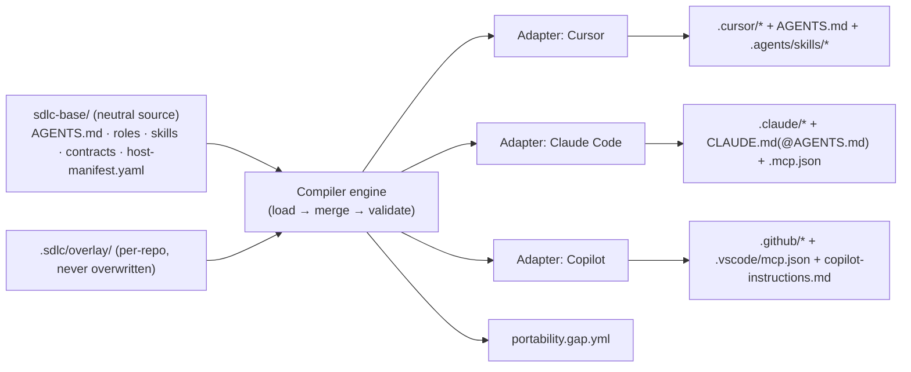

# feat: Internal AI SDLC Framework (cross-host base + `/customize`)

## Summary

Build a public AI SDLC framework with two layers: an opinionated-but-configurable
**base** (constitution, role agents, review gates, Jira/GitLab wrap-up) and a **`/customize`**
step that adapts it to a repo. Authoring happens once in a **host-neutral source**; a **compiler**
emits host-native configuration for **Cursor, Claude Code, and GitHub Copilot** (all three in v1).
The vertical proof is: `install → /customize → orchestrated Architect→Engineer→Reviewer loop with
an Approved? gate → GitLab MR + Jira update`, running on all three hosts with honest graceful
degradation where a host lacks a primitive.

**Scope override vs origin:** the brainstorm deferred multi-host to v2 and targeted one host first.
Per the planning decision on 2026-06-14, **cross-host portability (Cursor + Copilot + Claude Code)
and cross-host orchestration are v1 scope.** This plan supersedes that deferral.

---

## Problem Frame

Engineers use AI agents inconsistently across repos and across hosts (Cursor, Claude Code,
Copilot). There is no shared review bar, no standard Jira/GitLab wrap-up, and conventions do not
transfer between teams or hosts. We want one host-neutral source of truth that compiles to each
host, encodes company standards, integrates internal Jira/GitLab, and improves as it is used —
distributed by a platform team so dozens of repos stay in sync without forks.

---

## Requirements (traceability to origin)

Carried from `origin` (names preserved):

- **Base & distribution:** versioned base, no copy-paste forks, project state in an overlay the
  updater never overwrites; base upgrade flags (not clobbers) overlay conflicts; selectable
  ceremony tracks (Quick/Standard/Full).
- **`/customize`:** repo-mine first, interview only for gaps, evidence-backed artifacts, a passing
  smoke run is a hard exit criterion, re-runnable and drift-aware.
- **Orchestration & roles:** single writer; Architect/Debugger explore read-only; Reviewer runs
  after writes in fresh context; explicit `Approved?` gate.
- **Tool integration:** Jira/GitLab via MCP, never baked into core; per-role least-privilege;
  wrap-up validated against a thin contract.
- **Portability:** host-neutral authoring (was "readiness only"; **now full v1 compile to three
  hosts**).
- **Compounding memory (minimal in v1):** capture `Approved?` gate outcomes + a living standards
  index that accepts gated deltas. Promotion-back and similarity recall are deferred.

---

## Key Technical Decisions

### KTD-1: Runtime is TypeScript/Node (confirmed)
The compiler/CLI manipulates JSON/YAML/markdown and targets the VS Code/Cursor/Copilot ecosystem;
Node enables npm-based internal distribution and broad contributor familiarity. *Decided 2026-06-14*
(alternative considered: Python, as in the reference harness — weaker fit for the host ecosystems).
All paths below assume TS/Node.

### KTD-2: Host-neutral source is the single source of truth
Author once under `sdlc-base/` (constitution as `AGENTS.md`, roles, skills, integration contracts,
`host-manifest.yaml`). Hosts are **emit targets**, never hand-edited. This is the "universal" in the
framework and the only way three hosts stay consistent. (Grounded in Agent Skills / AGENTS.md / MCP
being the ~70%-portable substrate; see Sources.)

### KTD-3: Compiler + per-host adapter pattern
A core engine loads neutral source and dispatches to pluggable adapters (`cursor`, `claude-code`,
`copilot`). Adapters are idempotent and emit a `portability.gap.yml` listing anything that did not
map cleanly (e.g., Copilot IDE gates). Adding a fourth host = one new adapter, no source changes.

### KTD-4: Orchestration uses host-native dispatch with declared degradation
Roles compile to each host's native primitive: Cursor subagents+hooks, Claude Code subagents
(`tools`/`disallowedTools` enforced) + `settings.json` hooks, Copilot custom agents
(`.agent.md`) + `runSubagent`/handoffs. Where a host lacks a primitive, the adapter emits the
documented fallback rather than failing — **Copilot IDE has no `PreToolUse` gate**, so the
`Approved?` gate degrades to an instruction-driven checklist + branch-protection/CI enforcement,
and autonomous wrap-up routes through the Copilot **cloud coding agent**. A **capability matrix**
(U4) is a first-class artifact, not a footnote.

### KTD-5: Per-role MCP least-privilege is enforced per host, not assumed portable
Cursor `permissions.json` `mcpAllowlist` is **global, not per-role**, and Cursor/Copilot subagents
lack frontmatter tool allowlists. So least-privilege is enforced by: Claude Code subagent
`tools`/`mcpServers` frontmatter (native); Cursor + Copilot CLI via `beforeMCPExecution`/`preToolUse`
hooks keyed on the active role; Copilot IDE via instructions + CI as the backstop.

### KTD-6: `/customize` ships as a Skill (`disable-model-invocation: true`), not a bare command
`$ARGUMENTS` in slash commands is undocumented in Cursor; skills are the portable, parameterized,
progressively-disclosed unit across all three hosts. The orchestrated loop is likewise authored as
neutral skills + role agents.

### KTD-7: Distribution = pinned base + untouched overlay; per-host packaging is an emit target
The base is consumed as a pinned git submodule (or versioned npm package) plus a `.sdlc/overlay/`
the updater never writes. `aisdlc upgrade` re-pins and replays the compile, flagging overlay
conflicts for human resolution. Cursor/Claude Code **plugins** are *packaging* emit targets for
publish, not the primary install mechanism.

---

## High-Level Technical Design

### Compile flow



### Role loop (single-writer, Approved? gate)

```mermaid
sequenceDiagram
  participant O as Orchestrator
  participant A as Architect (read-only)
  participant E as Engineer (write-lock)
  participant G as Approved? gate
  participant R as Reviewer (fresh, read-only)
  participant M as MCP (Jira/GitLab)
  O->>A: plan task (returns compressed summary)
  A-->>O: plan
  O->>E: implement per plan
  E-->>G: changes ready
  G-->>O: pass/block (hook on Cursor/Claude; instruction+CI on Copilot IDE)
  O->>R: review in clean context
  R-->>O: verdict
  O->>M: on approve → open/update MR + Jira (least-privilege)
```

### Cross-host capability matrix (drives U4 degradation)

| Capability | Cursor | Claude Code | Copilot |
|---|---|---|---|
| Project instructions (AGENTS.md) | Native | via `CLAUDE.md` `@AGENTS.md` | Native + `copilot-instructions.md` |
| Agent Skills (SKILL.md) | Yes | Yes | Yes (`.github/skills`/`.agents/skills`) |
| Role subagents + dispatch | Yes | Yes (`Agent` tool) | Partial (`runSubagent`/handoffs; cloud for autonomous) |
| Per-subagent tool restriction | Hook-enforced | Native frontmatter | Partial (custom-agent `tools`) |
| Hooks / gates | Yes | Yes (`PreToolUse`) | **No IDE hooks** (CLI/cloud only) → instruction+CI fallback |
| MCP | Yes | Yes | Yes (`.vscode/mcp.json` + repo MCP) |
| Slash/prompt + args | Yes | Yes (`$ARGUMENTS`) | Prompt files (preview) |

---

## Output Structure

```text
ai_sdlc/                          # framework repo (this repo)
├── package.json · tsconfig.json
├── src/
│   ├── cli/                      # aisdlc compile|customize|upgrade|smoke
│   ├── core/                     # source loader, merge, compiler engine, adapter registry, gap report
│   ├── schema/                   # zod schemas: host-manifest, role, skill, integration-contract, overlay
│   ├── adapters/
│   │   ├── cursor/               # instructions, skills, agents, gates(hooks), mcp(+permissions)
│   │   ├── claude-code/          # instructions, skills, agents(tools), gates(settings hooks), mcp
│   │   └── copilot/              # instructions, skills, agents(.agent.md), gates(github hooks/CI), mcp
│   ├── customize/                # repo-miner, gap-interview, artifact emitters
│   └── smoke/                    # smoke harness + canned task fixtures
├── sdlc-base/                    # OPINIONATED NEUTRAL SOURCE (the base layer)
│   ├── AGENTS.md                 # starter constitution
│   ├── host-manifest.yaml        # which hosts to emit; per-host options
│   ├── roles/                    # architect|engineer|reviewer|debugger (neutral)
│   ├── skills/                   # customize, sdlc-loop, wrap-up, track-select (neutral)
│   └── integrations/             # jira.contract.yaml, gitlab.contract.yaml
├── templates/overlay/            # starter .sdlc/overlay scaffold + .customize.yaml
├── tests/                        # fixtures + golden emitted trees per host
└── docs/

# Emitted into a TARGET repo by `aisdlc compile`:
#   AGENTS.md
#   .agents/skills/<name>/SKILL.md
#   .cursor/{agents,rules,hooks.json,mcp.json,permissions.json}
#   .claude/{agents,skills,settings.json}  + CLAUDE.md  + .mcp.json
#   .github/{agents,prompts,skills,hooks,copilot-instructions.md}  + .vscode/mcp.json
#   .sdlc/{project.lock, overlay/}
```

---

## Milestones (host-depth sequencing, decided 2026-06-14)

- **Milestone 1:** Cursor + Claude Code at **full orchestration depth**; GitHub Copilot at the
  **degraded tier** (instruction-driven gate + CI, prompt-file/handoff phases, cloud agent for
  wrap-up). All three still receive the portable layer (AGENTS.md + skills + MCP).
- **Milestone 2:** raise Copilot toward parity where its primitives allow (CLI/cloud hooks,
  custom-agent handoffs), and add deferred items from Scope Boundaries.

This sequencing affects U4/U8 (build Cursor + Claude Code adapters/loop first; emit Copilot's
degraded path and record the gaps) but not the unit boundaries.

## Implementation Units

### Phase 1 — Host-neutral core & compiler

### U1. Repo scaffold + host-neutral source schema
**Goal:** Stand up the TS/Node project and define the neutral source format (roles, skills,
integration contracts, `host-manifest.yaml`) plus overlay schema, validated by zod.
**Requirements:** KTD-1, KTD-2; "host-neutral authoring".
**Dependencies:** none.
**Files:** `package.json`, `tsconfig.json`, `src/schema/{host-manifest,role,skill,integration-contract,overlay}.ts`, `sdlc-base/host-manifest.yaml`, `sdlc-base/roles/architect.md`, `sdlc-base/AGENTS.md`, `tests/schema/*.test.ts`.
**Approach:** Schemas are the contract every adapter reads; keep them host-agnostic (no `.cursor`/`.claude` leakage). `host-manifest.yaml` lists target hosts + per-host options (e.g., `copilot.gateMode: ci`).
**Patterns to follow:** Agent Skills `SKILL.md` frontmatter as the neutral skill shape; AGENTS.md as the neutral instruction shape.
**Test scenarios:**
- Valid role/skill/manifest fixtures parse and type-narrow correctly.
- Invalid frontmatter (missing `name`/`description`, unknown host) fails with a path-pointed error.
- Overlay with unknown keys is rejected; overlay overriding an allowed edge is accepted.
**Verification:** `aisdlc` package builds; schema tests pass; a sample neutral source validates.

### U2. Compiler engine + adapter registry + gap report
**Goal:** Load neutral source, merge overlay, validate, and dispatch to registered adapters;
emit idempotently and produce `portability.gap.yml`.
**Requirements:** KTD-3; "no copy-paste forks".
**Dependencies:** U1.
**Files:** `src/core/{loader,merge,engine,adapter-registry,gap-report}.ts`, `src/cli/compile.ts`, `tests/core/*.test.ts`, `tests/golden/` (golden emitted trees).
**Approach:** Adapter interface = `emit(neutralModel, outDir, opts) -> EmitResult{written[], gaps[]}`. Engine is pure/deterministic for golden-file testing. Re-running compile on an unchanged source is a no-op (idempotent).
**Patterns to follow:** Agent OS "compile-to-tool-native"; Terraform-style plan/emit separation.
**Test scenarios:**
- Two compiles of the same source produce byte-identical output (idempotency).
- A capability a host can't satisfy appears in `portability.gap.yml` with reason + host.
- Adapter registry dispatches only to hosts named in `host-manifest.yaml`.
- Overlay value overrides base value in the merged model used for emit.
**Verification:** golden trees match for a sample source across all three adapters.

### Phase 2 — Per-host adapters (the portability spine)

### U3. Instructions + Skills adapters (all three hosts)
**Goal:** Emit the portable instruction + skill layer per host.
**Requirements:** KTD-2; "host-neutral authoring".
**Dependencies:** U2.
**Files:** `src/adapters/*/instructions.ts`, `src/adapters/*/skills.ts`, `tests/adapters/skills.test.ts`.
**Approach:** Instructions → `AGENTS.md` passthrough (Cursor/Copilot) and `CLAUDE.md` with `@AGENTS.md` import + host appendix (Claude Code). Skills → `.agents/skills/<n>/SKILL.md` plus host shims (`.cursor/skills`, `.claude/skills`, `.github/skills`). Preserve progressive-disclosure frontmatter.
**Patterns to follow:** research portability matrix (Sources §2).
**Test scenarios:**
- A neutral skill emits valid `SKILL.md` in each host's expected path with required frontmatter.
- Claude Code instruction emit contains the `@AGENTS.md` import and a Claude-specific appendix.
- Copilot emits both `AGENTS.md` and a `copilot-instructions.md` excerpt.
- Re-emit after editing the neutral skill updates all hosts; no orphan files left behind.
**Verification:** emitted skills load in each host (manual smoke) and match golden frontmatter.

### U4. Role-agent + gates + MCP adapters and capability matrix
**Goal:** Emit role agents, the `Approved?` gate, and MCP config per host with declared degradation;
publish the capability matrix as an artifact.
**Requirements:** KTD-4, KTD-5; "single writer", "Approved? gate", "least-privilege".
**Dependencies:** U3.
**Files:** `src/adapters/*/agents.ts`, `src/adapters/*/gates.ts`, `src/adapters/*/mcp.ts`, `sdlc-base/integrations/{jira,gitlab}.contract.yaml`, `docs/capability-matrix.md`, `tests/adapters/{agents,gates,mcp}.test.ts`.
**Approach:** Roles → `.cursor/agents`, `.claude/agents` (with `tools`/`disallowedTools`), `.github/agents/*.agent.md`. Gate → Cursor `hooks.json` (`subagentStart`/`beforeMCPExecution`), Claude `settings.json` `PreToolUse`, Copilot `.github/hooks/*.json` (CLI/cloud) **plus** an instruction-checklist + CI policy for IDE (the documented gap). MCP least-privilege per KTD-5. `docs/capability-matrix.md` is generated from `host-manifest` + adapter capabilities so it can't drift from code.
**Patterns to follow:** Devin single-writer + clean-context reviewer; research orchestration matrix (Sources §3).
**Test scenarios:**
- Claude Code reviewer agent emits a read-only `tools` allowlist (no Write/Edit).
- Cursor gate emits a `beforeMCPExecution` hook keyed to the active role; Copilot IDE emits the instruction+CI fallback and records the gap in `portability.gap.yml`.
- MCP emit produces `.cursor/mcp.json`, `.mcp.json`, `.vscode/mcp.json` with matching server defs.
- Engineer role can call GitLab MR tool; Reviewer role MCP profile denies write tools.
- Generated `docs/capability-matrix.md` matches the adapters' declared capabilities.
**Verification:** on each host, the role loop dispatches and the gate blocks an unapproved write (or, on Copilot IDE, the checklist+CI path is present and documented).

### Phase 3 — Two-layer distribution & `/customize`

### U5. Base distribution + overlay & upgrade model
**Goal:** Define base consumption (pinned submodule/npm) + `.sdlc/overlay/` + `project.lock`, and an
`aisdlc upgrade` that re-pins, replays compile, and flags overlay conflicts.
**Requirements:** KTD-7; "versioned base, no forks", "upgrade flags conflicts".
**Dependencies:** U2.
**Files:** `src/cli/upgrade.ts`, `src/core/overlay.ts`, `templates/overlay/.customize.yaml`, `templates/overlay/README.md`, `tests/core/upgrade.test.ts`.
**Approach:** Overlay holds only deltas + interview answers; base files are never edited in place. Upgrade computes a three-way view (old base, new base, overlay) and, on any collision, **blocks and emits a conflict report for human resolution — never auto-merges or overwrites** (policy decided 2026-06-14).
**Patterns to follow:** BMAD update-safe `.customize.yaml`; distro base + overlay.
**Test scenarios:**
- Upgrading the base with a non-conflicting overlay leaves the overlay byte-identical.
- A base change that touches an overlaid edge produces a conflict entry (not a silent overwrite).
- `project.lock` records the pinned base version and is updated on upgrade.
**Verification:** simulated base bump on a fixture repo yields the expected conflict report.

### U6. `/customize` skill (repo-mine first, interview for gaps, emit)
**Goal:** The flagship skill: mine the repo, emit evidence-backed artifacts (constitution,
standards index, role overlays, integration bindings), interview only for gaps, then invoke compile.
**Requirements:** KTD-6; "repo-mine first", "evidence-backed", "drift-aware re-run".
**Dependencies:** U2, U5.
**Files:** `sdlc-base/skills/customize/SKILL.md`, `src/customize/{repo-miner,gap-interview,emitters}.ts`, `src/cli/customize.ts`, `tests/customize/*.test.ts`, `tests/fixtures/sample-repos/`.
**Approach:** Miner reads tree, CI, linters, CODEOWNERS, manifests, existing docs; emitters cite the
repo paths each artifact derives from; interview fires only for unanswered gaps. Re-run diffs prior
artifacts and reports changes (drift-aware). The skill body orchestrates the CLI steps. The starter
`sdlc-base/AGENTS.md` constitution treats **only hard gates as non-negotiable** (review required,
tests must pass, `Approved?` gate, least-privilege MCP); everything else is team-configurable via
the overlay (decided 2026-06-14).
**Patterns to follow:** Agent OS `/discover-standards` → `index.yml`; defending-code `/customize`.
**Test scenarios:**
- On a Python fixture (mirroring `rags`: `pyproject.toml` + `Makefile` + `tests/`), miner detects framework/test-runner/lint and emits a standards index citing real paths.
- Miner ignores vendored/env dirs (`venv/`, `__pycache__/`) — mirrors `streamlit-frontend`.
- A thin POC (mirroring `bookaball_poc`: lone `app.py`) yields a minimal artifact set and suggests the Quick track, not an over-built config.
- A non-Python fixture (e.g., TS) detects its stack — guards the language-agnostic assumption.
- A gap the repo can't answer triggers exactly one interview prompt; an answerable item triggers none.
- Re-running after a fixture change reports a drift delta, not a full rewrite.
- Emitted constitution/overlay validate against U1 schemas.
**Verification:** `aisdlc customize` on each sample repo produces a complete, schema-valid artifact set.

### U7. Smoke-run validation gate
**Goal:** Make a passing smoke run the hard exit criterion for "customize complete."
**Requirements:** "passing smoke run is a hard exit criterion".
**Dependencies:** U4, U6.
**Files:** `src/smoke/{harness,canned-task}.ts`, `src/cli/smoke.ts`, `tests/smoke/*.test.ts`.
**Approach:** Run a canned **trivial change** (e.g., add a small code comment / tiny function)
through the Engineer→Reviewer stages against the generated config, with **MCP mocks** (no live
creds, CI-safe); capture pass/fail to `.sdlc/validation.log`. `customize` does not report ready
until smoke passes; failure surfaces a structured fix path, not a silent success flag. A live-MCP
wrap-up check is an opt-in extension, deferred (decided 2026-06-14).
**Patterns to follow:** defending-code smoke-validation gate.
**Test scenarios:**
- A correctly generated config passes smoke and writes a pass log.
- A deliberately broken config (missing MCP env, bad skill path) fails smoke with a specific reason.
- `customize` exit status reflects smoke result.
**Verification:** smoke gate blocks "ready" on a broken fixture and passes on a good one.

### Phase 4 — Orchestration loop & integration

### U8. Orchestrated role loop (neutral) compiled per host
**Goal:** Author the Architect→Engineer→Reviewer loop with `Approved?` gate as neutral skills+roles;
rely on U4 adapters to compile with per-host degradation.
**Requirements:** KTD-4; "single writer", "Reviewer fresh context".
**Dependencies:** U4.
**Files:** `sdlc-base/skills/sdlc-loop/SKILL.md`, `sdlc-base/roles/{architect,engineer,reviewer,debugger}.md`, `tests/loop/compiled-shape.test.ts`.
**Approach:** Loop skill encodes single-writer discipline and the gate; roles carry tool postures
(Architect/Reviewer read-only, Engineer write). Copilot path documents the handoff/instruction
fallback. No custom orchestrator engine (KTD-4) — dispatch is host-native.
**Patterns to follow:** Devin map-reduce-and-manage; clean-context reviewer.
**Test scenarios:**
- Compiled Cursor/Claude output dispatches three roles with correct tool postures.
- Reviewer is emitted read-only on every host.
- Copilot emit includes handoff definitions + the IDE-gate fallback note.
**Verification:** end-to-end loop runs on each host on a trivial change (manual smoke per host).

### U9. Jira/GitLab MCP wrap-up + least-privilege
**Goal:** On approval, open/update GitLab MR and update Jira via MCP, scoped to role profiles and
validated against the integration contract.
**Requirements:** "Jira/GitLab via MCP", "validated against contract", "least-privilege".
**Dependencies:** U4, U8.
**Files:** `sdlc-base/skills/wrap-up/SKILL.md`, `sdlc-base/integrations/{jira,gitlab}.contract.yaml`, `src/adapters/*/mcp.ts` (contract wiring), `tests/integration/wrap-up.test.ts`.
**Approach:** Wrap-up reads bindings produced by `/customize`; responses validated against the thin
contract; contract gaps recorded for the next customize. Least-privilege enforced per KTD-5.
**Patterns to follow:** SRE runbook + service-context binding (ideation #6 analogy).
**Test scenarios:**
- Wrap-up against a mock GitLab MCP creates an MR and updates a mock Jira issue.
- A contract-shape mismatch is reported (not silently passed).
- Reviewer role attempting a write MCP call is denied.
**Verification:** wrap-up completes against mock MCP servers and writes a contract-valid result.

### U10. Track selector + minimal compounding memory
**Goal:** Add Quick/Standard/Full track selection and minimal memory capture (gate outcomes +
appendable standards index).
**Requirements:** "selectable ceremony tracks"; "compounding memory (minimal)".
**Dependencies:** U7, U8.
**Files:** `sdlc-base/skills/track-select/SKILL.md`, `src/customize/emitters.ts` (track wiring), `src/core/memory.ts`, `tests/memory/*.test.ts`.
**Approach:** Track maps task size to loop depth (Quick = Engineer→Reviewer; Full adds wrap-up).
Memory appends `Approved?` outcomes to `.sdlc/gate_history/` and supports gated deltas to the
standards index. Promotion-back and similarity recall are explicitly deferred.
**Test scenarios:**
- Quick track skips Architect and wrap-up; Full track runs all stages.
- A gate outcome is appended with verdict + scope + reason.
- A standards-index delta is recorded only after the gated approval flag.
**Verification:** track selection changes the compiled loop; gate outcomes persist across runs.

---

## Scope Boundaries

**Deferred to follow-up work (this product, later PRs):** full compounding memory (promotion into
skills + similar-failure recall); continuous/background drift reconciliation; composable internal
pack **registry**; a fourth host adapter (Codex); Cursor/Claude **plugin/marketplace** publish
packaging beyond the basic emit.

**Deferred for later (from origin):** non-developer (PM-driven) customize; bespoke scanning
infrastructure.

**Outside this product's identity (from origin):** public/OSS framework; replacing the company's
Jira/GitLab/CI; fully autonomous merge without a human gate.

---

## Risks & Dependencies

- **Copilot orchestration gap (high):** no IDE-level gates and only sequential handoffs. *Mitigation:*
  KTD-4 degradation — instruction checklist + branch-protection/CI for the gate; cloud coding agent
  for autonomous wrap-up; gap recorded in `portability.gap.yml` and the capability matrix.
- **Overlay/upgrade conflict UX (medium):** central-push vs team overlays can collide. *Mitigation:*
  U5 emits a conflict report for human resolution; never auto-overwrite. *(Open question 3.)*
- **Host API drift (medium):** Copilot prompt files + agent hooks are Preview; Claude `Task`→`Agent`
  rename. *Mitigation:* adapters isolate host specifics; capability matrix is generated, not hand-kept.
- **MCP credentials per host (medium):** env/secret handling differs (`.vscode/mcp.json` vs repo MCP
  vs `~/.claude.json`). *Mitigation:* emit references to env vars, never secrets; document per-host setup.
- **Dependency:** company Jira/GitLab MCP servers + credentials; a platform team to own base versioning.

---

## Alternatives Considered

- **Custom orchestrator engine (rejected for v1):** building a host-agnostic orchestrator process
  rather than compiling to native dispatch. Higher control but heavy, and it fights each host's own
  agent runtime; KTD-4 prefers native dispatch + declared degradation.
- **CLI installer as primary distribution (rejected):** simpler onboarding but weaker upgrade/overlay
  semantics than pinned-base + overlay (KTD-7). Kept as a possible convenience wrapper.
- **Single-host first, port later (origin's plan; superseded):** lower v1 cost, but the user requires
  three-host parity now; portability is the spine, so deferring it would force a later rewrite.

---

## Sources & Research

- Ideation + requirements: `docs/ideation/2026-06-14-ai-sdlc-universal-setup-ideation.md`,
  `origin`.
- Cursor extensibility (plugins/rules/skills/commands/subagents/hooks/MCP/permissions) — official
  Cursor docs; load-bearing for U3–U7 paths and KTD-5/6.
- Claude Code + GitHub Copilot extensibility & orchestration (2026) — official Anthropic + GitHub/VS
  Code docs; load-bearing for U3–U4, KTD-4/5, and the capability matrix. Key facts: Claude Code
  subagents support native `tools`/`disallowedTools`; Copilot has no IDE hooks (CLI/cloud only),
  sequential handoffs, and cloud coding agent for autonomous issue→PR; `.chatmode.md`→`.agent.md`
  rename; `Task`→`Agent` tool rename.

---

## Resolved Decisions (2026-06-14)

- **Runtime:** TypeScript/Node (KTD-1).
- **Host depth:** staged — Cursor + Claude Code full orchestration in Milestone 1, Copilot degraded
  then raised in Milestone 2 (see Milestones).
- **Overlay conflict policy:** block + report for human resolution; never auto-merge (U5).
- **Smoke task (U7):** trivial change through Engineer→Reviewer against MCP mocks; live wrap-up check deferred/opt-in.
- **Constitution (U6):** only hard gates non-negotiable (review, tests-pass, `Approved?`, least-privilege MCP); rest configurable.
- **Pilot repos (local sibling projects under `~/Projects/`):**
  - `streamlit-frontend` — Python/Streamlit app, commits a `venv/` (validates miner ignore-set).
  - `rags` — Python RAG app (`pyproject.toml` + `requirements.txt`, `Makefile`, `tests/`); rich standards mining + a real test suite for the tests-pass gate.
  - `bookaball_poc` — thin Python POC (`app.py` + `requirements.txt`); minimal-repo / Quick-track path.

## Open Questions

None blocking — all planning questions resolved.

**Note (assumption gap):** all three pilots are Python (two Streamlit), so Milestone-1 validation
exercises Python mining well but **does not test the language-agnostic mining assumption** (origin).
Add at least one non-Python repo (or a synthetic fixture) before relying on cross-language `/customize`.
