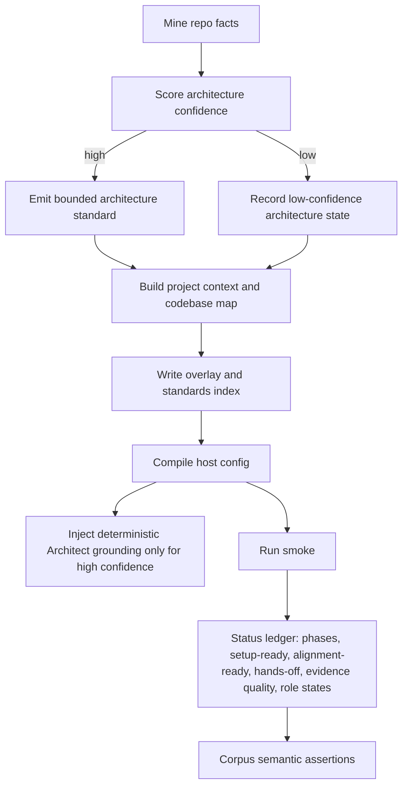
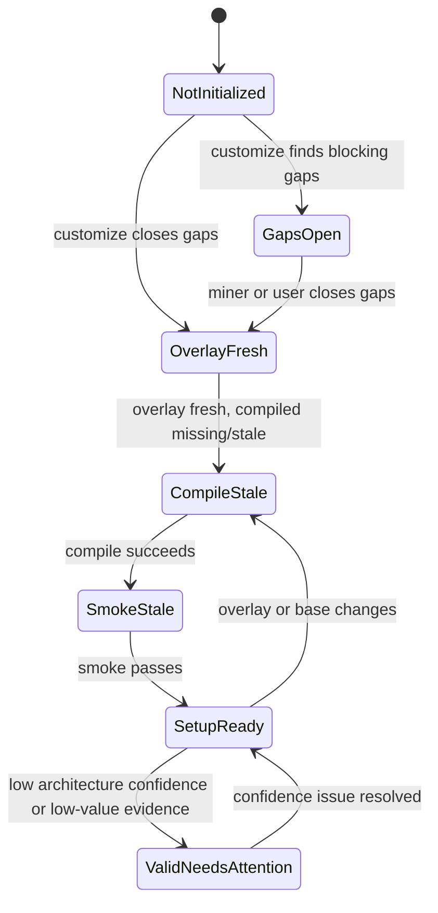

# feat: Harden setup quality signals

## Summary

Harden the setup loop so ai-sdlc can distinguish valid emitted files from useful repo alignment. The plan adds confidence-gated architecture mining, semantic corpus checks, honest hands-off/status reporting, and deterministic Architect grounding without putting LLM output in the compile path.

---

## Problem Frame

The earlier deeper-mining work shipped the main surfaces: architecture and convention mining, `status`, `explain`, setup phases, workspace detection, and quarantined `roleAddenda`. The remaining risk is that generated context can pass structural gates while still pointing agents at low-value roots such as tutorials or playgrounds.

The current corpus signal shows this clearly: FastAPI-like repos can over-select `docs_src/`, Vite-like repos can over-select `playground/`, and mined test commands can be persisted as `interviewAnswers`, making hands-off setup hard to measure. This work hardens the quality signal around those cases.

---

## Requirements

| ID | Requirement | Units |
|----|-------------|-------|
| R1 | Architecture mining classifies candidate roots with confidence signals instead of file-count dominance alone. | U1 |
| R2 | Tutorial, documentation, fixture, demo, and playground trees are demoted unless evidence shows they are primary product surfaces. | U1 |
| R3 | Low-confidence architecture emits an explicit low-confidence state rather than a detailed architecture standard. | U1, U3 |
| R4 | High-confidence architecture output stays bounded, with overflow details kept in evidence or map surfaces. | U1 |
| R5 | Corpus validation exercises `customize -> compile -> smoke -> status` for selected fixtures. | U4 |
| R6 | Corpus assertions cover setup-ready, evidence coverage, architecture root sanity, project-context map sanity, and known false-positive roots. | U4 |
| R7 | Adversarial fixtures prove ambiguous repos surface low-confidence architecture and never publish a confident wrong map. | U1, U4 |
| R8 | Readiness distinguishes structural setup-ready from alignment-ready quality. | U3, U4 |
| R9 | `status` reports hands-off setup using closure provenance, not just absence of blocking gaps. | U2, U3 |
| R10 | `status` shows mined, overlay-written, compiled, smoke-passed, setup-ready, alignment-ready, stale phases, and next action. | U3 |
| R11 | Freshness reporting names the stale phase and why at a user-actionable level. | U3 |
| R12 | Evidence reporting distinguishes cited evidence from useful evidence when sources come from low-value roots. | U1, U3 |
| R13 | Architect receives deterministic grounding from high-confidence mined repo facts. | U5 |
| R14 | Deterministic role grounding is bounded, additive, and cannot weaken hard gates. | U5 |
| R15 | Optional LLM-authored addenda remain outside deterministic compile and are not required for baseline Architect usefulness. | U5 |
| R16 | Role-personalization status reports generic, deterministic, and LLM-authored role states. | U3, U5 |

---

## Key Technical Decisions

- **Architecture confidence has a concrete contract.** Roots start from deterministic signals: product evidence from manifests/workspaces/entrypoints/CI test paths, low-value evidence from demoted directory roles, and tie evidence from file counts. A root is `high` only when it has at least one product signal, is not demoted, and beats any demoted or competing root by a clear reason-coded rule; otherwise the architecture is `low`.
- **Low confidence gates every architecture-bearing surface.** Low-confidence architecture must not appear as a confident standard, primary codebase-map row, package-context row, or deterministic Architect grounding. It can appear only as an advisory low-confidence state with reasons.
- **Structural setup-ready and alignment-ready are separate.** `setup-ready` remains gaps plus smoke. `alignment-ready` is false when status reports valid-but-needs-attention signals such as low architecture confidence or low-value evidence dominance.
- **The adversarial corpus fixture must pass by proving caution.** It is green only when status reports low-confidence architecture, no confident primary root is emitted, and generated map surfaces do not publish the wrong root.
- **Hands-off provenance is schema-backed.** Add an Overlay field such as `gapClosureProvenance: Record<string, "miner" | "ci" | "interview" | "seeded" | "manual" | "unknown">`. `miner` and `ci` count as hands-off; `interview`, `seeded`, `manual`, and `unknown` do not.
- **Status is the setup ledger.** Extend the existing read-only command instead of adding `doctor` or `watch`; it becomes the single place for phase state, next action, hands-off, evidence quality, alignment-ready, and role grounding state.
- **Architect grounding is deterministic compile-time context, not LLM prose.** The deterministic pack is separate from `roleAddenda`; LLM-authored addenda remain preserved overlay content validated by the existing contract.

---

## High-Level Technical Design

The first diagram defines the data path. The second diagram defines readiness and alignment states; ledger phase names remain `mined`, `overlay-written`, `compiled`, and `smoke-passed`.

---

## Implementation Units

### U1. Architecture Confidence And Bounded Output

- **Goal:** Replace file-count-only architecture selection with confidence-scored, bounded architecture output across all architecture-bearing surfaces.
- **Requirements:** R1, R2, R3, R4, R7, R12
- **Dependencies:** none
- **Files:** `src/customize/repo-miner.ts`, `src/customize/emitters.ts`, `tests/customize/deeper-mining.test.ts`, `tests/fixtures/sample-repos/fastapi-like/`, `tests/fixtures/sample-repos/vite-like/`, `tests/fixtures/sample-repos/ambiguous-architecture/`
- **Approach:** Extend the architecture profile with `confidence`, `reasons`, `selectedRoot`, `demotedRoots`, bounded module entries, overflow count, and evidence-quality markers. Add demotion rules for low-value roots such as `docs_src`, `docs_*`, `playground`, `demo`, `demos`, `examples`, `fixtures`, and generated paths. High confidence requires product evidence and no unresolved tie with demoted or competing roots. Low confidence suppresses confident standards, primary map rows, scoped package rows, and deterministic role grounding.
- **Patterns to follow:** Existing evidence collection and standard emission in `src/customize/repo-miner.ts` and `src/customize/emitters.ts`; existing workspace exclusion tests in `tests/customize/customize.test.ts`.
- **Test scenarios:**
  - Covers AE1. A FastAPI-like fixture with many `docs_src/` files does not emit a confident architecture standard or map row rooted only in tutorials.
  - Covers AE2. A Vite-like fixture demotes `playground/` and does not publish it as primary architecture or package-map context.
  - Covers AE4. An ambiguous fixture at the confidence boundary emits low-confidence architecture and no confident wrong map.
  - A high-confidence fixture emits a bounded module summary and keeps overflow details accessible through evidence or map data.
  - Evidence quality flags standards whose only sources are demoted roots.
  - Confidence reason codes are asserted in tests, not just final high/low outcomes.
  - Changing confidence inputs changes the mined fingerprint; unchanged inputs preserve no-op behavior.
- **Verification:** Miner and emitter tests pass; known FastAPI/Vite false-positive patterns are covered by fixtures.

### U2. Gap Closure Provenance For Hands-Off Setup

- **Goal:** Separate how a blocking setup concern was closed from where the resolved value is stored.
- **Requirements:** R9
- **Dependencies:** none
- **Files:** `src/schema/overlay.ts`, `src/cli/customize.ts`, `src/customize/emitters.ts`, `src/customize/gap-interview.ts`, `src/cli/phase-fingerprints.ts`, `tests/customize/customize.test.ts`, `tests/customize/setup-chain.test.ts`
- **Approach:** Add `gapClosureProvenance` to the strict Overlay schema. Keep `interviewAnswers["test-command"]` available for existing gates, but treat provenance as the source of truth for hands-off reporting. Missing provenance on older overlays means `unknown`, which is not hands-off. On re-customize, if current mining reproduces a resolved value with evidence, update provenance to `miner` or `ci` without clobbering user-owned answers.
- **Patterns to follow:** Round-trip editable overlay pattern from `docs/solutions/design-patterns/round-trip-editable-generated-config.md`; current answer merge behavior in `src/cli/customize.ts`.
- **Test scenarios:**
  - Covers AE5. A CI-mined `pytest` command closes the test-command gap and reports hands-off without counting as interview provenance.
  - A user-provided `--answers-file` value closes the gap but reports hands-off false even if the value matches the mined command.
  - A prior overlay with only `interviewAnswers.test-command` remains smoke-compatible and reports `unknown` provenance until a re-run proves miner closure.
  - Re-running customize preserves user-owned answers and updates miner provenance when current evidence supports it.
- **Verification:** Setup chain tests pass; existing overlays remain readable.

### U3. Status Setup Ledger And Evidence Quality

- **Goal:** Make `aisdlc status` the read-only source of truth for setup state, hands-off provenance, alignment quality, and role personalization state.
- **Requirements:** R3, R8, R9, R10, R11, R12, R16
- **Dependencies:** U1, U2 for full signals; before those land, status reports missing values as `unknown`.
- **Files:** `src/cli/status.ts`, `src/cli/customize.ts`, `src/customize/setup-state.ts`, `src/cli/phase-fingerprints.ts`, `src/cli/index.ts`, `tests/cli/status.test.ts`, `tests/customize/deeper-mining.test.ts`
- **Approach:** Add a shared ledger builder that accepts repo root, overlay dir, SDLc dir, base dir, and output dir. It reuses phase fingerprints and setup-state to report stale phases, next action, computed setup-ready, alignment-ready, hands-off status, evidence quality, low-confidence architecture, and role state. Machine-checkable tests should import the `StatusReport` shape directly; a `--json` CLI flag is deferred unless implementation makes it cheap.
- **Patterns to follow:** Current `buildStatus` / `formatStatus` split and read-only status tests.
- **Test scenarios:**
  - Covers AE5. Given `ci` or `miner` gap provenance, status shows hands-off true and provenance is not `interview`.
  - Covers AE6. Overlay current plus missing/stale compile reports `compiled` as stale, explains why, and sets next action to compile.
  - Low-confidence architecture reports setup-ready separately from alignment-ready.
  - A repo with cited evidence only from demoted roots reports evidence quality risk.
  - Corrupt or missing setup-state does not claim up-to-date.
  - Status reports role state as generic, deterministic, LLM-authored, or deterministic+LLM where applicable.
  - Status after low-confidence customize leaves `.sdlc` byte-stable.
- **Verification:** CLI status tests pass and status remains read-only.

### U4. Corpus Semantic Regression Harness

- **Goal:** Turn corpus validation into a repeatable semantic regression gate for setup quality.
- **Requirements:** R5, R6, R7, R8
- **Dependencies:** U1 and U3.
- **Files:** `tests/corpus/corpus-regression.test.ts`, `tests/corpus/expectations/`, `tests/fixtures/sample-repos/fastapi-like/`, `tests/fixtures/sample-repos/vite-like/`, `tests/fixtures/sample-repos/ambiguous-architecture/`
- **Approach:** Add a lightweight Vitest corpus slice using deterministic fixtures derived from the real corpus failure shapes. Each fixture runs `customize -> compile -> smoke -> status` in a temp output and asserts semantic invariants rather than full snapshots. External corpus runs against a user-provided corpus path remain manual verification for this plan; checked-in tests provide the merge gate.
- **Patterns to follow:** Existing temp-repo fixture style in `tests/customize/*` and setup-chain tests.
- **Test scenarios:**
  - Covers AE3. Each selected fixture completes the full setup chain and produces machine-checkable status.
  - Covers AE4. The adversarial fixture passes only when status reports low confidence and generated map surfaces avoid a confident wrong root.
  - A partial pre-seeded `.sdlc` fixture is re-run from a clean temp output rather than trusting stale artifacts.
  - Corpus fails if FastAPI-like output includes `docs_src/` as confident architecture.
  - Corpus fails if Vite-like output includes `playground/` as primary confident architecture or package-map context.
- **Verification:** `npm test` includes the lightweight corpus slice; after implementation, run the larger external corpus manually as final evidence.

### U5. Deterministic Architect Grounding

- **Goal:** Give Architect useful repo grounding from high-confidence mined facts without requiring `tune-roles`.
- **Requirements:** R13, R14, R15, R16
- **Dependencies:** U1 for high-confidence architecture signals; U3 for role-state reporting.
- **Files:** `src/core/role-grounding.ts`, `src/core/merge.ts`, `src/core/role-addenda.ts`, `tests/core/merge.test.ts`, `tests/core/role-addenda.test.ts`, `tests/golden/compile.test.ts`
- **Approach:** Add a deterministic Architect grounding section during compile when high-confidence architecture or related mined facts exist. Keep it separate from `overlay.roleAddenda` so LLM-authored prose remains quarantined and preserved. Define a grounding-specific contract: bounded size, fixed heading, no gate-weakening verbs, and consistency with the standards index and project-context map. Do not edit `sdlc-base/roles/architect.md`; golden tests assert compiled output only.
- **Patterns to follow:** Existing `appendAddendum` contract in `src/core/role-addenda.ts` and role merge tests.
- **Test scenarios:**
  - Covers AE7. A repo with high-confidence architecture emits Architect grounding without any LLM-authored addendum.
  - Low-confidence architecture leaves Architect generic with no guessed module list.
  - Existing `roleAddenda.architect` composes with deterministic grounding and reports deterministic+LLM.
  - Gate-weakening text is not introduced by deterministic grounding.
  - Standard, map, and Architect grounding facts remain consistent.
  - Golden compile output changes only in expected Architect/context sections.
- **Verification:** Core merge and golden compile tests pass after intentional snapshot review.

---

## System-Wide Impact

- **Overlay compatibility:** Gap provenance must be added without breaking old overlays or clobbering user-owned `interviewAnswers`, `integrations`, `roleModels`, or `roleAddenda`.
- **Freshness:** Architecture confidence, demoted-root decisions, evidence quality, and provenance inputs must join relevant fingerprints so no-op behavior remains meaningful.
- **Compile output:** Deterministic Architect grounding changes role files and golden snapshots; review diffs carefully.
- **Map surfaces:** Low-confidence gating applies to standards, project context, codebase map, package rows, and Architect grounding.

---

## Scope Boundaries

### Deferred to Follow-Up Work

- Behavior-level agent evals that prompt an actual agent to choose modules or test commands.
- GitLab and generic CI test-command mining.
- Java, Ruby, Rust, and broader framework expansion.
- Deterministic addenda pre-seeds for every role beyond the Architect baseline.
- Full workspace-scoped package policy beyond root architecture quality fixes.
- Checked-in `.verify` harness changes for the larger external corpus.

### Out of Scope

- New `doctor`, `watch`, `init`, or TTY interview commands.
- LLM execution in deterministic compile.
- New host adapters or single-host default compile.
- Rewriting Base roles or weakening hard gates.

---

## Acceptance Examples

| ID | Scenario | Units |
|----|----------|-------|
| AE1 | FastAPI-like tutorial-heavy repo does not emit confident architecture rooted only in tutorials. | U1, U4 |
| AE2 | Vite-like playground-heavy repo demotes playground roots from primary architecture and package maps. | U1, U4 |
| AE3 | Selected corpus fixtures run the full setup chain and report semantic pass/fail checks beyond structural smoke. | U4 |
| AE4 | Ambiguous architecture fixture is green only when low-confidence architecture is reported and no confident wrong map is published. | U1, U4 |
| AE5 | CI-mined test command closes the gap without making hands-off look like a human interview closure. | U2, U3 |
| AE6 | Current overlay with stale compiled output reports `compiled` as stale and compile as the next action. | U3 |
| AE7 | High-confidence architecture facts produce deterministic Architect grounding without LLM-authored addenda. | U5 |

---

## Risks & Dependencies

- **Threshold tuning risk:** Over-strict confidence creates noisy low-confidence states; over-loose confidence preserves false architecture. Reason-coded fixture assertions are the mitigation.
- **Provenance migration risk:** Existing overlays may not distinguish old mined values from human answers. Treat missing provenance as `unknown` and let future runs prove miner closure.
- **Status verbosity risk:** The ledger can become noisy. Keep default output compact and reserve detailed standards/evidence for explain paths or report internals.
- **Role duplication risk:** Architect may receive the same fact through constitution, codebase map, and deterministic grounding. Keep grounding short and role-specific.
- **Corpus brittleness risk:** Avoid byte snapshots for corpus semantics; assert stable invariants instead.

---

## Sources & Research

- `docs/brainstorms/2026-06-14-deeper-mining-and-metrics-requirements.md`
- `docs/ideation/2026-06-14-strategy-aligned-improvements-ideation.md`
- `docs/plans/2026-06-14-002-feat-customize-skill-first-run-orchestration-plan.md`
- `docs/plans/2026-06-14-005-feat-llm-authored-role-addenda-plan.md`
- `docs/solutions/design-patterns/round-trip-editable-generated-config.md`
- `STRATEGY.md`
- `CONCEPTS.md`
