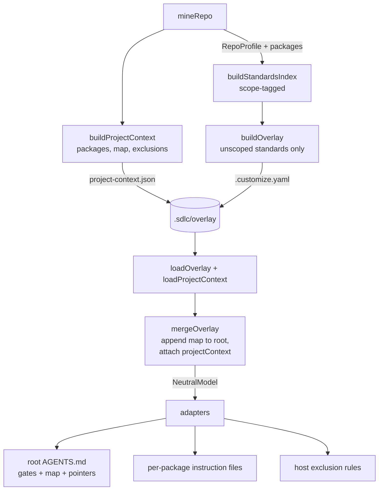

# feat: Large-repo scaling — monorepo-aware mining & layered instruction emission

## Summary

Make ai-sdlc's miner and emitters scale to large/complex repos. Today `mineRepo` returns one `RepoProfile` (one test command, one architecture) and instructions emit as a single root `AGENTS.md` that loads whole every session; the mined ignore set never reaches the host. This plan adds workspace/monorepo detection with per-package, evidence-backed mining; persists a structured **project context** across the `customize → compile` handoff; and emits **layered** instructions (lean root + per-package files), a **codebase map**, and **version-controlled exclusion rules**. Single-package repos are unchanged except for the additive map and exclusions.

---

## Problem frame

The strategy's promise — "agents follow *this* repo's stack/architecture/standards" — is delivered by mining one profile and flattening it into one root instruction file. In a monorepo this produces the exact failure the product exists to prevent, per package: one mined test command for many packages, a root file that bloats and crowds out the task, no emitted noise-reduction, and no map. See origin: `docs/brainstorms/2026-06-14-large-repo-scaling-requirements.md`.

---

## Requirements

| ID | Requirement | Units |
| --- | --- | --- |
| R1 | Detect workspaces; produce a per-package view (single-package repos → one root package, unchanged) | U1 |
| R2 | Per-package stack/test-command/linters, each citing a path inside that package | U1 |
| R3 | Mined fingerprint covers per-package data (add/remove/change package = drift) | U1 |
| R4 | Emit a per-package instruction file with that package's local conventions | U4 |
| R5 | Root holds cross-cutting only (gates + map + pointers); package standards route to package files | U2, U3, U4 |
| R6 | Emit an evidence-backed codebase map into root instructions | U3 |
| R7 | Emit host-native exclusion rules from the ignore set + generated artifacts | U5 |
| R8 | Soft, non-blocking advisory when root instructions exceed a length heuristic | U6 |
| R9 | Single-package output byte-identical to today except additive map + exclusions | U1–U5 (regression guard in each) |
| R10 | Per-package standards count toward evidence coverage and `status` | U3, U6 |

---

## Key technical decisions

1. **Per-package data is additive on `RepoProfile`.** Add `packages?: PackageProfile[]`; the existing top-level fields stay as the whole-repo aggregate, so every current caller and golden test is unaffected (R9). A flat repo yields no `packages` (or a single root entry) — identical behavior.

2. **Standards carry an optional scope.** `StandardEntry` gains `scope?: string` (a package path; absent ⇒ cross-cutting/root). One `standards-index.yaml` remains the single source for evidence coverage and drift (R10), while emission uses `scope` to route each standard to the root or a package file (R5). This resolves the core tension: counting per-package standards for the metric without re-bloating the root.

3. **A persisted `ProjectContext` carries structure across `customize → compile`.** The handoff is overlay-only today, and the overlay's flattened `standards: string[]` can't express packages/map/exclusions. `customize` writes `.sdlc/overlay/project-context.json`; `loader` loads it; `mergeOverlay` threads it onto `NeutralModel.projectContext`. Adapters read the model only (purity preserved). When absent (compile without customize), the **per-package instruction files and the map** fall back to today's output (R9); exclusion rules (U5) are additive and may still emit from the static default — see KTD 5.

4. **Root `standards` shrink to cross-cutting.** `buildOverlay`'s `standards` (which `mergeOverlay` appends to the root constitution) include only unscoped entries; scoped entries live in `ProjectContext.packages[].standards`. The full set still lands in `standards-index.yaml`.

5. **Exclusions are host-native, with honest degradation.** Claude → `permissions.deny` Read globs in `.claude/settings.json`; Cursor → `.cursorignore`; Copilot → a documented note in `copilot-instructions.md` plus a recorded `Gap` (no first-class ignore mechanism).

6. **Per-package instruction placement is per-host.** Claude → `<pkg>/CLAUDE.md`; Cursor → `<pkg>/AGENTS.md`; Copilot → `.github/instructions/<pkg-slug>.instructions.md` with an `applyTo` glob.

7. **Workspace detection is declaration-first, scan-fallback.** Prefer declared globs (npm/pnpm/yarn `workspaces`, `pnpm-workspace.yaml`, Cargo `[workspace]`, `go.work`); when none exist, a depth-bounded nested-manifest scan (reusing `WALK_DEPTH`) finds package dirs. No declaration and no nested manifests ⇒ single root package.

---

## High-level technical design

Data flow (customize mines → persists context → compile threads it → adapters emit):



Standard routing:

```
standards-index.yaml      = ALL entries (root + scoped)   → evidence coverage, drift, status
overlay.standards         = unscoped entries only         → appended to root constitution
projectContext.packages[] = scoped entries by path        → emitted to per-package files
```

---

## Implementation units

### U1. Per-package mining + workspace detection

**Goal:** `mineRepo` detects workspaces and mines each package; `RepoProfile` gains `packages`; standards become scope-aware.
**Requirements:** R1, R2, R3, R9.
**Dependencies:** none.
**Files:**
- `src/customize/repo-miner.ts` (add `PackageProfile`, `WorkspaceLayout` detection, `minePackage`, populate `RepoProfile.packages`)
- `src/customize/emitters.ts` (`StandardEntry.scope`; `buildStandardsIndex` emits per-package scoped entries)
- `tests/customize/large-repo.test.ts` (new)
- `tests/customize/repo-miner.test.ts` (extend)

**Approach:** Factor the per-root stack/test-command/linter logic into `minePackage(root, pkgDir)` returning a `PackageProfile { path, languages, frameworks, testCommand, linters, evidence }` whose evidence paths are inside `pkgDir`. Add `detectWorkspacePackages(root, fileSet)`: read root `package.json` `workspaces`, `pnpm-workspace.yaml`, `Cargo.toml [workspace]`, `go.work`; expand globs against walked dirs; fall back to a depth-bounded scan for dirs containing a recognized manifest. `mineRepo` keeps producing the aggregate top-level profile and, when ≥2 packages are found, sets `profile.packages`. `buildStandardsIndex` appends one scoped `StandardEntry` per package for its test command / linters (`scope: pkg.path`); existing root entries keep `scope` absent. The mined fingerprint already serializes the whole profile minus `root` (`stableProfileJson`), so `packages` flows into it automatically (R3).

**Patterns to follow:** existing `resolveTestCommand`, `addEvidence`, `immediateSubdirs` in `repo-miner.ts`; evidence-keying convention.

**Test scenarios:**
- Covers AE1. pnpm workspace with `packages/a` (vitest) + `packages/b` (pytest) → `profile.packages` has two entries; `a.testCommand` cites a path under `packages/a/`, `b` under `packages/b/`.
- npm `workspaces` array and `pnpm-workspace.yaml` globs both resolve packages.
- Cargo `[workspace] members` and `go.work` `use` directives resolve packages.
- No workspace declaration but nested `pyproject.toml` dirs → packages found via scan.
- Covers AE3/R9. Flat single-package TS repo → `profile.packages` undefined; aggregate fields unchanged vs prior fixture.
- Covers AE6/R3. Adding a package changes `stableProfileJson` (fingerprint differs); removing one likewise.
- `buildStandardsIndex` emits scoped entries for packages and unscoped for root; `evidenceCoverage` counts both.

### U2. ProjectContext model, persistence, and handoff plumbing

**Goal:** carry packages/map/exclusions from `customize` to adapters via a persisted artifact and `NeutralModel`.
**Requirements:** R5 (routing), R9.
**Dependencies:** U1, U3.
**Files:**
- `src/core/project-context.ts` (new — `ProjectContext`, `PackageContext`, build + serialize)
- `src/customize/emitters.ts` (`buildProjectContext(profile, standardsIndex)`)
- `src/cli/customize.ts` (write `project-context.json`; route unscoped-only standards into overlay)
- `src/core/loader.ts` (`loadProjectContext`)
- `src/core/merge.ts` (`mergeOverlay` accepts optional `ProjectContext`, attaches to model, appends map to constitution, keeps root standards unscoped)
- `src/core/types.ts` (`NeutralModel.projectContext?`)
- `src/cli/compile.ts` (load context, pass to `mergeOverlay`) — **and every other `mergeOverlay`/`buildOverlay` caller: `src/cli/smoke.ts`, `src/cli/index.ts`, `src/cli/customize.ts`**
- `tests/core/project-context.test.ts` (new)

**Approach:** `ProjectContext = { packages: PackageContext[]; map: MapEntry[]; exclusions: string[] }` where `PackageContext = { path, instructionBody, testCommand }` and `MapEntry = { path, role, sources }`. `buildProjectContext` derives packages' instruction bodies from scoped standards (KTD 2/4), the map from `profile.architecture`/`packages` (U3), and exclusions from `IGNORE_DIRS` + emitted/generated paths. `customize` writes it next to `.customize.yaml`; `buildOverlay` is changed to take only unscoped standards. The new optional `mergeOverlay(base, overlay, projectContext?)` parameter defaults to `undefined`, so callers that don't pass it (smoke's compile path, tests) keep compiling unchanged; audit all callers found above and update `compile.ts` (and the smoke `--compile` path via `runCompile`) to load and pass the context. `loadProjectContext` returns `undefined` when the file is absent (compile-without-customize), and `mergeOverlay` then behaves exactly as today (R9). When present, `mergeOverlay` appends the rendered map to `constitution` and attaches `projectContext` to the model.

**Patterns to follow:** `loadOverlay`/`EMPTY_OVERLAY` optional-load pattern; `appendStandards` in `merge.ts`; `.sdlc/overlay/` write convention in `customize.ts`.

**Test scenarios:**
- `buildProjectContext` produces one `PackageContext` per package with its test command in the body.
- `loadProjectContext` returns `undefined` for a missing file and a parsed object otherwise.
- `mergeOverlay` with context appends the map to the constitution and leaves root standards unscoped; without context, output equals the prior `mergeOverlay` (snapshot).
- Round-trip: serialize → load → deep-equal.

### U3. Codebase map building

**Goal:** build an evidence-backed map (top-level module/package → one-line role).
**Requirements:** R6, R10.
**Dependencies:** U1.
**Files:**
- `src/customize/emitters.ts` (`buildCodebaseMap(profile)` → `MapEntry[]`; rendering helper)
- `tests/customize/large-repo.test.ts` (extend)

**Approach:** From `profile.packages` (preferred) or `profile.architecture.modules`, emit one entry per top-level unit with a concise role string derived from its mined stack (e.g. "`packages/api` — TypeScript service, tests via `vitest run`") and `sources` = the directory/manifest that justifies it. Provide a markdown renderer used by `mergeOverlay` (U2) to append under a `## Codebase map` heading.

**Patterns to follow:** the architecture-standard construction already in `buildStandardsIndex`.

**Test scenarios:**
- Covers AE5. Map lists each package/module with a one-line role and a non-empty `sources` for each entry.
- Flat repo with a source root but no packages → map from `architecture.modules`.
- Genuinely flat repo (no architecture) → empty map (no `## Codebase map` heading appended).

### U4. Per-package instruction emission (layered, per-host)

**Goal:** emit nested instruction files so an agent working in a package sees that package's conventions; keep the root lean.
**Requirements:** R4, R5, R9.
**Dependencies:** U2.
**Files:**
- `src/adapters/shared/package-instructions.ts` (new — render a package instruction body from `PackageContext`)
- `src/adapters/claude-code/instructions.ts` (emit `<pkg>/CLAUDE.md` per package)
- `src/adapters/cursor/instructions.ts` (emit `<pkg>/AGENTS.md` per package)
- `src/adapters/copilot/instructions.ts` (emit `.github/instructions/<slug>.instructions.md` with `applyTo`)
- `tests/adapters/large-repo-instructions.test.ts` (new) + golden updates

**Approach:** Each instructions emitter reads `model.projectContext?.packages`. When present and non-empty, emit one nested file per package using the host's native mechanism (KTD 6). When absent/empty, emit exactly today's files (R9). Root instruction emitters are unchanged except that the root body now excludes package-scoped standards (handled upstream in U2).

**Patterns to follow:** existing `emitInstructions` in each adapter; `portableSkillPath` slug style for Copilot file names.

**Test scenarios:**
- Covers AE2. Two-package fixture → Claude emits `packages/b/CLAUDE.md` naming pytest; root `AGENTS.md` asserts no single global test command.
- Cursor emits `packages/*/AGENTS.md`; Copilot emits `.github/instructions/*.instructions.md` with correct `applyTo`.
- Covers AE3/R9. Single-package model (no `projectContext`) → emitters produce the prior golden file set exactly.

### U5. Host-native exclusion rules

**Goal:** version-controlled noise reduction reaches the agent.
**Requirements:** R7, R9.
**Dependencies:** U2.
**Files:**
- `src/adapters/claude-code/gates.ts` (add `permissions.deny` from `model.projectContext?.exclusions`)
- `src/adapters/cursor/index.ts` + new `src/adapters/cursor/ignore.ts` (emit `.cursorignore`)
- `src/adapters/copilot/instructions.ts` (append an exclusions note; record a `Gap`)
- `tests/adapters/large-repo-exclusions.test.ts` (new) + golden updates

**Approach:** Build deny/ignore globs from `projectContext.exclusions`. Claude: merge `permissions: { deny: ["Read(./node_modules/**)", ...] }` into the existing `.claude/settings.json`. Cursor: write `.cursorignore` with one glob per line. Copilot: a documented "do not search" note plus a recorded `Gap(host: copilot, capability: "exclusions", reason: "no native ignore")`. When `projectContext` is absent, fall back to the static `IGNORE_DIRS`-derived default so even compile-without-customize gets basic exclusions (additive per R9 — these files are new).

**Patterns to follow:** `emitGates` settings-object construction; `stableJson`; Gap shape in `core/types.ts`.

**Test scenarios:**
- Covers AE4. Claude settings include deny globs for `node_modules` and `dist`; Cursor `.cursorignore` contains them.
- Copilot records a `Gap` for exclusions and includes the note.
- Exclusion globs are stable/sorted (golden-stable).

### U6. Lean-root advisory + status/coverage wiring

**Goal:** surface a non-blocking root-bloat advisory; ensure per-package standards show in metrics.
**Requirements:** R8, R10.
**Dependencies:** U1, U3.
**Files:**
- `src/customize/emitters.ts` (`rootInstructionAdvisory(constitution)` length heuristic)
- `src/cli/customize.ts` + `src/cli/status.ts` (surface advisory; reflect package count)
- `src/cli/index.ts` (print advisory line)
- `tests/customize/large-repo.test.ts` (extend)

**Approach:** A pure helper returns an advisory string (or `undefined`) when the rendered root instruction body exceeds a line/char heuristic, naming that package standards can move to per-package files. CLI prints it as a non-blocking line; `ready`/`setup-ready` are untouched (R8). `status` reports package count and the (already package-inclusive) evidence coverage from U1.

**Patterns to follow:** existing `evidenceCoverage` reporting and `formatStatus`.

**Test scenarios:**
- Covers AE7. Over-long root → advisory returned; `ready` still true.
- Under-threshold root → no advisory.
- `status` on a monorepo reports >1 package and coverage including scoped standards.

---

## System-wide impact

- **Freshness/idempotency:** `packages` flows into the mined fingerprint automatically (R3); `project-context.json` is a new `.sdlc/overlay` artifact — confirm it is covered by `.gitignore`'d `.sdlc` and does not perturb the `overlay-written`/`compiled` fingerprints unless intended (it changes overlay inputs only via the unscoped-standards split).
- **Golden tests:** single-package goldens gain the additive map + exclusion files; update intentionally (R9) — never silently.
- **Capability matrix:** Copilot exclusions land as a `fallback`/gap; regenerate `docs/capability-matrix.md` if a new capability row is added.

## Scope boundaries

**In scope:** U1–U6 (S1–S5).

### Deferred to follow-up work
- Path-scoped skills, LSP emission, model-evolution config review, self-improving stop-hooks, a hard token readiness gate.
- Richer per-package framework/convention mining beyond stack/test/linters.

**Outside this product's identity:** restructuring the user's repo; building a codebase index/embedding pipeline; runtime tooling.

## Risks & dependencies

- **Workspace detection breadth.** Globs vary per ecosystem; v1 covers the declared-workspace + nested-manifest cases and degrades to single-package. Risk: exotic layouts under-detected → mitigated by the scan fallback and single-package safety.
- **Golden churn.** Additive output touches many fixtures; mitigate by gating additive files behind `projectContext` presence and updating goldens in the same unit that introduces them.
- **Root constitution append order.** Map + standards both append to the constitution; keep deterministic ordering for golden stability.

## Deferred to implementation

- Exact length heuristic value for R8.
- Copilot `applyTo` slug normalization for nested package paths.
- The static-fallback choice for exclusions when `projectContext` is absent (U5 chose to emit from static `IGNORE_DIRS`); revisit if it churns goldens more than expected.
