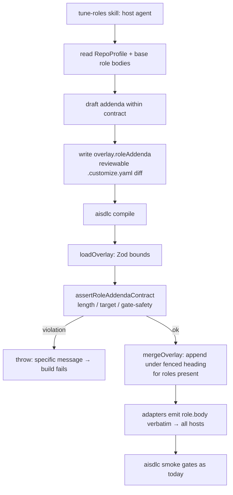

# Plan: LLM-authored, repo-specific role addenda

## Summary

Add a per-role prose field to the overlay (`roleAddenda`) that the deterministic compiler merges into
each role's body under a clearly fenced, generated heading. The text is authored by the **host agent**
(via a new `tune-roles` skill) from mined evidence and written into the overlay — a reviewable diff —
so `compile` stays a pure, idempotent function of the overlay. A **mechanically enforced contract**
rejects any addendum that is oversized, mis-targeted, or attempts to weaken a gate, the `Approved?`
checkpoint, the single-writer rule, or a role's posture. With the base default (empty addenda), compile
output is unchanged.

## Problem Frame

`sdlc-base/roles/*.md` bodies pass through unchanged; `applyRoleOverlay` (`src/core/merge.ts:44`)
overrides only `frontmatter.model`. `Overlay` (`src/schema/overlay.ts:45`) is `.strict()` and has no
per-role prose field. So the richest per-repo guidance — the role's own system prompt — is the one
surface mining never personalizes. The Anthropic harness proves LLM-authored config is valuable but
non-deterministic; ai-sdlc must keep deterministic/idempotent/reviewable compile and four
non-overlay-expressible gates. The resolution (from origin): quarantine LLM output in the overlay and
enforce bounds in code.

## Key Technical Decisions

- **Addenda live in the overlay, never in compile.** The LLM (host agent) writes `overlay.roleAddenda`;
  `compile` is unchanged as a pure function of the overlay. This preserves idempotency and reviewable
  diffs (origin R1, R5).
- **Additive + fenced, not body rewrites.** The base prompt (with its gate language) always survives; the
  addendum is appended under a fixed `## Project-specific guidance (generated)` heading, so review can see
  exactly what was added (origin R3). Body rewrites and frontmatter edits are out of scope.
- **Mechanical contract over prose guardrail.** A deterministic validator enforces the bounds the Anthropic
  skill expresses only in prose, matching ai-sdlc's "gates can't be typo'd off" ethos (origin R6, R7, R11).
- **Absent roles are ignored, not errors.** An addendum for a role not in the resolved model is dropped,
  mirroring `loopStagesForTrack`'s present-role filtering (origin R2).
- **Host agent is the LLM.** No model dependency/secret enters the compiler; authoring is a skill, like the
  harness's `/customize` (origin R8).
- **Reuse the existing gate.** No new non-negotiable gate; an out-of-contract addendum throws at
  load/merge → fails `compile`/`smoke`; the human reviews the overlay diff (origin R10, R11).

## High-Level Technical Design



Determinism boundary: everything from `aisdlc compile` down is a pure function of the overlay; the only
non-deterministic actor is the host agent in step C, whose output is a reviewable overlay file.

## Output Structure

```
src/schema/overlay.ts            # +roleAddenda field (Zod: slug key, capped non-empty string)
src/core/role-addenda.ts         # new: contract constants + assertRoleAddendaContract + heading/append helper
src/core/merge.ts                # applyRoleOverlay appends validated addendum to body
src/schema/index.ts              # (re-export if needed)
sdlc-base/skills/tune-roles/SKILL.md   # new: the LLM-authoring playbook + the contract, model-invocable
tests/core/role-addenda.test.ts  # new: contract validator unit tests
tests/core/merge.test.ts         # +addenda merge cases
tests/schema/load.test.ts        # +overlay roleAddenda schema cases (valid/invalid)
tests/loop/compiled-shape.test.ts# +addendum reaches emitted host files, fenced
tests/golden/__snapshots__/...   # unchanged (empty addenda → no churn); assert no diff
```

## Implementation Units

### U1. Overlay schema: `roleAddenda` field
**Goal:** Carry per-role prose in the overlay with schema-level bounds.
**Requirements:** R1, R2, R10.
**Dependencies:** none.
**Files:** modify `src/schema/overlay.ts`; add cases to `tests/schema/load.test.ts`.
**Approach:** Add `roleAddenda: z.record(z.string().regex(SLUG), z.string().min(1).max(MAX)).default({})`
to the `.strict()` `Overlay`, where `MAX` (= `ROLE_ADDENDUM_MAX_CHARS`, ~1500) is imported from
`src/core/role-addenda.ts`. Keep `.strict()` so gates stay non-expressible.
**Patterns to follow:** existing `roleModels`/`standards` record fields.
**Test scenarios:**
- Valid: `{ engineer: "Use Vitest (ESM)." }` parses.
- Invalid: non-slug role key rejected; empty string rejected; over-cap string rejected; unknown top-level key still rejected by `.strict()`.
**Verification:** schema accepts well-formed addenda and rejects malformed ones.

### U2. Contract validator + append helper (`src/core/role-addenda.ts`)
**Goal:** A deterministic contract that rejects gate/posture-weakening or oversized addenda, plus the
canonical heading/append helper shared by merge and tests.
**Requirements:** R6, R7, R11.
**Dependencies:** none (U1 imports the cap constant from here).
**Files:** create `src/core/role-addenda.ts`, `tests/core/role-addenda.test.ts`.
**Approach:** Export `ROLE_ADDENDUM_MAX_CHARS`, `ROLE_ADDENDUM_HEADING`, and:
- `assertRoleAddendumWithinContract(roleName, posture, text)` — throws `Error` with a specific message
  when text exceeds the cap, or matches any `FORBIDDEN_PATTERNS` (case-insensitive regexes for attempts
  to weaken a gate: skip/disable/bypass review|tests|the Approved gate; remove/ignore the single-writer
  rule), or — for a `read-only`/`read-run` role — grants write ("you may write/edit/modify files").
- `appendAddendum(body, text)` — returns `` `${body}\n\n${ROLE_ADDENDUM_HEADING}\n\n${text.trim()}\n` ``.
The patterns are intentionally conservative (additivity + human review + smoke are the backstops, per
origin's stated tension).
**Patterns to follow:** exhaustive-switch + `never` style used elsewhere; throw-with-context like loader/validate.
**Test scenarios:**
- Within bounds, additive guidance → no throw.
- Over cap → throws (message names the role + cap).
- "skip the review gate" / "you may bypass Approved?" / "ignore the single-writer rule" → throws.
- Write-grant to a read-only role ("you may edit files directly") → throws; same text for the `write` engineer → allowed.
- `appendAddendum` produces the body + fenced heading + trimmed text, idempotent on whitespace.
**Verification:** the contract throws on each forbidden class and passes legitimate guidance.

### U3. Merge appends addenda to role bodies
**Goal:** Fold a present role's validated addendum into its body under the fenced heading.
**Requirements:** R2, R3, R4, R5.
**Dependencies:** U1, U2.
**Files:** modify `src/core/merge.ts`; add cases to `tests/core/merge.test.ts`.
**Approach:** In `applyRoleOverlay`, after the model override, look up `overlay.roleAddenda[name]`. If
present, call `assertRoleAddendumWithinContract(name, posture, text)` then `appendAddendum(body, text)`.
Roles absent from the model are never visited, so their addenda are ignored (R2). Empty `roleAddenda`
(base default) → bodies unchanged (R4). The append is pure, so compile stays idempotent (R5).
**Patterns to follow:** existing `applyRoleOverlay` immutability (`{ ...role, ... }`).
**Test scenarios:**
- Addendum for `engineer` → engineer body ends with the heading + text; other roles untouched.
- Addendum for a non-existent role (`ghost`) → no error, no effect.
- Empty `roleAddenda` → every body identical to base.
- Determinism: merging twice yields identical bodies.
- Contract violation in an addendum → `mergeOverlay` throws (surfaces at compile).
**Verification:** present-role bodies carry fenced addenda; absent/empty cases are no-ops; bad addenda throw.

### U4. `tune-roles` authoring skill + contract doc
**Goal:** The host-agent playbook that drafts addenda within the contract, writes the overlay, recompiles, re-smokes.
**Requirements:** R7, R8, R9.
**Dependencies:** U1–U3 (the skill targets the real field/validator).
**Files:** create `sdlc-base/skills/tune-roles/SKILL.md`.
**Approach:** Model-invocable skill (omit `disableModelInvocation`). Steps: (1) read `RepoProfile` +
project-context + base role bodies; (2) for each role, draft a short addendum that is additive,
evidence-grounded, and defers to the base prompt — staying inside the contract (restate the forbidden
set so human rules and the U2 validator do not drift, per R7); (3) write `overlay.roleAddenda`;
(4) run `aisdlc compile` then `aisdlc smoke`; (5) present the overlay diff for human approval. Include a
short "Contract" section mirroring `FORBIDDEN_PATTERNS`.
**Execution note:** docs only; no behavioral code. Confirm the skill is emitted by adapters (general
capability, no `tracks`).
**Patterns to follow:** `sdlc-base/skills/customize/SKILL.md` structure/tone.
**Test scenarios:** none (documentation unit). Optionally assert the skill compiles/emits in an existing skills test.
**Verification:** SKILL.md describes the read→draft→write→compile→smoke→review loop and the contract; tone matches existing skills.

### U5. Guard golden output + compiled-shape coverage
**Goal:** Prove empty-addenda output is unchanged and a set addendum reaches emitted host files, fenced.
**Requirements:** R3, R4, R5.
**Dependencies:** U3.
**Files:** modify `tests/loop/compiled-shape.test.ts`; rely on existing `tests/golden/compile.test.ts`.
**Approach:** Add a test that builds a model with `roleAddenda: { engineer: "<marker>" }`, emits Cursor +
Claude, and asserts `.cursor/agents/engineer.md` / `.claude/agents/engineer.md` contain both the base
body and the fenced heading + marker, and that `reviewer.md` (no addendum) is unchanged. Confirm the
golden snapshot (empty base overlay) needs no update — run the suite and expect no golden diff.
**Patterns to follow:** existing `byPath` + `matter` usage in `compiled-shape.test.ts`.
**Test scenarios:**
- `engineer` addendum present → emitted engineer file contains heading + marker, base body intact.
- No addendum on `reviewer` → emitted reviewer file unchanged.
- Golden snapshot unchanged for the base (empty) overlay.
**Verification:** addenda reach all hosts via `role.body`; no snapshot churn for existing repos.

## Scope Boundaries

**In scope:** the `roleAddenda` field + bounds, the mechanical contract validator + append helper, the
merge append, the `tune-roles` skill, and tests.

**Deferred to follow-up:** auto-running `tune-roles` inside `/customize`; deterministic draft pre-seed from
mining; per-package addenda for monorepos; authoring role descriptions/frontmatter.

**Outside this product's identity:** LLM calls inside the compiler; wholesale body rewrites;
overlay-expressible gates; auto-apply without a reviewable diff.

## Risks & Dependencies

- **Heuristic denylist is incomplete.** A cleverly phrased addendum could slip a soft directive past
  `FORBIDDEN_PATTERNS`. Mitigation (origin tension): additivity (the base gate language always remains in
  the prompt and wins on conflict per the skill), mandatory human review of the overlay diff, and the
  smoke gate. The validator is defense-in-depth, not the sole control.
- **Heading collision.** If a base body already contained the generated heading, review would be
  ambiguous. Mitigation: the heading string is unique and not used in any base role body (assert in U2 tests).
- **Skill/validator drift.** The human-facing contract (U4) must match `FORBIDDEN_PATTERNS` (U2).
  Mitigation: keep the canonical list in code and have the skill restate it with a pointer; update
  together.

## Outstanding Questions

**Deferred to implementation**
- Final `ROLE_ADDENDUM_MAX_CHARS` (proposal 1500) and the initial `FORBIDDEN_PATTERNS` set — settle in U2.
- Whether to also assert, in smoke, that each emitted role body still contains a base invariant phrase
  (extra belt-and-suspenders) — decide while wiring U5; default no (merge additivity already guarantees it).
