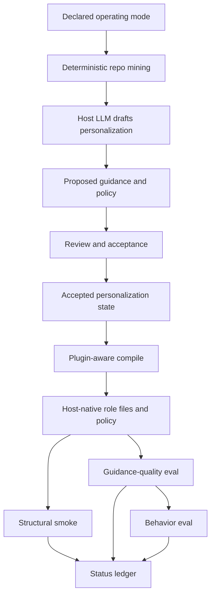
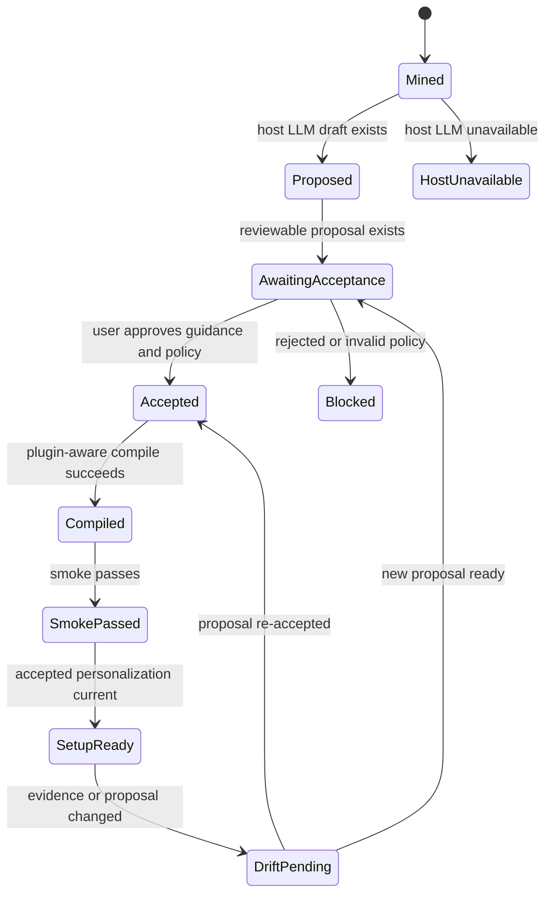

# feat: Add plugin-first LLM personalization

## Summary

Add Plugin Mode as a first-class setup path: `/customize` and compile can use the host LLM to propose richer role guidance and project-adaptable workflow policy, while accepted personalization remains reviewable and drift-aware. The plan adds proposed/accepted personalization state, plugin-only LLM-assisted compile, updated setup/status semantics, and staged guidance-quality plus behavior-level evals.

---

## Problem Frame

ai-sdlc currently treats repo adaptation as deterministic mining plus deterministic compile. LLM-authored role prose exists only as optional `tune-roles` overlay addenda, and the current contract blocks the gate/posture changes that the new product direction explicitly allows.

The new requirements redefine ai-sdlc as a plugin for coding tools where host model access is expected. That makes model-authored project fit part of the core setup path, not a follow-up, and it moves quality verification from file-shape checks toward guidance usefulness and agent behavior.

---

## Requirements

**Plugin-host LLM integration**

- R1. Plugin Mode exposes a host LLM invocation boundary that `/customize`, compile, and eval can use without introducing standalone provider configuration as the default.
- R2. `/customize` runs automatic LLM personalization after deterministic mining and records proposed role guidance plus proposed workflow-policy changes.
- R3. Compile has a plugin-only LLM-assisted path that can synthesize emitted guidance from accepted state and current evidence without activating unaccepted proposals.
- R4. Missing host LLM access in Plugin Mode blocks setup with a visible status reason.

**Personalization and policy state**

- R5. The project records proposed and accepted personalization separately so re-runs show drift without overwriting accepted guidance.
- R6. Accepted personalization can include rich per-role guidance and structured Project-Adaptable Workflow Policy.
- R7. Policy changes to gates, postures, or review flow are structured deltas with evidence-backed rationale, not hidden prose inside addenda.
- R8. Existing `roleAddenda` survive `/customize` re-runs and migrate into the richer personalization model without silent loss.

**Setup, compile, and status**

- R9. Plugin Mode setup-ready requires accepted personalization, enforceable accepted policy, and smoke pass.
- R10. Status reports structural readiness, personalization proposal/acceptance, policy acceptance, compile freshness, guidance eval, and behavior eval as separate signals.
- R11. Role personalization state covers every active base role, not only Architect.
- R12. Deterministic mode remains available for legacy paths, but deterministic compile is not a Plugin Mode invariant.

**Evaluation**

- R13. Guidance-quality eval checks grounding, role specificity, useful detail, generic-output failure, and policy rationale.
- R14. Behavior eval compares generic and personalized agents on pinned scenarios for module selection, test-command choice, risk recognition, and review-flow adherence.
- R15. Eval output keeps structural validity, guidance quality, and behavior improvement independent.
- R16. The test runner and eval harness avoid known worker teardown instability so failures are attributable to product behavior.

---

## Key Technical Decisions

- **Proposed/accepted state is the drift backbone.** The round-trip editable config pattern already protects mined standards and user-owned overlay edits; plugin personalization needs the same separation so fresh LLM output never silently replaces accepted policy.
- **Mode is persisted, not guessed.** Plugin Mode must be a declared project operating mode read by customize, compile, smoke, status, and docs; existing deterministic repos keep the old invariants unless they opt into Plugin Mode.
- **Accepted state is the only merge input.** Proposed LLM output is review material and drift signal only; `mergeOverlay`, adapters, smoke, and setup-ready consume accepted guidance and accepted workflow policy.
- **Proposals live outside the compile fingerprint.** Accepted personalization belongs with project-owned setup state, while machine-regenerated proposals should not make compile stale until accepted.
- **Policy changes get a typed channel.** Gate and posture changes are allowed in Plugin Mode, but they must be reviewable as structured policy deltas with rationale instead of bypassing validators through prose.
- **Workflow policy keeps an absolute safety floor.** Plugin Mode can lighten gates and change postures, but it must still fail closed for unknown MCP access, preserve at least one review path for write-capable changes, keep a test gate before shipping, and prevent hidden prose from granting capabilities.
- **Compile is mode-aware.** Deterministic compile remains useful for existing flows and tests, while Plugin Mode gets an LLM-assisted compile path whose output is still tied to proposed/accepted artifacts.
- **Customize owns proposals; compile owns emission.** Compile may use the host LLM in Plugin Mode, but it must not mutate accepted policy or activate new proposals without acceptance.
- **Policy resolves before adapters.** Project-Adaptable Workflow Policy is resolved into the Neutral Model; adapters emit or degrade that resolved policy instead of inventing host-local policy behavior.
- **Skills orchestrate host-model access first.** The current repo has no TypeScript host LLM API, but skills already run in the coding-tool context; the plan starts with a host invocation port that can be backed by skill orchestration and later by adapter hooks.
- **Eval is staged.** Guidance-quality checks are deterministic and cheap, so they land before behavior scenarios that involve agent judgment, baseline comparison, and potential flake/cost.
- **Behavior eval is not local setup-ready in v1.** Local Plugin Mode setup-ready requires accepted personalization, enforceable accepted policy, and smoke; behavior eval is a separately reported quality gate for corpus/CI and release confidence.

---

## High-Level Technical Design

---

## Implementation Units

### U12. Operating Mode Declaration

- **Goal:** Persist whether a project is running deterministic mode or Plugin Mode before any setup command branches.
- **Requirements:** R1, R4, R9, R12.
- **Dependencies:** none.
- **Files:** `src/schema/overlay.ts`, `src/cli/customize.ts`, `src/cli/compile.ts`, `src/cli/status.ts`, `src/smoke/harness.ts`, `tests/schema/load.test.ts`, `tests/customize/setup-chain.test.ts`, `tests/golden/compile.test.ts`.
- **Approach:** Add an explicit project operating mode with deterministic as the default for existing repos. `customize`, compile, smoke, status, and docs read the same mode value so Plugin Mode blockers do not leak into deterministic repos and deterministic snapshots stay stable.
- **Patterns to follow:** Existing `defaultTrack` overlay configuration and strict schema defaults.
- **Test scenarios:**
  - Existing overlays without a mode behave as deterministic mode.
  - Plugin Mode requires host LLM availability and accepted personalization before setup-ready.
  - Deterministic mode golden and corpus tests do not require personalization artifacts.
  - Status reports the active mode and uses mode-appropriate blockers.
- **Verification:** Every setup command branches on one persisted mode source instead of inferring mode from incidental files.

### U1. Personalization State Model

- **Goal:** Add proposed and accepted personalization state for role guidance and workflow policy.
- **Requirements:** R5, R6, R7, R8.
- **Dependencies:** U12.
- **Files:** `src/schema/overlay.ts`, `src/customize/emitters.ts`, `src/customize/setup-state.ts`, `src/cli/phase-fingerprints.ts`, `tests/schema/load.test.ts`, `tests/customize/customize.test.ts`, `docs/solutions/design-patterns/round-trip-editable-generated-config.md`.
- **Approach:** Extend the overlay or a sibling `.sdlc` artifact with separate proposed and accepted personalization sections. Preserve existing `roleAddenda` on re-run, migrate it into accepted guidance where possible, and add drift comparison between proposed and accepted state.
- **Technical design:** Use explicit field ownership: mined standards are regenerated, user-owned overlay fields are preserved, proposed personalization is machine-regenerated, and accepted personalization is user-approved. Proposed artifacts live outside the accepted compile fingerprint. Acceptance is a separate atomic transaction that stamps the evidence fingerprint and invalidates compile, smoke, and eval phases.
- **Patterns to follow:** Round-trip editable generated config in `docs/solutions/design-patterns/round-trip-editable-generated-config.md`; standards drift in `src/customize/emitters.ts`.
- **Test scenarios:**
  - Existing `roleAddenda` remain present after `runCustomize` re-runs with unchanged repo evidence.
  - A new proposed personalization differs from accepted state and is reported as drift without overwriting accepted state.
  - Empty proposed state with usable mined evidence is represented as incomplete personalization.
  - Old overlays without personalization fields parse and receive defaults.
  - Legacy `roleAddenda` migrate idempotently into accepted guidance without duplicating or truncating text.
  - Conflicting legacy `roleAddenda` and accepted guidance block setup-ready with a named integrity conflict.
  - A host LLM failure leaves accepted personalization and user-owned overlay fields unchanged.
- **Verification:** Re-running customize preserves accepted personalization and surfaces proposal drift.

### U2. Project-Adaptable Workflow Policy

- **Goal:** Represent Plugin Mode gate, posture, and review-flow changes as structured, reviewable policy.
- **Requirements:** R6, R7, R12.
- **Dependencies:** U1.
- **Files:** `src/schema/overlay.ts`, `src/core/types.ts`, `src/core/role-addenda.ts`, `src/core/merge.ts`, `src/core/loop.ts`, `src/adapters/shared/roles.ts`, `tests/core/role-addenda.test.ts`, `tests/loop/compiled-shape.test.ts`.
- **Approach:** Split ordinary role guidance from workflow policy. Keep hidden gate/posture changes invalid in prose guidance, but allow accepted structured policy deltas with rationale and evidence to alter resolved roles, postures, gates, or review flow in Plugin Mode. Model policy changes as an enumerated delta catalog with risk classes so high-risk gate, posture, and MCP-scope changes receive stricter validation and acceptance.
- **Technical design:** Define an absolute Plugin Mode safety floor before any LLM proposal can activate: unknown MCP access fails closed, write-capable changes retain a review path, a test gate remains before shipping, and prose guidance cannot grant capabilities absent from accepted structured policy.
- **Patterns to follow:** Role posture resolution in adapters; track-aware loop shaping in `src/core/loop.ts`.
- **Test scenarios:**
  - A prose addendum that attempts to weaken a gate without a structured policy delta fails validation.
  - A structured policy delta that removes every review path for write-capable work fails validation.
  - A posture or MCP-scope expansion without evidence references and security-impact rationale fails validation.
  - An accepted structured posture change updates emitted role policy for supported hosts.
  - A structured review-flow change updates handoff metadata and status.
  - Policy rationale is required for every accepted gate, posture, or review-flow change.
  - Conflicting accepted policy deltas for the same role or gate fail before merge.
- **Verification:** Policy changes are visible as structured state and affect emitted host config only after acceptance.

### U3. Host LLM Invocation Port

- **Goal:** Define the host-model boundary used by `/customize`, compile, and eval in Plugin Mode.
- **Requirements:** R1, R4.
- **Dependencies:** U12, U1.
- **Files:** `src/host/`, `src/cli/customize.ts`, `src/cli/compile.ts`, `src/schema/skill.ts`, `sdlc-base/skills/customize/SKILL.md`, `tests/customize/setup-chain.test.ts`.
- **Approach:** Introduce a small host invocation interface that can be backed by coding-tool skill orchestration first and adapter hooks later. Skills may invoke the host model, but persistence flows through CLI-owned validation and acceptance primitives so direct file writes cannot bypass schemas, policy safety floors, or dual-channel validation. Plugin Mode fails closed when no host model is available, while deterministic mode keeps the current no-model behavior.
- **Patterns to follow:** Skill frontmatter model invocation defaults in `src/schema/skill.ts`; current separation between CLI commands and skills.
- **Test scenarios:**
  - Plugin Mode with no host invocation reports a personalization blocker and does not claim setup-ready.
  - Deterministic mode with no host invocation follows the existing customize behavior.
  - A mocked host invocation returns a proposed personalization artifact.
  - Host invocation failures are reported without corrupting accepted personalization state.
- **Verification:** Plugin Mode can distinguish "model unavailable" from "model produced a proposal."

### U4. Automatic Customize Personalization

- **Goal:** Fold the LLM role-tuning step into `/customize` first-run orchestration.
- **Requirements:** R2, R4, R9.
- **Dependencies:** U1, U3.
- **Files:** `sdlc-base/skills/customize/SKILL.md`, `sdlc-base/skills/tune-roles/SKILL.md`, `src/cli/customize.ts`, `tests/customize/setup-chain.test.ts`, `tests/adapters/skills.test.ts`.
- **Approach:** Remove the model-disabled customize assumption for Plugin Mode, run personalization after mining, present proposed guidance and policy for acceptance, and keep `tune-roles` as a refinement or alias rather than the first-run path. Add an explicit acceptance primitive so proposed guidance and policy are promoted by a validated action rather than an implicit skill file write.
- **Patterns to follow:** Existing resumable phase copy in `sdlc-base/skills/customize/SKILL.md`; `tune-roles` evidence-grounding instructions.
- **Test scenarios:**
  - Plugin Mode customize produces proposed personalization after mining.
  - Accepted personalization is required before the setup chain can finish in Plugin Mode.
  - `tune-roles` no longer contradicts automatic first-run personalization.
  - Re-running customize with unchanged evidence short-circuits only after accepted personalization is current.
- **Verification:** `/customize` in Plugin Mode no longer leaves useful role guidance as a separate manual step.

### U5. Plugin-Aware Compile

- **Goal:** Add an LLM-assisted compile path for Plugin Mode while preserving deterministic mode.
- **Requirements:** R3, R9, R12.
- **Dependencies:** U1, U2, U3.
- **Files:** `src/cli/compile.ts`, `src/core/merge.ts`, `src/core/engine.ts`, `src/cli/phase-fingerprints.ts`, `tests/golden/compile.test.ts`, `tests/core/merge.test.ts`.
- **Approach:** Compile reads accepted personalization and can invoke the host LLM in Plugin Mode to synthesize emitted guidance tied to accepted anchors. Compile does not own proposal refresh in v1; proposal generation remains in customize so compile cannot become a second acceptance surface. Deterministic mode remains the snapshot-friendly path; Plugin Mode compile records model-derived output fingerprints so drift is visible.
- **Patterns to follow:** Compile freshness in `src/cli/compile.ts`; project-context threading through `mergeOverlay`.
- **Test scenarios:**
  - Deterministic compile snapshots remain stable without Plugin Mode.
  - Plugin Mode compile uses accepted personalization when present.
  - Plugin Mode compile with stale evidence produces pending proposal drift rather than silently activating new text.
  - Compile reports missing host LLM as a Plugin Mode blocker.
  - Compile output cannot include a proposed policy change that has not been accepted.
  - Compile-time LLM output re-runs prose-vs-accepted-policy validation before emit.
- **Verification:** Compile supports both old deterministic behavior and new plugin-personalized behavior without conflating their freshness rules.

### U6. Setup-Ready And Status Ledger

- **Goal:** Make readiness and status reflect personalization, policy acceptance, and eval state.
- **Requirements:** R4, R9, R10, R11.
- **Dependencies:** U12, U1, U2, U3, U4, U5.
- **Files:** `src/cli/status.ts`, `src/smoke/harness.ts`, `src/customize/setup-state.ts`, `src/cli/phase-fingerprints.ts`, `tests/customize/setup-state.test.ts`, `tests/smoke/smoke.test.ts`, `tests/customize/deeper-mining.test.ts`.
- **Approach:** Extend the phase ledger with personalization proposal, personalization acceptance, policy acceptance, guidance eval, and behavior eval states. In Plugin Mode, setup-ready requires accepted personalization, enforceable accepted policy, and smoke; eval state is reported separately. Accepted personalization is current only when its acceptance fingerprint matches the current load-bearing mined evidence and user-owned setup state.
- **Patterns to follow:** `setupReady` vs `alignmentReady` split in `src/cli/status.ts`; stale-phase propagation in setup state.
- **Test scenarios:**
  - Plugin Mode with smoke pass but pending personalization is not setup-ready.
  - Plugin Mode with accepted personalization and smoke pass is setup-ready even if behavior eval has not run.
  - Plugin Mode with accepted policy that a target host cannot enforce is not setup-ready unless a compensating control is accepted.
  - Status reports each active role's personalization state.
  - Status distinguishes no host LLM, pending proposal, accepted policy, stale compile, guidance-eval failure, and behavior-eval failure.
  - Corrupt or missing Plugin Mode acceptance records fail closed rather than implying readiness.
- **Verification:** Status no longer presents structurally valid but unpersonalized plugin output as complete.

### U7. Guidance-Quality Eval

- **Goal:** Add deterministic evaluation for generated guidance quality.
- **Requirements:** R13, R15, R16.
- **Dependencies:** U1, U2, U11.
- **Files:** `src/eval/guidance-quality.ts`, `src/cli/index.ts`, `tests/eval/guidance-quality.test.ts`, `tests/fixtures/sample-repos/`.
- **Approach:** Add an eval surface that scores generated guidance for evidence grounding, role specificity, useful detail, generic-output failure, and policy rationale. Output separate guidance-quality status so structural smoke cannot hide guidance failures.
- **Patterns to follow:** Semantic corpus assertions in `tests/corpus/corpus-regression.test.ts`; evidence coverage helpers in `src/customize/emitters.ts`.
- **Test scenarios:**
  - Guidance with repo evidence and distinct role instructions passes.
  - Generic guidance with no repo signals fails even if compile succeeds.
  - Policy change without rationale fails.
  - Guidance or policy rationale containing literal secret patterns fails before persistence or emit.
  - Guidance-quality failure is reflected in status separately from smoke.
- **Verification:** Guidance artifacts can fail quality before any behavior-level agent run.

### U8. Behavior-Level Eval

- **Goal:** Add pinned behavior scenarios comparing generic and personalized agents.
- **Requirements:** R14, R15, R16.
- **Dependencies:** U7, U11.
- **Files:** `src/eval/behavior-scenarios.ts`, `src/cli/index.ts`, `tests/eval/behavior-scenarios.test.ts`, `tests/corpus/corpus-regression.test.ts`, `tests/fixtures/sample-repos/`.
- **Approach:** Use fixture repos and pinned scenario prompts to compare decisions from generic vs personalized agents. Define the v1 runner explicitly as recorded or mocked structured agent decisions before adding live host-model scenarios, so CI has a stable baseline. Keep the first slice narrow: module selection, test-command choice, risk recognition, and review-flow adherence.
- **Patterns to follow:** Temp-repo fixture setup in corpus tests; staged semantic assertions instead of byte snapshots.
- **Test scenarios:**
  - Personalized guidance improves module selection for a fixture with known primary source roots.
  - Personalized guidance selects the mined test command where the generic baseline does not.
  - Reviewer behavior flags a fixture's known risk surface.
  - Review-flow scenario follows accepted workflow policy rather than the base default.
  - Behavior eval reports inconclusive or failed without changing structural readiness.
- **Verification:** Behavior eval can show whether generated guidance improves agent decisions over a baseline.

### U9. Adapter And Smoke Policy Enforcement

- **Goal:** Make host adapters and smoke validation respect accepted Plugin Mode workflow policy.
- **Requirements:** R7, R9, R10, R12.
- **Dependencies:** U2, U5, U6.
- **Files:** `src/adapters/cursor/`, `src/adapters/claude-code/`, `src/adapters/copilot/`, `src/smoke/harness.ts`, `src/smoke/canned-task.ts`, `tests/adapters/gates.test.ts`, `tests/adapters/agents.test.ts`, `tests/adapters/instructions.test.ts`.
- **Approach:** Thread accepted policy through the neutral model before adapter emission. Update smoke expectations to read resolved policy instead of assuming base postures and review flow always hold. Add enforceability checks so degraded hosts either block setup-ready or require accepted compensating controls for high-risk policy changes.
- **Patterns to follow:** Adapter capability degradation notes; `buildRolePolicy` and Copilot handoff generation.
- **Test scenarios:**
  - Cursor and Claude outputs reflect an accepted posture change where the host supports it.
  - Copilot reports honest degradation when a policy change cannot be enforced natively.
  - Smoke passes for accepted policy that differs from the base default.
  - Smoke fails when emitted host config contradicts accepted policy.
  - Runtime gate scripts and role-policy metadata match the accepted policy fingerprint.
- **Verification:** Policy adaptation is not just documented; it changes emitted host behavior where supported.

### U10. Documentation And Concept Alignment

- **Goal:** Update docs, skills, templates, and glossary language to match Plugin Mode.
- **Requirements:** R1-R16.
- **Dependencies:** U1-U9.
- **Files:** `CONCEPTS.md`, `templates/overlay/README.md`, `sdlc-base/AGENTS.md`, `sdlc-base/skills/customize/SKILL.md`, `sdlc-base/skills/tune-roles/SKILL.md`, `docs/capability-matrix.md`.
- **Approach:** Replace blanket "gates can never weaken" language with deterministic-mode vs Plugin Mode distinctions. Document setup-ready semantics, policy acceptance, and eval signals.
- **Patterns to follow:** Existing glossary style in `CONCEPTS.md`; skill tone in `sdlc-base/skills/customize/SKILL.md`.
- **Test scenarios:**
  - Skill parsing still succeeds after frontmatter and copy changes.
  - Capability matrix or host docs mention honest degradation for unsupported policy adaptation.
  - Docs no longer contradict Plugin Mode policy adaptation.
- **Verification:** A future implementer sees one coherent product model across docs and emitted instructions.

### U11. Test Runner Reliability

- **Goal:** Make eval and setup verification results trustworthy in local and CI environments.
- **Requirements:** R16.
- **Dependencies:** none.
- **Files:** `vitest.config.ts`, `package.json`, CI configuration if present, `tests/eval/`.
- **Approach:** Confirm that eval tests run under the stable forked Vitest configuration and isolate any remaining worker teardown failures. Keep R16 as a release blocker for behavior eval gating.
- **Patterns to follow:** Existing `vitest.config.ts` fork-pool mitigation.
- **Test scenarios:**
  - The guidance-quality eval suite completes without worker teardown errors.
  - The behavior eval suite can run independently from the full suite.
  - CI or local verification reports eval failures as product failures, not runner teardown noise.
- **Verification:** Eval can be trusted as a quality signal.

---

## System-Wide Impact

- **Product identity:** Plugin Mode supersedes the earlier "compile is always deterministic" and "gates are never weakenable" assumptions.
- **Compatibility:** Deterministic mode remains important for existing tests, snapshots, and non-plugin paths.
- **Review posture:** Gate/posture changes become allowed product behavior, so acceptance artifacts and status must be auditable.
- **Security posture:** LLM-generated policy is untrusted until validated, accepted, and proven enforceable on the target host.
- **Host parity:** Not every host can enforce every policy change equally; adapters must report degradation honestly.
- **Testing:** Golden snapshots remain useful for deterministic mode, while Plugin Mode relies on semantic, guidance-quality, and behavior-level assertions.

---

## Scope Boundaries

### Deferred To Follow-Up Work

- Non-plugin parity when no host LLM is available.
- Standalone multi-provider LLM configuration outside coding tools.
- Large external corpus automation beyond checked-in and manually runnable corpus paths.
- Fully unattended policy mutation with no acceptance point.

### Outside This Product's Identity

- Preserving deterministic compile as a Plugin Mode invariant.
- Treating base gates and role postures as impossible to weaken in Plugin Mode.
- Claiming setup quality from structural smoke alone.

---

## Risks & Dependencies

- **Non-determinism risk:** Plugin Mode compile can vary with model output. Proposed/accepted artifacts and fingerprints mitigate silent drift.
- **Policy safety risk:** Weakening gates or expanding postures can make agents too permissive. Typed policy deltas, rationale, acceptance, and adapter smoke checks make the change visible.
- **Structured bypass risk:** Moving gate/posture changes into a typed channel removes the old prose denylist as the main defense. The safety floor, risk-classed deltas, dual-channel validation, and enforceability checks replace it.
- **State integrity risk:** Proposed artifacts, accepted artifacts, legacy addenda, and setup phases can disagree. U1 and U6 make accepted-only merge, atomic acceptance, conflict blockers, and downgrade-safe migration explicit.
- **Flaky eval risk:** Behavior-level agent evals can be costly or unstable. Guidance-quality eval lands first, and behavior eval starts as a corpus/CI gate rather than local setup-ready.
- **Migration risk:** Existing `roleAddenda` can be clobbered by current customize re-runs. U1 fixes preservation before depending on richer personalization state.
- **Host parity risk:** Cursor, Claude Code, and Copilot do not expose identical enforcement capabilities. Adapter degradation must be explicit in emitted config and status.
- **Privacy risk:** Personalization artifacts may contain repo paths, internal names, and interview answers. Status and CI output should report summaries unless verbose output is requested, and generated artifacts must not persist literal secrets.
- **Prompt-injection risk:** Mined repo evidence is untrusted model input. Host prompts, guidance-quality eval, and policy validation should ignore instruction-like content in evidence and require resolvable evidence references for high-risk deltas.

---

## Acceptance Examples

- AE1. Given Plugin Mode with host LLM access, when `/customize` runs on a repo with useful mined evidence, then proposed role guidance and policy appear for review before setup-ready can pass.
- AE2. Given accepted personalization and changed repo evidence, when `/customize` re-runs, then new proposed guidance is reported as drift without overwriting accepted guidance.
- AE3. Given a structured accepted posture change, when compile emits host config, then supported adapters reflect the changed posture and unsupported hosts report degradation.
- AE4. Given smoke pass and pending personalization acceptance in Plugin Mode, when status runs, then setup-ready is false and the blocker names personalization acceptance.
- AE5. Given accepted personalization, enforceable accepted policy, and smoke pass but no behavior eval run, when status runs, then setup-ready is true and behavior eval is reported as not run.
- AE6. Given generic generated guidance with no evidence-backed role-specific content, when guidance-quality eval runs, then it fails even if compile and smoke pass.
- AE7. Given a pinned corpus scenario, when behavior eval compares generic and personalized outputs, then it reports structural, guidance-quality, and behavior-improvement signals independently.
- AE8. Given legacy `roleAddenda` and no accepted personalization fields, when customize migrates the overlay, then accepted guidance contains the prior addenda and deterministic-mode merge output is unchanged.
- AE9. Given an LLM proposal that removes every review path for write-capable work, when policy validation runs, then the proposal is rejected before acceptance.
- AE10. Given accepted policy and a host that cannot enforce it, when status runs, then setup-ready is blocked or a documented compensating control is required.
- AE11. Given prose guidance that grants write access while structured policy keeps the role read-only, when compile runs, then validation fails before emit.
- AE12. Given generated guidance or policy rationale containing literal secret patterns, when validation runs, then persistence and emit are blocked until the text is redacted.

---

## Documentation / Operational Notes

- Update `sdlc-base/skills/customize/SKILL.md` after the model invocation and acceptance paths exist so the skill does not promise behavior the CLI cannot support.
- Keep `sdlc-base/skills/tune-roles/SKILL.md` as a refinement path only after first-run personalization lands.
- Update `CONCEPTS.md` and `templates/overlay/README.md` together so the Base/Overlay/Constitution language does not contradict Plugin Mode.
- Treat behavior eval as release or corpus confidence until it is cheap and stable enough for ordinary local setup.

---

## Sources / Research

- `docs/brainstorms/2026-06-29-plugin-first-llm-personalization-requirements.md`
- `STRATEGY.md`
- `CONCEPTS.md`
- `docs/solutions/design-patterns/round-trip-editable-generated-config.md`
- `docs/brainstorms/2026-06-14-llm-authored-role-addenda-requirements.md`
- `docs/plans/2026-06-14-003-feat-deeper-mining-and-metrics-plan.md`
- `docs/plans/2026-06-14-005-feat-llm-authored-role-addenda-plan.md`
- `sdlc-base/skills/customize/SKILL.md`
- `sdlc-base/skills/tune-roles/SKILL.md`
- `src/schema/overlay.ts`
- `src/customize/emitters.ts`
- `src/cli/customize.ts`
- `src/cli/compile.ts`
- `src/cli/status.ts`
- `src/core/role-addenda.ts`
- `src/core/merge.ts`
- `tests/corpus/corpus-regression.test.ts`
- `vitest.config.ts`
