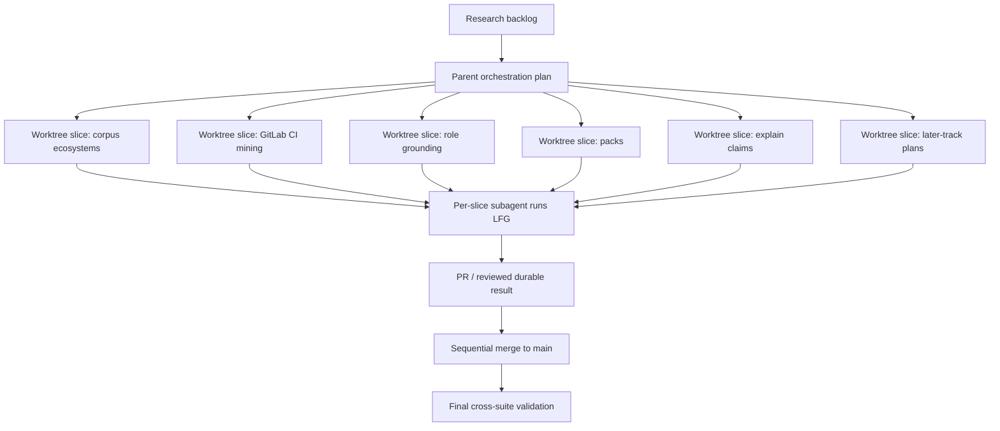

# feat: Execute improvement backlog through worktree LFG slices

## Summary

Run the ranked agent/language/tooling improvement backlog as separate, reviewable implementation slices. Each slice uses an isolated git worktree, delegates implementation to a subagent that follows the full `lfg` pipeline, and merges back to `main` only after validation is durable.

---

## Problem Frame

The research note identified ten possible improvements, but several are independently shippable and some are broad enough to become later discovery work. Running them in the current checkout would risk mixing unrelated diffs, invalidating review boundaries, and trampling existing local changes. The execution plan needs worktree isolation, per-slice LFG discipline, and merge sequencing that preserves the repo's evidence-backed strategy.

The product strategy prioritizes hands-off setup rate, lower blocking gaps, evidence coverage, and no-op re-runs. The first implementation wave should therefore prefer changes that improve validated ecosystem coverage, mined setup quality, and generated role usefulness before broader speculative host packaging or framework detection.

---

## Requirements

### Execution Isolation

- R1. Each improvement point runs in its own git worktree and branch so unrelated changes cannot mix.
- R2. Each implementation subagent must load and follow `lfg` end to end for its slice, including its own plan, work, review, tests, commit, PR, CI watch, and residual recording where applicable.
- R3. The parent orchestration merges a slice to `main` only after that slice has produced a durable reviewed result.
- R4. Existing uncommitted work in the original checkout must not be reverted or swept into slice commits.
- R4a. A reusable `/lfg` invocation must perform worktree isolation before writing its plan so the plan itself lands on the feature branch.

### Improvement Coverage

- R5. The execution must cover all ten research takeaways either as implementation work or an explicit deferred plan when a takeaway is too large for a safe first slice.
- R6. First-wave implementation should prioritize corpus coverage, non-GitHub CI mining, deterministic role grounding, missing reference packs, and stable evidence explanation.
- R7. Broad ecosystem/tool detection must be gated by fixtures and corpus expectations rather than unsupported manifest strings.

### Verification

- R8. Each slice must include focused tests for its changed behavior and run the relevant repository checks before merge.
- R9. Cross-slice regressions must be caught by running the full suite after each merge batch or before final completion.
- R10. Residual review findings or CI failures must be recorded durably before a slice is considered complete.

---

## Key Technical Decisions

- **Worktree-per-slice execution:** The implementation surface spans tests, miner heuristics, roles, packs, adapters, and docs. A worktree boundary is the simplest way to keep each point reviewable and avoid current-checkout pollution. The reusable `/lfg` workflow should treat this as a startup preflight before `ce-plan`, not as an optional implementation-time cleanup.
- **Wave-based ordering:** Corpus coverage and CI mining land before broad framework detection because they expand the safety net. Role grounding and packs land next because they improve generated agent usefulness without depending on external host changes.
- **Deferred-plan treatment for large research items:** Behavior Eval v2, context memory, host packaging, and broad framework detection are substantial. Their first LFG slice should create a narrow implementation or a dedicated plan/spike rather than attempting a full platform in one branch.
- **Merge only after slice validation:** Worktree branches are merged to `main` sequentially after each slice's LFG outcome is reviewed, pushed, and green enough to be durable.
- **No hidden base-role expansion:** New domain reviewers should be delivered through packs. Base role grounding can expand, but base role count should stay stable unless a later plan proves otherwise.

---

## High-Level Technical Design

---

## Implementation Units

### U1. Orchestration Preflight

- **Goal:** Establish a clean execution model before launching implementation work.
- **Requirements:** R1, R2, R3, R4, R4a
- **Dependencies:** None
- **Files:** `docs/plans/2026-06-29-004-feat-lfg-improvement-backlog-plan.md`
- **Approach:** Record the worktree/LFG contract in this plan and use it as the parent runbook for subsequent subagents. Confirm current branch state before creating worktrees and keep existing uncommitted changes out of implementation branches.
- **Patterns to follow:** Existing plan documents in `docs/plans/`; existing research artifact in `docs/ideation/2026-06-29-agent-language-tooling-improvements-research.md`.
- **Test scenarios:** Test expectation: none -- this unit is orchestration documentation only.
- **Verification:** The plan exists and names the execution, validation, and merge constraints.

### U2. Corpus-Gate Existing New Ecosystems

- **Goal:** Promote current Go, Rust, JVM, Ruby, and .NET sample fixtures into semantic corpus expectations.
- **Requirements:** R5, R6, R7, R8
- **Dependencies:** U1
- **Files:** `tests/corpus/corpus-expectations.ts`, `tests/corpus/corpus-regression.test.ts`, `tests/corpus/behavior-eval.ts`, `tests/corpus/behavior-eval.test.ts`, `tests/fixtures/sample-repos/**`
- **Approach:** Launch a dedicated worktree subagent whose slice is the second ranked opportunity from the research note. The subagent should run full `lfg`, produce or reuse a slice-specific plan, add semantic assertions for the existing ecosystem fixtures, and avoid changing miner behavior unless a fixture exposes a real bug.
- **Patterns to follow:** Current `CorpusExpectation` shape, existing setup-ready/alignment-ready assertions, and the already implemented language-mining plan.
- **Test scenarios:** Each promoted fixture asserts language/toolchain signals, test-command provenance, setup readiness, architecture confidence where applicable, and role guidance content. Negative cases must preserve the rule that bare test directories do not infer a runner.
- **Verification:** Focused corpus tests pass and the full test suite remains green after merge.

### U3. Mine GitLab CI Test Commands

- **Goal:** Add evidence-backed GitLab CI test-command mining before expanding to other CI systems.
- **Requirements:** R5, R6, R7, R8
- **Dependencies:** U2 preferred
- **Files:** `src/customize/repo-miner.ts`, `tests/customize/customize.test.ts`, `tests/fixtures/sample-repos/**`, `docs/plans/2026-06-29-002-feat-broaden-repo-miner-languages-plan.md`
- **Approach:** Launch a dedicated worktree subagent for the third ranked opportunity. The subagent should parse `.gitlab-ci.yml` `script` blocks, prioritize test/CI jobs, reuse existing test-command extraction and ecosystem gating, and preserve GitHub Actions behavior.
- **Patterns to follow:** Existing `resolveTestCommand`, `testCommandFromWorkflow`, `TEST_TOOL`, and evidence provenance conventions.
- **Test scenarios:** A GitLab fixture with an evidenced primary test command becomes hands-off setup-ready; a mixed-language GitLab fixture does not pick a minority-ecosystem command; malformed or non-test GitLab jobs leave the test-command gap open.
- **Verification:** Focused customize tests pass, corpus tests still pass, and status reports CI provenance for GitLab-mined commands.

### U4. Add Deterministic Grounding for Non-Architect Roles

- **Goal:** Give Tester, Reviewer, Engineer, and Debugger role outputs deterministic repo facts that match their responsibilities.
- **Requirements:** R5, R6, R8
- **Dependencies:** U2
- **Files:** `src/core/role-grounding.ts`, `src/core/engine.ts`, `src/adapters/shared/roles.ts`, `src/cli/status.ts`, `tests/adapters/agents.test.ts`, `tests/core/**`, `tests/corpus/**`, `sdlc-base/roles/*.md`
- **Approach:** Launch a dedicated worktree subagent for the fourth ranked opportunity. Start with Tester grounding as the smallest useful slice, then extend the internal shape so other base roles can gain grounding without duplicating prose.
- **Patterns to follow:** Existing deterministic Architect grounding and `roleStates` reporting.
- **Test scenarios:** Tester output includes root and package-local test commands when known, includes CI provenance where relevant, and remains generic when setup evidence is low. Status reports role grounding beyond Architect without falsely marking LLM-authored addenda as deterministic.
- **Verification:** Adapter golden tests and corpus behavior scenarios prove the new role guidance carries actionable test signals.

### U5. Add Missing Reference Packs

- **Goal:** Add first-class pack breadth for mobile and at least one data/ML or compliance slice.
- **Requirements:** R5, R6, R8
- **Dependencies:** U1
- **Files:** `packs/README.md`, `packs/mobile/**`, `packs/data-ml/**`, `packs/compliance/**`, `docs/packs.md`, `tests/packs/reference-packs.test.ts`, `README.md`
- **Approach:** Launch separate worktree subagents for the fifth and sixth ranked opportunities unless the first pack is small enough to land alone. Each subagent must run `lfg`, create pack manifests, roles, skills, and tests using the existing additive pack contract.
- **Patterns to follow:** `packs/frontend`, `packs/backend-api`, `packs/security`, `packs/infra`.
- **Test scenarios:** New packs load without duplicate names, compile with the base, emit expected roles and skills, and do not require credentials by default.
- **Verification:** Reference pack tests pass and README examples no longer mention nonexistent packs.

### U6. Add Stable Claim-Key Explain

- **Goal:** Let users explain stable mined claims such as test command and architecture without relying on numbered standards.
- **Requirements:** R5, R6, R8
- **Dependencies:** U2, U3 preferred
- **Files:** `src/cli/explain.ts`, `src/customize/emitters.ts`, `src/customize/repo-miner.ts`, `src/core/project-context.ts`, `tests/cli/**`, `README.md`, `CONCEPTS.md`
- **Approach:** Launch a dedicated worktree subagent for the seventh ranked opportunity. Implement `aisdlc explain test-command` and `aisdlc explain architecture` first, with positive evidence and known uncertainty reasons. Defer every possible claim key until those are validated.
- **Patterns to follow:** Existing numbered `explain` behavior and evidence coverage/status output.
- **Test scenarios:** A ready repo explains the selected test command and provenance; a low-confidence architecture repo explains why no primary map was emitted; existing numeric explain remains compatible.
- **Verification:** CLI tests cover stable keys and existing explain behavior.

### U7. Plan or Spike Behavior Eval v2

- **Goal:** Convert the first ranked opportunity into a safe first implementation slice rather than a broad host automation platform.
- **Requirements:** R5, R8, R10
- **Dependencies:** U2
- **Files:** `tests/corpus/behavior-eval.ts`, `tests/corpus/behavior-eval.test.ts`, `docs/plans/**`, `docs/ideation/2026-06-29-agent-language-tooling-improvements-research.md`
- **Approach:** Launch a dedicated worktree subagent. The subagent should use `lfg` to either implement one read-only host-agent scenario harness or produce a deeper plan if execution depends on missing host automation primitives.
- **Patterns to follow:** Current deterministic behavior scenarios and the research note's "one host, one read-only task class" first slice.
- **Test scenarios:** If implementation proceeds, compare generic guidance vs emitted guidance on one fixture without mutating the repo. If planning only, include acceptance criteria that future work can verify.
- **Verification:** The slice produces durable tests or a durable plan, with residual blockers recorded.

### U8. Defer Large Tracks with Dedicated Plans

- **Goal:** Cover context memory, host packaging, and broad framework/tool detection without forcing unsafe scope into the first wave.
- **Requirements:** R5, R7, R10
- **Dependencies:** U1
- **Files:** `docs/plans/**`, `docs/ideation/2026-06-29-agent-language-tooling-improvements-research.md`
- **Approach:** Launch one or more worktree subagents that run `lfg` against the eighth, ninth, and tenth ranked opportunities. Each subagent should produce a narrow implementation if obvious, or a dedicated plan that names fixtures, host contracts, and test gates before code.
- **Patterns to follow:** Existing plan style and the rejection notes in the research artifact.
- **Test scenarios:** Test expectation: none if the slice produces only plans. If code is changed, each slice must add focused tests matching its changed behavior.
- **Verification:** Every deferred track has a written, reviewable plan or a deliberately small validated implementation.

### U9. Sequential Merge and Cross-Suite Validation

- **Goal:** Merge completed worktree branches back to `main` without losing reviewability or introducing cross-slice regressions.
- **Requirements:** R3, R4, R8, R9, R10
- **Dependencies:** U2, U3, U4, U5, U6, U7, U8 as available
- **Files:** No planned source file changes; merge outcomes derive from completed worktree branches.
- **Approach:** Merge only one completed slice at a time. After each merge, run focused checks for the touched area; after the final selected batch, run the full suite. If conflicts appear, resolve them in the merge context without reverting unrelated user work.
- **Patterns to follow:** Repository commit and PR conventions inferred by each slice's `lfg` run.
- **Test scenarios:** The merged `main` branch retains all per-slice tests and passes the full suite.
- **Verification:** `main` contains only validated slice commits, CI residuals are recorded, and local status is understandable.

---

## Scope Boundaries

- This plan does not require landing all ten improvements as code in one branch.
- This plan does not permit implementation subagents to bypass `lfg`; every slice must run its own full LFG workflow.
- This plan expects `/lfg` to create or reuse a feature-specific worktree before its plan step. If isolation fails, the run should stop for an explicit decision instead of continuing in the caller's current checkout.
- This plan does not hide unsupported host capability gaps, especially Copilot's Approved? gate limitations.
- This plan does not add broad language/tool detection without fixtures and semantic expectations.

### Deferred to Follow-Up Work

- Full multi-host live agent evaluation beyond the first read-only behavior scenario.
- CircleCI, Jenkins, and Azure Pipelines parsing after GitLab CI lands.
- Full context-memory infrastructure after accepted-learning semantics are planned.
- Cursor plugin packaging and organization-level distribution after core setup quality improves.

---

## Risks & Dependencies

- **Large parallelism risk:** Multiple subagents may touch overlapping tests or docs. Sequential merge and conflict resolution are required.
- **CI/runtime cost:** Full LFG per point can be expensive. The first wave should prioritize implementation units with clear value and bounded scope.
- **Host automation uncertainty:** Behavior Eval v2 may need host-specific harness support not present in this repo. The first slice may legitimately produce a deeper plan instead of broad code.
- **Dirty checkout risk:** The original checkout already has uncommitted files. Worktrees must isolate implementation from those changes.

---

## Sources & Research

- `docs/ideation/2026-06-29-agent-language-tooling-improvements-research.md`
- `docs/plans/2026-06-29-002-feat-broaden-repo-miner-languages-plan.md`
- `docs/plans/2026-06-29-003-feat-corpus-behavior-validation-plan.md`
- `STRATEGY.md`
- `CONCEPTS.md`

