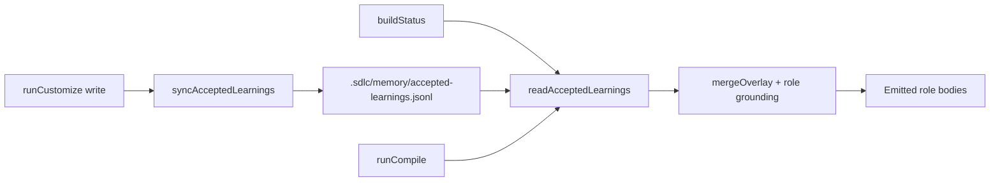

# feat: Accepted learnings ledger (context memory v1)

## Summary

Add a small, deterministic, reviewable ledger under `.sdlc/memory/` for accepted project learnings derived from customize outputs — not free-form chat memory. Surface the ledger in `status` and inject a bounded summary into emitted role guidance during compile.

---

## Problem Frame

Research item 8 calls for evidence-linked, accepted learnings that agents can reuse across sessions without an append-only chat transcript. The repo already captures gate outcomes and gated standards deltas in `src/core/memory.ts`, but there is no unified, typed ledger for human-accepted setup facts (test-command corrections, demoted architecture roots, newly accepted standards) that `status` and compile can read deterministically.

The parent backlog plan (U8) treats full context-memory infrastructure as deferred unless a narrow first slice is safe. This plan scopes a v1 ledger that reuses existing customize provenance and JSONL patterns.

---

## Requirements

- R1. Store accepted learnings as typed, evidence-linked entries in `.sdlc/memory/accepted-learnings.jsonl` — no free-form chat blobs.
- R2. Record learnings only from deterministic customize/miner sources: test-command answers + provenance, demoted architecture roots, and newly added standards on drift.
- R3. Entries dedupe by stable `key`; re-sync is idempotent.
- R4. `buildStatus` / `formatStatus` report ledger count and a compact summary of accepted claims.
- R5. Compile merges a bounded accepted-learnings section into relevant base roles (architect, engineer, tester).
- R6. Focused unit tests cover persistence, sync, status surfacing, and role grounding.
- R7. Defer retrieval ranking, behavior-eval coupling, overlay schema changes, and gate-history promotion.

---

## Key Technical Decisions

- **JSONL under `.sdlc/memory/`:** Matches existing gate history / standards-delta pattern in `src/core/memory.ts`; append-only with keyed upsert on sync keeps the log reviewable in git.
- **Sync at customize write time:** Learnings are derived when `runCustomize` writes overlay output, using the same profile, overlay, and drift objects already computed — no new interview surface.
- **Status reads, never writes:** `inspectRepo` / `buildStatus` remain read-only; ledger mutations happen only in customize sync (and future explicit record APIs).
- **Role injection at merge:** `mergeOverlay` accepts optional accepted learnings read by compile/smoke from `sdlcDir`, keeping merge pure aside from the passed array.
- **No overlay schema change:** Interview answers and gap provenance stay in `.customize.yaml`; the ledger is a derived artifact, not a second source of truth.

---

## High-Level Technical Design

---

## Implementation Units

### U1. Ledger schema and persistence

- **Goal:** Define typed accepted-learning entries and JSONL read/write with keyed upsert.
- **Requirements:** R1, R3
- **Dependencies:** None
- **Files:** `src/core/accepted-learnings.ts`, `tests/memory/accepted-learnings.test.ts`
- **Approach:** Export `AcceptedLearningEntry`, `AcceptedLearningKind`, `readAcceptedLearnings`, `upsertAcceptedLearning`, `ACCEPTED_LEARNINGS_FILE`. Reuse corrupt-line tolerance from `memory.ts`. Keys like `test-command`, `architecture:docs`, `standard:<hash>`.
- **Patterns to follow:** `src/core/memory.ts` JSONL helpers.
- **Test scenarios:** Upsert replaces same key; corrupt line skipped; empty ledger returns [].
- **Verification:** Memory tests pass.

### U2. Customize sync

- **Goal:** Derive ledger entries from customize outputs when overlay is written.
- **Requirements:** R2, R3
- **Dependencies:** U1
- **Files:** `src/core/accepted-learnings-sync.ts`, `src/cli/customize.ts`, `tests/memory/accepted-learnings-sync.test.ts`
- **Approach:** `syncAcceptedLearningsFromCustomize(sdlcDir, profile, overlay, standardsIndex, drift)` records test-command (when answer present), each `architecture.demotedRoots` entry, and each `drift.added` standard with index sources. Call from `runCustomize` inside the `!fresh` write block.
- **Patterns to follow:** `resolveGapClosureProvenance` provenance values in `src/schema/overlay.ts`.
- **Test scenarios:** Interview test-command creates ledger entry with `interview` provenance; miner-closed command uses `miner`/`ci`; demoted roots recorded; added standards recorded on re-run drift.
- **Verification:** Sync tests pass; customize re-run is idempotent.

### U3. Status surfacing

- **Goal:** Expose ledger summary on `aisdlc status`.
- **Requirements:** R4
- **Dependencies:** U1
- **Files:** `src/cli/status.ts`, `tests/cli/status.test.ts`, `tests/customize/deeper-mining.test.ts` (if assertions need extending)
- **Approach:** Add `acceptedLearnings: { count: number; claims: string[] }` to `StatusReport`. Read ledger in `buildStatus`. Print `Accepted learnings (N):` with up to 5 claims in `formatStatus`.
- **Patterns to follow:** Existing gap-closure provenance formatting in `formatStatus`.
- **Test scenarios:** After customize on a fixture with test command, status shows count ≥ 1 and claim text; empty repo shows count 0.
- **Verification:** Status tests pass.

### U4. Role guidance injection

- **Goal:** Surface accepted learnings in emitted role bodies during compile.
- **Requirements:** R5
- **Dependencies:** U1
- **Files:** `src/core/role-grounding.ts`, `src/core/merge.ts`, `src/cli/compile.ts`, `src/cli/smoke.ts`, `tests/core/merge.test.ts`
- **Approach:** Add `appendAcceptedLearnings(role, entries)` with per-role kind filter and char cap. Extend `mergeOverlay` optional 4th arg. Compile/smoke read ledger from `sdlcDir` and pass through.
- **Patterns to follow:** Existing `appendArchitectGrounding` heading and cap discipline.
- **Test scenarios:** Merge with test-command learning injects claim into tester body; architect receives architecture-demotion entries; no learnings leaves roles unchanged.
- **Verification:** Merge tests pass.

### U5. Vocabulary

- **Goal:** Document the ledger concept in the project glossary.
- **Requirements:** R1
- **Dependencies:** U1
- **Files:** `CONCEPTS.md`
- **Approach:** Add **Accepted Learning Ledger** entry under Customize or Process gates.
- **Test scenarios:** Test expectation: none — glossary only.
- **Verification:** Entry present and consistent with implementation.

---

## Scope Boundaries

- No free-form chat memory, vector retrieval, or top-k similarity search.
- No changes to gate hook behavior or standards-delta approval flow in this slice.
- No behavior-eval v2 coupling (deferred per research roadmap cluster 5).
- No overlay `.customize.yaml` schema fields for learnings.

### Deferred to Follow-Up Work

- Ranked retrieval and behavior-eval proof that selected learnings help agents.
- Promoting ledger entries into skills (`/ce-compound` style).
- Recording gate-outcome patterns into the ledger automatically.
- Stable claim-key `explain` integration for ledger entries.

---

## Risks & Dependencies

- **Duplicate truth:** Ledger is derived from overlay/miner; manual edits to JSONL could drift. Mitigation: sync upserts known keys on each customize write; document ledger as derived.
- **Role body growth:** Bounded caps per role prevent unbounded constitution bloat.
- **Corpus regressions:** Corpus harness uses `buildStatus`; new fields must remain backward compatible.

---

## Sources & Research

- `docs/ideation/2026-06-29-agent-language-tooling-improvements-research.md` (item 8)
- `docs/plans/2026-06-29-004-feat-lfg-improvement-backlog-plan.md` (U8)
- `src/core/memory.ts`, `src/cli/status.ts`, `src/core/role-grounding.ts`
