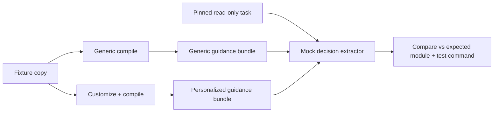

# feat: Behavior eval v2 read-only host-agent scenario

## Summary

Add a deterministic Behavior Eval v2 harness for one host (Cursor), one read-only task class (localization: where to change and which test command to run), comparing generic base compile output against personalized `customize → compile` guidance — without invoking a host LLM or mutating fixture repos.

---

## Problem Frame

Behavior Eval v1 (`tests/corpus/behavior-eval.ts`) scores whether generated artifacts contain expected module and test-command strings. That validates preconditions but not whether guidance would steer an agent toward the right read-only decisions. Host LLM automation is not yet available in this repository, so the first v2 slice uses a mocked structured decision extractor over emitted Cursor guidance surfaces, establishing a CI-stable baseline before live agent traces.

---

## Requirements

| ID | Requirement |
|----|-------------|
| R1 | One host only: Cursor (`AGENTS.md`, `.cursor/agents/architect.md`, overlay standards). |
| R2 | One read-only task class: localization — "where should I change X and what test command should I run?" |
| R3 | Compare generic guidance (base compile, no customize mining) vs personalized guidance (full corpus setup). |
| R4 | No host LLM calls, no repo writes beyond existing temp-fixture copy + setup pipeline. |
| R5 | Pinned scenario on `python-rags` proves personalized guidance wins and generic guidance fails. |
| R6 | Harness is extensible for future scenarios and live host traces without changing v1 scaffold. |

---

## Key Technical Decisions

- **Mock agent, not live host.** Follow plugin-first plan U8: recorded/mock structured decisions before live host-model scenarios. The mock agent scores candidate modules and test commands from weighted guidance surfaces deterministically.
- **Generic baseline = base-only compile.** `runGenericSetup` compiles `sdlc-base` into a temp fixture copy without `/customize`, yielding constitution and Architect role without mined map, standards, or grounding.
- **Separate v2 module.** Keep `behavior-eval.ts` as v1 artifact signal scoring; add `behavior-eval-v2.ts` for generic-vs-personalized decision comparison.
- **Cursor host bundle.** Read the same surfaces corpus tests already use for Cursor: constitution, architect agent, standards index, and `project-context.json`.

---

## High-Level Technical Design

---

## Implementation Units

### U1. Generic setup helper

- **Goal:** Produce a generic guidance bundle from base-only compile on a fixture copy.
- **Files:** `tests/corpus/corpus-harness.ts`
- **Approach:** Add `runGenericSetup(root)` mirroring artifact reads from `runSetup` but skipping `runCustomize`.
- **Test scenarios:** Generic setup emits constitution and architect without mined map rows or repo-specific standards.
- **Verification:** Helper returns readable Cursor artifacts without throwing on missing overlay files.

### U2. Behavior eval v2 harness

- **Goal:** Mock read-only localization decisions and compare generic vs personalized guidance.
- **Files:** `tests/corpus/behavior-eval-v2.ts`, `tests/corpus/behavior-eval-v2.test.ts`
- **Approach:** Define pinned scenario, weighted surface scoring for module/test-command candidates, and pass/improvement flags.
- **Test scenarios:**
  - Personalized guidance selects `src` and `pytest` for the python-rags localization task.
  - Generic guidance does not select both correctly.
  - Improvement flag is true (personalized passes, generic fails).
- **Verification:** `npm test -- tests/corpus/behavior-eval-v2.test.ts` passes.

---

## Scope Boundaries

- No live Cursor/Claude/Copilot/Codex agent invocation in this slice.
- No mutation tasks, approval-path scoring, or multi-host parity.
- v1 behavior-eval tests remain unchanged.

### Deferred to Follow-Up Work

- Live host LLM trace capture and flake controls.
- Additional fixtures (monorepo package selection, FastAPI/Vite avoid-path scenarios).
- CLI `aisdlc eval behavior` surface and status reporting integration.

---

## Risks & Dependencies

- Mock scoring is a proxy for agent behavior; document limits clearly in module docstring.
- Depends on existing corpus harness and python-rags fixture remaining setup-ready.

---

## Sources & Research

- `docs/ideation/2026-06-29-agent-language-tooling-improvements-research.md` (ranked item 1)
- `docs/plans/2026-06-29-004-feat-lfg-improvement-backlog-plan.md` (U7)
- `docs/plans/2026-06-29-003-feat-corpus-behavior-validation-plan.md` (v1 scaffold)
- `docs/plans/2026-06-29-001-feat-plugin-first-llm-personalization-plan.md` (U8 mock-first approach)
