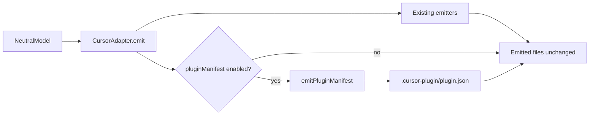

# feat: Emit Cursor plugin manifest for compiled host artifacts

## Summary

Add an opt-in Cursor adapter path that emits a `.cursor-plugin/plugin.json` manifest pointing at the existing compiled artifact layout (`.cursor/agents`, `.agents/skills`, `.cursor/hooks.json`, `.cursor/mcp.json`). This is the first slice of the Host Packaging and Distribution track: distribution metadata without restructuring emitted paths or claiming marketplace-ready packaging.

---

## Problem Frame

Cursor now supports distributable plugins bundling rules, skills, agents, hooks, and MCP servers. ai-sdlc already emits a compatible in-repo Cursor layout, but compile output lacks the plugin manifest that Cursor uses for discovery and distribution. Teams cannot treat compiled output as a plugin bundle without hand-authoring manifest metadata.

The parent backlog plan (U8) treats host packaging as a deferred track: first slice should be narrow and contract-tested, not a full distribution platform. Official Cursor docs allow manifest fields to reference explicit component paths, so we can add manifest emission without relocating existing adapter outputs.

---

## Requirements

- R1. Cursor compile may optionally emit `.cursor-plugin/plugin.json` when enabled via host manifest options.
- R2. Default compile behavior is unchanged (manifest off unless opted in).
- R3. Manifest `name` satisfies Cursor kebab-case constraints; optional override via host options.
- R4. Manifest references existing emitted paths only — no duplicate component trees in this slice.
- R5. Tests assert manifest shape, path wiring, and schema validation for enabled/disabled modes.
- R6. Document companion files and deferred packaging work (marketplace, native plugin directory layout, Codex/Copilot bundles).

---

## Key Technical Decisions

- **Opt-in via host manifest:** Follow the existing `options.copilot.gateMode` pattern with `options.cursor.pluginManifest` (default `false`). Keeps deterministic snapshots and corpus fixtures stable.
- **Explicit path manifest, not layout migration:** Cursor docs permit `"agents"`, `"skills"`, `"hooks"`, and `"mcpServers"` path overrides. Point at current `.cursor/*` and `.agents/skills` outputs rather than introducing parallel `agents/` / `skills/` plugin-root trees.
- **Fixed default plugin identity:** Default `name` is `ai-sdlc` with a stable description/version string derived from compile metadata. Per-repo naming is deferred until overlay carries an explicit plugin identity field.
- **Honest gaps:** `.cursor/permissions.json`, `.cursor/sdlc/role-policy.json`, and hook scripts under `.cursor/hooks/` remain companion enforcement artifacts outside the manifest schema. Constitution (`AGENTS.md`) is not mapped to plugin `rules/` in v1 because plugin rules expect `.mdc` frontmatter; AGENTS.md continues to be read natively by Cursor.

---

## High-Level Technical Design

---

## Implementation Units

### U1. Host manifest option schema

- **Goal:** Declare the Cursor plugin manifest toggle and optional name override in the host manifest schema.
- **Requirements:** R1, R2, R3
- **Dependencies:** None
- **Files:** `src/schema/host-manifest.ts`, `tests/schema/load.test.ts`
- **Approach:** Extend `HostOptions` with a strict `cursor` object: `pluginManifest` boolean defaulting to `false`, optional `pluginName` slug.
- **Test scenarios:**
  - Host manifest without cursor options parses with manifest disabled.
  - Host manifest with `options.cursor.pluginManifest: true` parses and preserves the flag.
  - Invalid `pluginName` values fail schema validation.
- **Verification:** Schema load tests cover new options without breaking existing manifests.

### U2. Cursor plugin manifest emitter

- **Goal:** Produce a valid `.cursor-plugin/plugin.json` referencing compiled component paths.
- **Requirements:** R1, R3, R4
- **Dependencies:** U1
- **Files:** `src/adapters/cursor/plugin-manifest.ts`, `src/adapters/cursor/index.ts`
- **Approach:** Add `emitPluginManifest(model)` returning one `EmittedFile`. Wire it in `CursorAdapter.emit` when `model.manifest.options?.cursor?.pluginManifest` is true. Manifest includes `name`, `displayName`, `description`, `version`, and path fields for agents, skills, hooks, and mcpServers.
- **Test scenarios:**
  - With option enabled, compile output includes `.cursor-plugin/plugin.json`.
  - Manifest JSON references `.cursor/agents`, `.agents/skills`, `.cursor/hooks.json`, `.cursor/mcp.json`.
  - With option disabled, manifest file is absent.
  - Custom `pluginName` appears in manifest `name`.
- **Verification:** Focused adapter test file passes; golden/corpus behavior unchanged when option is off.

### U3. Documentation and packaging contract notes

- **Goal:** Record the v1 packaging contract, companion files, and deferred distribution tracks.
- **Requirements:** R6
- **Dependencies:** U2
- **Files:** `README.md` (compile section), `docs/plans/2026-06-29-005-feat-cursor-plugin-manifest-plan.md` (this file — scope boundaries)
- **Approach:** Document how to enable manifest emission, what paths are referenced, and what remains for marketplace/Codex/Copilot packaging follow-ups.
- **Test scenarios:** Test expectation: none — documentation only.
- **Verification:** README mentions opt-in flag and points to deferred tracks.

---

## Scope Boundaries

- No marketplace manifest (`.cursor-plugin/marketplace.json`).
- No relocation of emitted files to plugin-native root directories.
- No Codex `.codex-plugin/` or Copilot org-profile packaging in this slice.
- No runtime validation that Cursor IDE loads the manifest (structural contract tests only).

### Deferred to Follow-Up Work

- Plugin-native directory layout (`rules/`, `agents/`, `skills/` at repo root) for marketplace submission.
- Mapping constitution to plugin rules (`.mdc` conversion or dual emission).
- Per-repo plugin identity in overlay (display name, author, repository URL).
- Organization-level Copilot agent profile bundles.
- Codex project config packs.

---

## Risks & Dependencies

- **Cursor loader behavior:** Manifest path references are documented but not verified by live IDE loading in CI. Structural tests and official schema alignment mitigate false confidence.
- **Hooks format drift:** `.cursor/hooks.json` includes a `version` field for IDE hooks; plugin docs show a hooks object without `version`. Manifest points at the existing file; if Cursor plugin parsing rejects the shape, a follow-up may need a plugin-specific hooks copy.
- **permissions.json gap:** Global MCP allowlist remains a companion file outside the manifest until Cursor documents inclusion.

---

## Sources & Research

- `docs/ideation/2026-06-29-agent-language-tooling-improvements-research.md` (item 9)
- `docs/plans/2026-06-29-004-feat-lfg-improvement-backlog-plan.md` (U8 deferred track)
- [Cursor Plugins reference](https://cursor.com/docs/reference/plugins)
- Existing Cursor adapter emitters under `src/adapters/cursor/`
