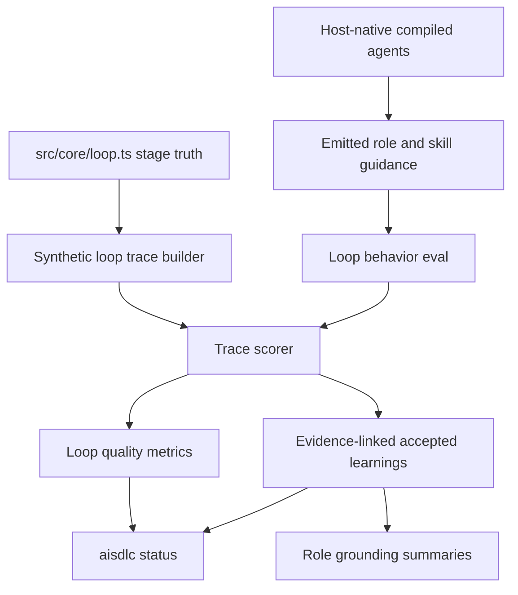

# feat: Agent loop quality metrics and bounded role gates

## Summary

Add a deterministic loop-quality layer for the existing host-native SDLC compiler: canonical trace events, offline loop-behavior scoring, bounded role operating loops, evaluator-optimizer gate guidance, loop-derived accepted learnings, and status metrics that make agent-loop quality visible without introducing a custom runtime orchestrator.

---

## Problem Frame

Recent agent-loop and agentic SDLC research converges on short bounded loops, separate evaluator roles, trace-based scoring, explicit human gates, and evidence-linked memory. `ai-sdlc` already compiles host-neutral roles and skills into Cursor, Claude Code, Copilot, and Codex, and it already evaluates setup readiness and some behavior-level localization signals. The missing layer is loop compliance: whether emitted agents are guided toward the right role sequence, gate behavior, evaluator handbacks, and learning surfaces.

This plan implements the first offline, deterministic slice. It reinforces the current product architecture: compile to host-native dispatch and evaluate emitted artifacts plus synthetic traces. Live host-agent execution, LangGraph-style orchestration, and unbounded Reflexion memory stay out of scope.

---

## Requirements

- R1. Preserve host-native dispatch as the runtime boundary; do not add a custom SDLC orchestrator or long-running agent runner inside `src/`.
- R2. Define a canonical loop trace and score schema that can represent plan, handoff, tool, test, approval, review, replan, done, and stuck events.
- R3. Add offline loop-behavior evaluation that scores stage order, role ownership, approval-gate placement, tester/reviewer verdicts, and retry/escalation behavior from deterministic traces or emitted guidance.
- R4. Strengthen base role prompts and `/sdlc-loop` with a bounded operating loop: plan three to five steps, act, observe, then choose `continue`, `replan`, `escalate`, or `done` within a small retry budget.
- R5. Make Tester and Reviewer explicit evaluator-optimizer gates with structured pass/fail verdicts, actionable handbacks to Engineer, and max-loop escalation guidance.
- R6. Extend accepted learnings with evidence-linked loop-derived entries without storing free-form chat memory.
- R7. Surface loop-quality metrics in `aisdlc status`, including role grounding completeness, handoff coverage, gate coverage, behavior-eval pass counts, and accepted loop learnings.
- R8. Cover the new behavior with focused unit and corpus tests that remain offline and CI-stable.

---

## Key Technical Decisions

- **No new runtime orchestrator:** The repo remains a compiler and evaluator. Runtime execution stays in host-native surfaces emitted by adapters, and new code lives in eval/schema/status paths rather than a competing agent runner.
- **Synthetic traces before live traces:** Trace scoring starts with deterministic synthetic traces derived from `loopStagesForTrack`, role postures, and behavior scenarios. This gives stable regression tests before host LLM automation is available.
- **Trace schema under `src/eval`:** Loop traces are evaluation artifacts rather than persisted product state in this slice. Persistence remains optional JSONL helpers only where accepted learnings need durable records.
- **Prompt changes paired with eval assertions:** Bounded-loop and evaluator-gate guidance must be asserted in emitted role/skill bodies so prompt quality does not regress silently.
- **Reflection memory stays evidence-linked:** Accepted learnings may record review findings, test corrections, and bench residuals only when they have a stable key and evidence source. No free-form chat transcript or vector retrieval is introduced.

---

## High-Level Technical Design

---

## Implementation Units

### U1. Canonical loop trace schema and scorer

- **Goal:** Represent and score loop execution without needing a live host-agent run.
- **Requirements:** R1, R2, R3, R8
- **Dependencies:** None
- **Files:** `src/eval/loop-trace.ts`, `src/eval/loop-score.ts`, `tests/eval/loop-trace.test.ts`, `tests/eval/loop-score.test.ts`, `CONCEPTS.md`
- **Approach:** Define discriminated trace event types for `plan_created`, `handoff`, `tool_attempt`, `test_run`, `approval_gate`, `review_verdict`, `replan`, `done`, and `stuck`. Add `scoreLoopTrace(trace, expected)` with deterministic metrics for stage order, role ownership, gate-before-wrap-up, tester-before-reviewer on standard/full tracks, and terminal status.
- **Patterns to follow:** Exhaustive TypeScript unions in `src/core/loop.ts`; JSONL tolerance patterns in `src/core/memory.ts` if helper persistence is needed.
- **Test scenarios:**
  - A standard-track trace with Architect, Engineer, Tester, Reviewer in order scores as pass.
  - A trace where Engineer writes before approval or wrap-up without an approval gate records a gate violation.
  - A trace where Reviewer runs before Tester on standard track records a handoff-order violation.
  - Exhaustive switch handling fails to compile if a new event type lacks scoring behavior.
- **Verification:** New eval tests pass and `CONCEPTS.md` defines loop trace and loop-quality score vocabulary.

### U2. Offline loop-behavior eval scenarios

- **Goal:** Extend behavior eval from localization signals to loop compliance decisions.
- **Requirements:** R3, R8
- **Dependencies:** U1
- **Files:** `tests/corpus/loop-behavior-eval.ts`, `tests/corpus/loop-behavior-eval.test.ts`, `tests/corpus/behavior-eval-v2.ts`, `tests/corpus/behavior-eval-v2.test.ts`, `tests/corpus/corpus-harness.ts`
- **Approach:** Add deterministic scenarios for role choice, stage order, approval-gate path, and evaluator handback behavior. Keep the first slice Cursor-focused because existing v2 guidance bundles are Cursor-only, but design types so additional hosts can be added without changing scenario shape.
- **Patterns to follow:** `tests/corpus/behavior-eval-v2.ts` weighted guidance bundle and generic-vs-personalized comparison.
- **Test scenarios:**
  - A standard-track fixture expects Tester before Reviewer and an Approved? checkpoint before wrap-up.
  - A quick-track fixture expects Engineer to hand directly to Reviewer and does not require Tester.
  - A task that asks "who verifies this?" selects Tester, not Engineer or Reviewer.
  - A failing test scenario expects Tester to hand actionable failures to Engineer instead of writing a fix.
- **Verification:** Loop-behavior tests pass without host LLM calls or fixture mutation beyond existing temp setup copies.

### U3. Bounded operating loop guidance

- **Goal:** Make base roles use short, inspectable loops rather than open-ended execution.
- **Requirements:** R4, R8
- **Dependencies:** None
- **Files:** `sdlc-base/skills/sdlc-loop/SKILL.md`, `sdlc-base/roles/architect.md`, `sdlc-base/roles/engineer.md`, `sdlc-base/roles/tester.md`, `sdlc-base/roles/reviewer.md`, `sdlc-base/roles/debugger.md`, `tests/loop/compiled-shape.test.ts`, `tests/loop/role-guidance.test.ts`
- **Approach:** Add a shared "Operating loop" section that asks each role to plan three to five immediate steps, act, observe real feedback, then choose `continue`, `replan`, `escalate`, or `done`. Add role-specific exit criteria and retry limits without changing postures or tool access.
- **Patterns to follow:** Existing `sdlc-base/skills/sdlc-loop/SKILL.md` invariant-first style and role frontmatter contracts.
- **Test scenarios:**
  - Emitted Cursor/Claude/Codex role bodies contain the bounded-loop decision vocabulary.
  - Role postures remain unchanged after prompt edits.
  - Copilot handoffs still compile from `loopStagesForTrack`.
- **Verification:** Loop shape and adapter compile tests pass.

### U4. Tester and Reviewer evaluator gates

- **Goal:** Turn Tester and Reviewer into explicit evaluator-optimizer gates with structured verdicts.
- **Requirements:** R5, R8
- **Dependencies:** U1, U3
- **Files:** `sdlc-base/roles/tester.md`, `sdlc-base/roles/reviewer.md`, `sdlc-base/roles/engineer.md`, `sdlc-base/skills/sdlc-loop/SKILL.md`, `tests/loop/evaluator-gate.test.ts`, `tests/corpus/loop-behavior-eval.ts`
- **Approach:** Add a verdict contract for Tester and Reviewer: `pass` or `fail/request-changes`, exact evidence, actionable deltas, and retry/escalation status. Engineer guidance should say retry fixes only address listed evaluator findings and must not expand scope on loop-back.
- **Patterns to follow:** Existing Tester verification report and Reviewer verdict sections.
- **Test scenarios:**
  - Tester guidance requires command evidence, failures, coverage gaps, and no writes.
  - Reviewer guidance requires approve/request-changes and ordered actionable findings.
  - Engineer guidance includes optimizer behavior for evaluator handbacks.
  - Loop-behavior eval recognizes Tester failure handback to Engineer.
- **Verification:** New evaluator gate tests pass and no role gains extra integrations.

### U5. Loop-derived accepted learnings

- **Goal:** Record durable learning signals from loop evaluation and gate outcomes without chat memory.
- **Requirements:** R6, R8
- **Dependencies:** U1
- **Files:** `src/core/accepted-learnings.ts`, `src/core/memory.ts`, `src/core/role-grounding.ts`, `tests/memory/accepted-learnings.test.ts`, `tests/memory/gate-to-learning.test.ts`, `tests/core/role-grounding.test.ts`
- **Approach:** Extend `AcceptedLearningKind` with loop-derived kinds such as `review-finding`, `test-correction`, and `bench-residual`. Add helpers that can promote approved gate outcomes or explicit eval residuals into keyed accepted learnings with evidence sources. Surface relevant loop learnings to Engineer, Tester, and Reviewer through existing bounded role-grounding caps.
- **Patterns to follow:** Accepted learnings keyed upsert and role-specific filtering in `src/core/role-grounding.ts`.
- **Test scenarios:**
  - Approved gate outcome can be converted into a keyed learning with `gate` provenance.
  - Repeated promotion of the same review finding is idempotent by key.
  - Reviewer receives review-finding learnings while Tester receives test-correction learnings.
  - Corrupt JSONL lines remain ignored.
- **Verification:** Memory and role-grounding tests pass.

### U6. Loop-quality status metrics

- **Goal:** Make loop compliance visible beside setup readiness.
- **Requirements:** R7, R8
- **Dependencies:** U1, U2, U5
- **Files:** `src/cli/status.ts`, `tests/cli/status.test.ts`, `tests/corpus/corpus-harness.ts`
- **Approach:** Add a `loopQuality` block to `StatusReport` with role grounding completeness, expected stage count, handoff coverage, approval-gate coverage, behavior-eval pass counts when available, and loop-learning count. Keep `buildStatus` read-only; if behavior-eval results are unavailable, report `not-run` rather than synthesizing a false pass.
- **Patterns to follow:** Existing compact `formatStatus` output and `roleStates` reporting.
- **Test scenarios:**
  - Initialized fixture prints loop-quality metrics with deterministic role states.
  - Repo with no generated behavior-eval artifacts reports behavior eval as `not-run`.
  - Accepted loop learnings increase loop-learning count without changing setup readiness.
- **Verification:** Status tests pass and formatted output stays compact.

### U7. Host-native guardrails and documentation

- **Goal:** Reinforce the boundary that this feature evaluates the compiled loop instead of replacing host dispatch.
- **Requirements:** R1, R8
- **Dependencies:** U1, U2, U3, U4, U6
- **Files:** `tests/loop/compiled-shape.test.ts`, `docs/ideation/2026-06-29-agent-language-tooling-improvements-research.md`, `README.md`
- **Approach:** Add tests or documentation that call out the no-runtime boundary, Codex/Copilot degradation honesty, and synthetic-trace-first roadmap. Avoid broad README churn; update only if a user-facing eval/status command or concept changes.
- **Patterns to follow:** Existing capability-gap wording in `sdlc-base/skills/sdlc-loop/SKILL.md` and adapter tests.
- **Test scenarios:**
  - Codex and Copilot still emit host-native loop artifacts without referencing a local orchestrator.
  - Documentation describes loop-quality scoring as offline eval, not runtime automation.
- **Verification:** Compile-shape tests and documentation review pass.

---

## Scope Boundaries

- No LangGraph, CrewAI, AutoGen, or custom durable runtime orchestration in this slice.
- No live Cursor, Claude, Copilot, or Codex model invocation.
- No unbounded Reflexion memory, vector store, or chat transcript ingestion.
- No attempt to make Copilot's Approved? gate equivalent to hosts with pre-tool hooks; keep the honest checklist and CI degradation.
- No broad external-repo bench merge unless the bench code already exists on this branch during implementation.

### Deferred to Follow-Up Work

- Live host trace capture once host automation is available and flake controls exist.
- External bench aggregation of loop metrics after the bench workflow lands on this branch.
- Ranking or retrieval of accepted learnings beyond role-specific bounded summaries.
- Multi-host behavior-eval bundles beyond Cursor.

---

## System-Wide Impact

This change touches the product promise more than the setup pipeline. It adds loop-quality concepts that `status`, tests, role guidance, and future bench reports can share, while keeping the existing adapters responsible for host-specific dispatch. The highest-risk impact is prompt expansion: role bodies must become more precise without making emitted artifacts noisy or weakening posture boundaries.

---

## Risks & Dependencies

- **Synthetic traces can overfit:** Mitigate by scoring structural invariants and explicit emitted guidance, not pretending the mock is a live model.
- **Prompt bloat can reduce usefulness:** Keep bounded-loop and evaluator sections short and assert only the required contract in tests.
- **Status may imply unavailable evidence:** Report behavior eval as `not-run` when no score artifact exists.
- **Accepted learnings can become duplicate truth:** Keep entries keyed, evidence-linked, and derived from approved gate/eval facts rather than manual prose.

---

## Sources & Research

- Prior research synthesis on agent loops, agentic SDLC, SWE-agent, trace evals, 12-Factor Agents, and Reflexion.
- `CONCEPTS.md`
- `sdlc-base/skills/sdlc-loop/SKILL.md`
- `sdlc-base/roles/engineer.md`
- `sdlc-base/roles/tester.md`
- `sdlc-base/roles/reviewer.md`
- `src/core/loop.ts`
- `src/cli/status.ts`
- `src/core/accepted-learnings.ts`
- `src/core/memory.ts`
- `tests/corpus/behavior-eval-v2.ts`
- `docs/plans/2026-06-29-005-feat-behavior-eval-v2-readonly-plan.md`
- `docs/plans/2026-06-29-005-feat-accepted-learnings-ledger-plan.md`
