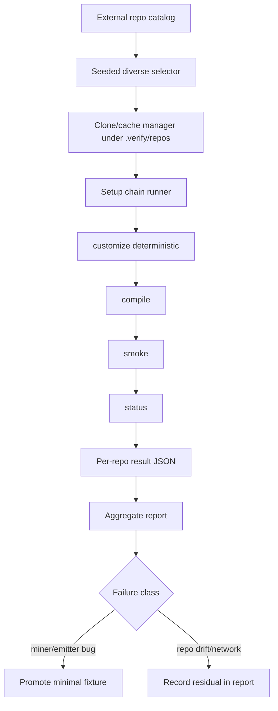

# feat: Reproducible external repo eval workflow

## Summary

Add a maintainer-facing evaluation workflow that selects five pinned GitHub projects by seed, runs the ai-sdlc setup chain against isolated clones, and writes quality/performance reports that can drive miner and emitter fixes. The workflow uses deterministic mode for external runs, keeps network work out of the normal test suite, treats cloned repos as untrusted input, and promotes recurring external failures into checked-in fixtures before changing product behavior.

---

## Problem Frame

The existing corpus proves `customize -> compile -> smoke -> status` on checked-in sample repos, but it does not reproduce the user's desired real-world E2E loop: run ai-sdlc on medium-to-big public projects across different languages and tools, measure setup quality and performance, then fix ai-sdlc issues exposed by those runs. A naive "pick random GitHub repos today" workflow would be irreproducible, flaky in CI, and unclear about whether failures belong to ai-sdlc or the external project.

This plan turns the idea into an agent-runnable evaluation product: a pinned external repo catalog, seed-based subset selection, isolated clone/cache management, per-phase timing, structured reports, and opt-in tests that reuse the existing corpus harness semantics.

---

## Requirements

### Reproducible Selection

- R1. The workflow must select `count` repos deterministically from a checked-in catalog using a numeric seed, stable catalog ordering, and explicit tie-breaks while enforcing language/tool diversity when the catalog can satisfy it.
- R2. Each catalog entry must pin `id`, `owner`, `repo`, `commit`, primary language, tool tags, size band, catalog revision, and any expected skip reason so future runs compare the same source tree and metadata.
- R3. Live GitHub search may be deferred; if added later, it must generate or refresh catalog entries rather than becoming the regression oracle.

### Setup Execution

- R4. The workflow must run `customize -> compile -> smoke -> status` in isolated clone directories under `.verify/`, never in the ai-sdlc repo root or in checked-in fixtures.
- R5. Default runs must use deterministic setup mode so results do not depend on host LLM availability or Plugin Mode personalization variance.
- R6. Clone and run steps must be resumable: cache keys include commit plus catalog-entry hash, per-repo results checkpoint under a stable run directory, and a resumed run skips completed repos unless forced.

### Measurement and Reporting

- R7. Each repo result must record setup readiness, alignment readiness, hands-off status, blocking gaps, gap provenance, evidence coverage, architecture confidence, role grounding, smoke outcome, freshness/no-op re-run signal, phase timings, and failure classification.
- R8. The aggregate report must include setup-ready rate, hands-off rate, valid-but-needs-attention count, failure classes, slowest phases, selected repo metadata, and any diversity gaps.
- R9. Reports must default to machine-readable JSON under `.verify/reports/`, with `--report-dir` allowed only after path containment validation, and CLI summaries must redact or omit untrusted secret-like content.

### Safety and Fix Loop

- R10. The workflow must not install dependencies or run target project test suites; it validates ai-sdlc setup quality only.
- R11. Failures must carry a class and confidence before they become actionable: `miner-bug`, `emitter-bug`, `repo-edge-case`, `upstream-drift`, `network`, `workflow-error`, `monorepo-miner-limitation`, `scale-timeout`, or `needs-triage`.
- R12. Product fixes triggered by external runs must be backed by a checked-in fixture or corpus expectation when a minimal reproduction is possible; when it is not possible, the report must record the reason and a durable residual.
- R13. External repo handling must validate catalog slugs, keep cache/report paths contained under `.verify/` by default, isolate Git credential/config use, avoid following repo-controlled symlinks outside the clone, cap parsed input sizes and per-repo runtime, and label external-derived report strings as untrusted.
- R14. V1 CLI exit behavior is calibrated, not metric-threshold driven: `aisdlc bench` exits non-zero for workflow-level failures that prevent a report, or for explicit `--fail-on-class` values; setup-ready and hands-off rates are reported but do not fail by default.

---

## Key Technical Decisions

- **Pinned catalog plus seeded selection, not live random search:** GitHub search supports language, stars, size, and pushed qualifiers, but search results and default branches drift. A catalog with pinned commits makes the run reproducible; the seed controls which five entries are selected.
- **External eval is opt-in:** Normal `npm test` remains offline. Network cloning and medium-to-big repo scans run through a CLI command and an env-gated Vitest slice.
- **Extract the corpus setup chain into `src/eval`:** `tests/corpus/corpus-harness.ts` already encodes the canonical setup sequence. Moving the reusable chain into production code prevents a second orchestration path from drifting; the corpus wrapper preserves today's default Plugin Mode while `bench` passes deterministic mode explicitly.
- **Score status metrics before behavior or live-host quality:** External repos lack golden expectations. The first report uses existing status/smoke signals; later behavior evals can be added for pinned catalog entries with explicit or inferred oracles.
- **Use `.verify/` as the evaluation workspace:** The repo already ignores `.verify/` for corpus runs and ad-hoc compiles. Clones, per-repo artifacts, and reports stay there.
- **No default metric thresholds in v1:** The report establishes baselines first. Failure-class gating is opt-in via `--fail-on-class`; rate thresholds are deferred until enough runs calibrate realistic targets.
- **Security controls are part of the workflow contract:** Public repos are untrusted even when pinned. Clone, parse, report, and agent-triage paths all need containment and redaction controls in v1.
- **Fix ai-sdlc, not external repos:** The loop should repair miner, emitter, adapter, or harness defects. It must not hand-edit cloned project overlays to make a metric green.

---

## High-Level Technical Design



The CLI owns orchestration, while the library owns deterministic selection, cloning, setup execution, and report shaping. Tests cover those pieces offline with fixtures and opt-in online with the external catalog.

---

## Output Structure

```text
src/eval/
  catalog.ts
  repo-cache.ts
  report.ts
  setup-chain.ts
src/cli/bench.ts
eval-corpus/external-repos.json
tests/eval/
  catalog.test.ts
  repo-cache.test.ts
  report.test.ts
  setup-chain.test.ts
tests/cli/bench.test.ts
tests/corpus/external-corpus.test.ts
docs/eval/external-repo-workflow.md
```

The exact file names may adjust during implementation, but the main boundary should hold: reusable evaluation logic under `src/eval`, CLI parsing under `src/cli`, catalog data in a root-level eval corpus, and network-gated tests under `tests/corpus`.

---

## Implementation Units

### U1. Shared setup chain runner

- **Goal:** Move the canonical setup sequence into a reusable evaluation module with per-phase timings.
- **Requirements:** R4, R5, R7
- **Dependencies:** None
- **Files:** `src/eval/setup-chain.ts`, `tests/corpus/corpus-harness.ts`, `tests/eval/setup-chain.test.ts`
- **Approach:** Extract the `runSetup` sequence from `tests/corpus/corpus-harness.ts` into `runSetupChain(root, options)`. Define `SetupChainOptions` with required `baseDir`, optional `operatingMode`, optional `hosts`, and optional `force`. The corpus wrapper should preserve today's implicit Plugin Mode for regression parity; `bench` should pass `operatingMode: "deterministic"`. Return artifacts needed by corpus tests plus timing data for customize, compile, smoke, status, and optional freshness/no-op re-run.
- **Patterns to follow:** Existing `runSetup` and `runGenericSetup` in `tests/corpus/corpus-harness.ts`; setup-ready semantics in `src/cli/smoke.ts` and `src/cli/status.ts`.
- **Test scenarios:** A checked-in fixture produces the same `setupReady`, `handsOff`, standards, operating mode, and role guidance as the current harness; timings are non-negative and present for customize, compile, smoke, and status; deterministic mode is used when the bench caller passes it.
- **Verification:** Corpus regression tests still pass after importing the extracted runner.

### U2. External catalog schema and seeded selector

- **Goal:** Define a pinned repo pool and deterministic diverse selection for five-repo runs.
- **Requirements:** R1, R2
- **Dependencies:** None
- **Files:** `src/eval/catalog.ts`, `eval-corpus/external-repos.json`, `tests/eval/catalog.test.ts`
- **Approach:** Add a JSON catalog schema validated with `zod`, including strict GitHub slug patterns and a stable `id` (canonical default: `owner/repo@commit`). Implement deterministic selection by sorting catalog entries by `id`, applying a seed-based shuffle, then greedily selecting distinct primary languages before relaxing diversity with a deterministic fallback. Seed the first catalog with at least five pre-validated public repos across distinct ecosystem families and document follow-up expansion.
- **Patterns to follow:** Schema validation patterns in `src/schema`; corpus expectation data shape in `tests/corpus/corpus-expectations.ts`.
- **Test scenarios:** The same seed and catalog produce identical repo IDs; count defaults to five; diversity selection avoids duplicate primary languages when the catalog has enough choices; invalid owner/repo/commit/catalog entries fail with actionable messages; insufficient diversity records a report warning rather than changing selection nondeterministically.
- **Verification:** Selector unit tests cover stable ordering and validation failures.

### U3. Clone/cache manager for external repos

- **Goal:** Materialize selected catalog entries into isolated working directories safely and repeatably.
- **Requirements:** R4, R6, R10
- **Dependencies:** U2
- **Files:** `src/eval/repo-cache.ts`, `tests/eval/repo-cache.test.ts`
- **Approach:** Clone public repos into a validated cache root that defaults to `.verify/repos/<entry-id-hash>/`, checkout the pinned commit, and reuse an existing cache when commit, catalog-entry hash, and ai-sdlc/base fingerprint match. Introduce an injectable `GitRunner` for offline tests. Use an isolated Git environment (`GIT_TERMINAL_PROMPT=0`, no credential helper by default), validate paths before writing, avoid following outbound symlinks, apply per-repo clone/setup timeouts, and never install dependencies or execute project scripts.
- **Patterns to follow:** `.verify/` gitignore convention; fixture-copy isolation from `tests/corpus/corpus-harness.ts`.
- **Test scenarios:** A mocked git runner records clone and checkout commands without network; cache hit skips clone; mismatched commit or catalog metadata invalidates the cache; invalid catalog path segments fail closed; checkout failure returns a structured clone outcome for the report layer; outbound symlink and timeout cases are represented as structured failures instead of crashing the whole run.
- **Verification:** Offline tests use a fake command runner; manual validation can run one real public repo behind an explicit flag.

### U4. Report model and failure classification

- **Goal:** Convert per-repo setup outcomes into durable JSON and a concise aggregate summary.
- **Requirements:** R7, R8, R9, R11, R12, R13, R14
- **Dependencies:** U1, U2, U3
- **Files:** `src/eval/report.ts`, `tests/eval/report.test.ts`
- **Approach:** Define `EvalRunReport` with run metadata, selected catalog entries, per-phase timings, status/smoke/customize metrics, per-repo checkpoint paths, failure class, classification confidence, and residual reason. Classify only obvious cases mechanically: clone/checkout failure as `network` or `upstream-drift`; timeouts as `scale-timeout`; thrown customize/miner exceptions as `miner-bug`; smoke failures with adapter/emission checks as `emitter-bug`; monorepo-related setup gaps as `monorepo-miner-limitation`; ambiguous gaps as `needs-triage`. Redact secret-like strings, cap field sizes, and label external-derived text as untrusted in JSON and CLI summaries.
- **Patterns to follow:** `StatusReport` in `src/cli/status.ts`; setup-ready distinction in `src/cli/smoke.ts`; evidence coverage reporting in `src/customize/emitters.ts`.
- **Test scenarios:** Aggregation computes setup-ready and hands-off rates; low architecture confidence counts as valid-but-needs-attention rather than failure; clone outcomes from U3 map to report classes without duplicating repo-cache logic; thrown errors are represented as per-repo failed results; report JSON round-trips without losing classification, confidence, checkpoint, redaction, or timing fields.
- **Verification:** Report tests assert stable JSON shape and human summary strings.

### U5. `aisdlc bench` CLI command

- **Goal:** Provide an agent- and human-runnable entrypoint for the external evaluation workflow.
- **Requirements:** R1, R4, R5, R6, R8, R9
- **Dependencies:** U1, U2, U3, U4
- **Files:** `src/cli/bench.ts`, `src/cli/index.ts`, `README.md`, `package.json`, `tests/cli/bench.test.ts`
- **Approach:** Add `aisdlc bench --seed <n> --count <n> --catalog <file> --cache-dir <dir> --report-dir <dir> --base <dir> --mode deterministic --skip-clone --dry-run --force --fail-on-class <classes>`. The command validates cache/report paths under `.verify/` by default, selects repos, clones or reuses caches, resumes from `.verify/reports/<run-id>/` checkpoints, runs the setup chain, writes the aggregate report, prints the redacted summary, and exits non-zero only when the workflow cannot write a report or when a reported class matches `--fail-on-class`.
- **Patterns to follow:** Flat command dispatch in `src/cli/index.ts`; `parseArgs` option parsing; existing README command documentation.
- **Test scenarios:** CLI defaults parse correctly; `--dry-run` prints selected repos without network or report writes; `--fail-on-class miner-bug,workflow-error` exits non-zero only when those classes are present; successful reports with repo-edge-case findings exit zero by default; help text lists the command and Git prerequisite.
- **Verification:** CLI tests cover parsing and report writing with fake dependencies.

### U6. Opt-in external corpus test and fixture promotion loop

- **Goal:** Make the workflow usable as a periodic E2E gate without making normal CI depend on the network.
- **Requirements:** R10, R11, R12
- **Dependencies:** U5
- **Files:** `tests/corpus/external-corpus.test.ts`, `tests/fixtures/sample-repos/README.md`, `docs/eval/external-repo-workflow.md`
- **Approach:** Add an env-gated test that runs the default five-repo bench only when `AISDLC_EXTERNAL_CORPUS=1`. Document the fix loop: inspect report, confirm failure class, reduce ai-sdlc bugs into checked-in fixtures when possible, add corpus expectations, record residuals when reduction is not possible, then fix miner/emitter behavior. Keep live GitHub discovery and Plugin Mode eval as follow-up work.
- **Patterns to follow:** Existing corpus tests as the merge gate; plans that treat external corpus as manual verification until stable.
- **Test scenarios:** Without the env flag the test skips; with a fake catalog/cache the test consumes a report and fails only on explicit `--fail-on-class` values; documentation explains how to promote a failure into `tests/fixtures/sample-repos` or record a residual when reduction is impossible.
- **Verification:** Default `npm test` remains offline; explicit env-gated run writes a report under `.verify/reports/`.

---

## Acceptance Examples

- AE1. Given the same catalog and `--seed 42 --count 5`, when `aisdlc bench` runs twice, then it selects the same repo commits and emits reports with matching repo IDs.
- AE2. Given a selected Python repo with a mineable test command, when the setup chain completes, then the report records `setupReady: true`, `handsOff: true`, miner provenance for `test-command`, and non-empty phase timings.
- AE3. Given a selected repo with no mineable test command, when the setup chain completes, then the report records an open blocking gap and classifies it as a repo edge case unless the miner crashed or contradicted existing evidence.
- AE4. Given a clone failure or missing pinned commit, when the bench runs, then the run continues for the remaining repos and records a `network` or `upstream-drift` result for that repo.
- AE5. Given `AISDLC_EXTERNAL_CORPUS` is unset, when the test suite runs, then no network clone is attempted.
- AE6. Given a malicious catalog entry or repo path containing `..`, path separators in slugs, or outbound symlinks, when the bench validates the entry or clone, then it fails closed with a structured workflow result and does not write outside `.verify/`.
- AE7. Given a run interrupted after two repo results are checkpointed, when `aisdlc bench` resumes with the same seed and catalog, then it keeps the completed results and continues from the remaining repos unless `--force` is set.

---

## System-Wide Impact

This adds a new maintainer workflow and reusable evaluation modules, but it should not change default product behavior for `customize`, `compile`, `smoke`, or `status`. It strengthens the strategy metrics by measuring hands-off setup rate, blocking gaps, evidence coverage, and re-run cost on real public repos. It also gives agents a durable report artifact to resume from instead of relying on terminal scrollback.

---

## Scope Boundaries

### In Scope

- Pinned external repo catalog, deterministic selection, isolated clone/cache, deterministic setup chain execution, JSON reports, `aisdlc bench`, and opt-in external corpus testing.

### Deferred to Follow-Up Work

- Live GitHub search that refreshes or expands the catalog.
- Plugin Mode personalization evaluation and live host-agent traces.
- Generic behavior-eval oracles for external repos.
- Scheduled automation dashboards or trend reporting.
- Parallel execution across repos.

### Outside This Product's Identity

- Running or fixing external projects' own build/test suites.
- Committing generated ai-sdlc config back to external repositories.
- Treating unpinned random GitHub search results as a merge gate.

---

## Risks & Dependencies

- **GitHub rate limits and drift:** GitHub Search API allows repository qualifiers such as language, stars, size, and pushed date, but search is rate-limited and result sets drift. The plan avoids that risk in v1 by pinning commits in a catalog.
- **Large repo runtime:** Medium-to-big repos can stress `mineRepo` traversal and architecture detection. Timeouts and phase timings make slowness visible before optimization work begins.
- **False negatives:** Some real repos intentionally lack a single root test command. The report treats those as setup quality signals, not automatic harness failures.
- **Security:** Public repos are untrusted input. The workflow must clone and parse only; it must not run target package managers, scripts, or tests. V1 mitigations are catalog slug validation, `.verify/` containment, isolated Git environment, outbound-symlink rejection, command allowlisting, report redaction, field-size caps, and per-repo timeouts.
- **Fixture gap:** External failures are hard to review unless reduced. The fix loop requires a checked-in fixture or corpus expectation for durable product changes where possible.

---

## Sources & Research

- `README.md` for the documented `customize -> compile -> smoke` chain and command structure.
- `tests/corpus/corpus-harness.ts` for the existing full-chain harness.
- `src/cli/customize.ts`, `src/cli/compile.ts`, `src/cli/smoke.ts`, and `src/cli/status.ts` for reusable programmatic APIs and readiness semantics.
- `docs/plans/2026-06-14-004-feat-large-repo-scaling-plan.md` for monorepo and large-repo mining constraints.
- `docs/plans/2026-06-29-005-feat-corpus-gate-ecosystems-plan.md` for multi-language corpus expectations.
- `docs/plans/2026-06-29-005-feat-e2e-tool-detection-plan.md` for separating unit-test and E2E-tool signals.
- `docs/solutions/design-patterns/round-trip-editable-generated-config.md` for preserving editable overlay state across setup re-runs.
- GitHub REST Search documentation for repository qualifiers, result limits, and search rate limits.
