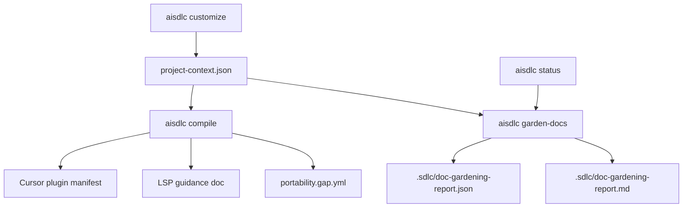

# feat: Add LSP-aware distribution and doc-gardening automation

## Summary

Add a bounded distribution slice that makes compiled host artifacts easier to package, adds LSP setup guidance from mined repo languages without trying to run language servers, and introduces a deterministic doc-gardening report that keeps agent-facing docs lean, linked, and reviewable.

---

## Problem Frame

The repo already implements the first large-codebase lessons from the articles: lean root instructions, layered package guidance, codebase maps, exclusions, and an opt-in Cursor plugin manifest. The next gaps are around distribution and maintenance. Good harness setups should not stay tribal, LSP guidance should be visible where agents and developers install plugins, and agent-facing docs need mechanical checks so `AGENTS.md`-style entry points remain a table of contents instead of becoming stale encyclopedias.

This plan keeps ai-sdlc in its lane as a config emitter. It emits packageable metadata, LSP recommendations, and doc-gardening signals; it does not manage IDE runtimes, install language servers, or mutate docs automatically.

---

## Requirements

- R1. Compiled Cursor plugin metadata can carry distribution identity (`displayName`, `version`, `publisher`, `repository`) without changing default output.
- R2. Compile can emit an LSP guidance artifact derived from mined languages and package context, with honest unsupported-language notes.
- R3. LSP guidance is referenced from plugin/distribution metadata where the host supports explicit companion docs, but runtime server installation remains out of scope.
- R4. A new doc-gardening command reports stale or noisy agent-facing documentation without rewriting user-owned docs.
- R5. Doc-gardening checks cover root instruction bloat, broken local links, missing codebase-map references, and stale generated capability matrix content.
- R6. Reports are deterministic, redacted where needed, and suitable for scheduled automation or future PR-opening agents.
- R7. README and generated command help document distribution and doc-gardening usage, including scope boundaries from the articles.
- R8. Existing compile/customize/smoke behavior remains unchanged unless the new options or command are invoked.

---

## Key Technical Decisions

- **Emit guidance, not LSP processes:** ai-sdlc should recommend language-server setup from repo evidence, not install binaries or proxy LSP calls. This matches the project architecture: adapters are pure emitters and the engine owns file output.
- **Distribution metadata extends the existing Cursor slice first:** Cursor already has `.cursor-plugin/plugin.json`. Add distribution identity and companion documentation there before inventing Codex/Copilot package formats with uncertain schemas.
- **Doc-gardening is report-first:** The command produces structured findings and a markdown summary. Automated edits or PR creation are deferred so the first slice is deterministic, testable, and safe on user repositories.
- **Use existing generated facts:** LSP recommendations and map checks should reuse `ProjectContext`, adapter capability data, and the generated capability matrix path instead of adding a new mining subsystem.
- **Warnings do not affect setup-ready:** The articles frame gardening as continuous maintenance. A noisy doc should be visible but should not block compile or smoke in this slice.

---

## High-Level Technical Design

The compile path remains pure: model data flows into adapters, adapters return files, and the engine writes them. The doc-gardening path is read-only over generated artifacts and docs, then writes a report under `.sdlc/`.

---

## Implementation Units

### U1. Distribution metadata schema and Cursor manifest extension

- **Goal:** Let projects opt into richer plugin distribution identity while preserving existing default manifest behavior.
- **Requirements:** R1, R3, R8
- **Dependencies:** None
- **Files:** `src/schema/host-manifest.ts`, `src/adapters/cursor/plugin-manifest.ts`, `tests/adapters/cursor-plugin-manifest.test.ts`, `tests/schema/load.test.ts`
- **Approach:** Add optional Cursor distribution fields that validate strictly and default to the current manifest values. Keep `.cursor-plugin/plugin.json` emission behind `options.cursor.pluginManifest`; when enabled, include identity fields and a companion docs pointer for generated LSP guidance.
- **Patterns to follow:** Existing `CursorPluginName`, `HostOptions.cursor`, and `emitPluginManifest` structure.
- **Test scenarios:**
  - Manifest defaults match the current shape when only `pluginManifest: true` is set.
  - Valid distribution fields appear in `.cursor-plugin/plugin.json`.
  - Invalid publisher/name/version values fail schema validation.
  - Manifest is still absent when `pluginManifest` is false or omitted.
- **Verification:** Adapter and schema tests cover enabled, disabled, and invalid options.

### U2. LSP recommendation model and generated guidance

- **Goal:** Emit a deterministic LSP guidance artifact from mined repo languages and package context.
- **Requirements:** R2, R3, R6, R8
- **Dependencies:** U1
- **Files:** `src/core/lsp-guidance.ts`, `src/core/project-context.ts`, `src/adapters/shared/lsp-guidance.ts`, `src/adapters/cursor/index.ts`, `tests/core/lsp-guidance.test.ts`, `tests/adapters/cursor-plugin-manifest.test.ts`
- **Approach:** Add a small mapping from known language identifiers to recommended language servers and setup notes. Build guidance from `NeutralModel.projectContext` package languages when available, falling back to whole-repo context when not. Emit a markdown doc such as `.sdlc/lsp-guidance.md` or `docs/ai-sdlc/lsp-guidance.md` through the adapter layer when distribution metadata is enabled.
- **Patterns to follow:** `ProjectContext` as the compile handoff, shared adapter helpers under `src/adapters/shared/`, and honest degradation via `Gap` for unsupported hosts or unknown languages.
- **Test scenarios:**
  - TypeScript, Python, Go, Java, C#, and Rust map to stable recommendations.
  - Multi-package context groups recommendations by package path.
  - Unknown languages produce an explicit "no recommendation" note rather than disappearing.
  - Cursor compile with plugin manifest enabled references the generated guidance doc.
- **Verification:** Core mapping tests and adapter tests prove deterministic content and path wiring.

### U3. Doc-gardening analyzer and report model

- **Goal:** Provide a deterministic analysis engine for agent-facing docs.
- **Requirements:** R4, R5, R6
- **Dependencies:** U2
- **Files:** `src/garden/doc-gardener.ts`, `src/garden/types.ts`, `tests/garden/doc-gardener.test.ts`, `tests/fixtures/doc-gardening/`
- **Approach:** Implement pure checks over a target repo root: root instruction bloat thresholds, broken relative markdown links, missing codebase-map mention when `project-context.json` has map entries, and stale `docs/capability-matrix.md` by comparing it to `renderCapabilityMatrix()`. Return typed findings with severity, source path, message, and suggested next action.
- **Patterns to follow:** Pure helper style in `src/core/gap-report.ts`, redaction discipline from eval reports, and existing root-bloat advisory logic in customization.
- **Test scenarios:**
  - Overlong `AGENTS.md` yields a warning, not an error.
  - Broken local links in `AGENTS.md` and docs are reported with paths.
  - Project context with map entries but no root map reference yields a warning.
  - Stale capability matrix content yields a deterministic finding.
  - Clean fixtures produce an empty findings list.
- **Verification:** Fixture-driven unit tests cover each finding class and report stability.

### U4. `aisdlc garden-docs` CLI

- **Goal:** Expose doc-gardening as an automation-friendly command.
- **Requirements:** R4, R6, R7, R8
- **Dependencies:** U3
- **Files:** `src/cli/index.ts`, `src/cli/garden-docs.ts`, `tests/cli/garden-docs.test.ts`, `README.md`
- **Approach:** Add `aisdlc garden-docs --repo <dir> --config <dir> --format text|json --write-report --fail-on warning|error`. Default behavior prints a concise text summary and exits 0 unless `--fail-on` is set. With `--write-report`, write JSON and markdown reports under `.sdlc/`.
- **Patterns to follow:** CLI option parsing style in `bench`, report rendering style in `status`, and deterministic output conventions from eval reporting.
- **Test scenarios:**
  - Clean repo prints "0 findings" and exits 0.
  - Warning findings exit 0 by default and exit 1 with `--fail-on warning`.
  - `--format json` emits parseable JSON.
  - `--write-report` writes both report files under `.sdlc/`.
  - Unknown flags or invalid `--fail-on` values produce usage errors.
- **Verification:** CLI tests cover output modes, exit codes, and report writes.

### U5. Documentation and generated matrix updates

- **Goal:** Document the new distribution and gardening workflows and update capability reporting.
- **Requirements:** R3, R7
- **Dependencies:** U1, U2, U4
- **Files:** `README.md`, `docs/capability-matrix.md`, `src/core/capability-matrix.ts`, `tests/core/capability-matrix.test.ts`
- **Approach:** Add LSP guidance and doc-gardening to the public README command/artifact sections. Extend capability matrix data only if the new LSP guidance or distribution metadata needs a host capability row; regenerate the markdown through the existing command path.
- **Patterns to follow:** Existing "What gets emitted" and "Commands" README sections plus `aisdlc gen-matrix`.
- **Test scenarios:**
  - Capability matrix renderer includes any new capability rows in stable order.
  - README command list mentions `garden-docs` and distribution/LSP boundaries.
- **Verification:** Unit tests plus generated docs diff are reviewed together.

---

## Scope Boundaries

- No runtime LSP client, LSP proxy, or language-server installation.
- No managed marketplace publishing.
- No automatic doc rewrites or PR opening from doc-gardening findings.
- No Codex or Copilot plugin-bundle schemas unless implementation finds an existing local adapter pattern with a clear, testable contract.
- No change to `setup-ready`, `smoke`, or default compile output.

### Deferred to Follow-Up Work

- Scheduled automation that runs `garden-docs`, opens PRs, and applies safe doc updates.
- Plugin-native directory layout for marketplace submission.
- Codex and Copilot distribution bundle formats once their package contracts are stable.
- A host MCP or plugin bridge that exposes live LSP symbol queries to agents.

---

## System-Wide Impact

This work adds a new command and generated artifacts, so it affects CLI help, README setup docs, golden adapter tests, and capability reporting. It also extends the agent harness surface by making LSP and doc-health signals first-class, which should improve large-repo navigability without increasing root instruction context.

---

## Risks & Dependencies

- **Host schema uncertainty:** Plugin distribution schemas move quickly. Keeping the first implementation on Cursor's existing manifest and explicit companion docs limits breakage.
- **False-positive gardening findings:** Broken-link and bloat checks can be noisy. Findings are warnings by default and do not block setup.
- **LSP overclaiming:** Recommendations must stay framed as setup guidance, not proof that symbol navigation works in the host.
- **Generated file placement:** If writing LSP guidance under `docs/` creates unwanted churn for users, implementation may choose `.sdlc/` and reference it from plugin metadata instead.

---

## Sources & Research

- OpenAI, "Harness Engineering: Codex in an agent-first world" (2026-02-11): AGENTS.md as table of contents, docs as system of record, mechanical enforcement, and doc-gardening background agents.
- Anthropic, "How Claude Code works in large codebases" (2026-05-14): plugins distribute working setups, LSP gives symbol-level navigation, hooks and skills keep context progressive, and docs need periodic review as models evolve.
- `docs/ideation/2026-06-14-large-repo-scaling-ideation.md`
- `docs/plans/2026-06-29-005-feat-cursor-plugin-manifest-plan.md`
- `docs/plans/2026-06-14-004-feat-large-repo-scaling-plan.md`
- Existing implementation surfaces: `src/adapters/cursor/plugin-manifest.ts`, `src/schema/host-manifest.ts`, `src/core/project-context.ts`, `src/core/gap-report.ts`, `src/cli/status.ts`
