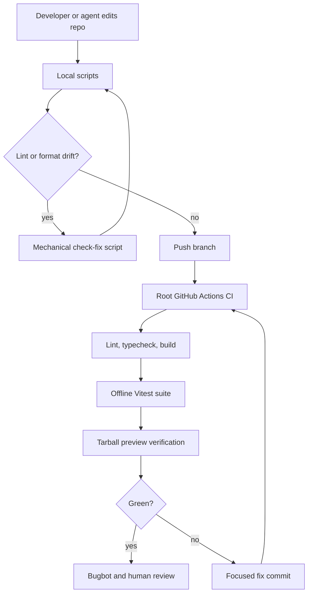
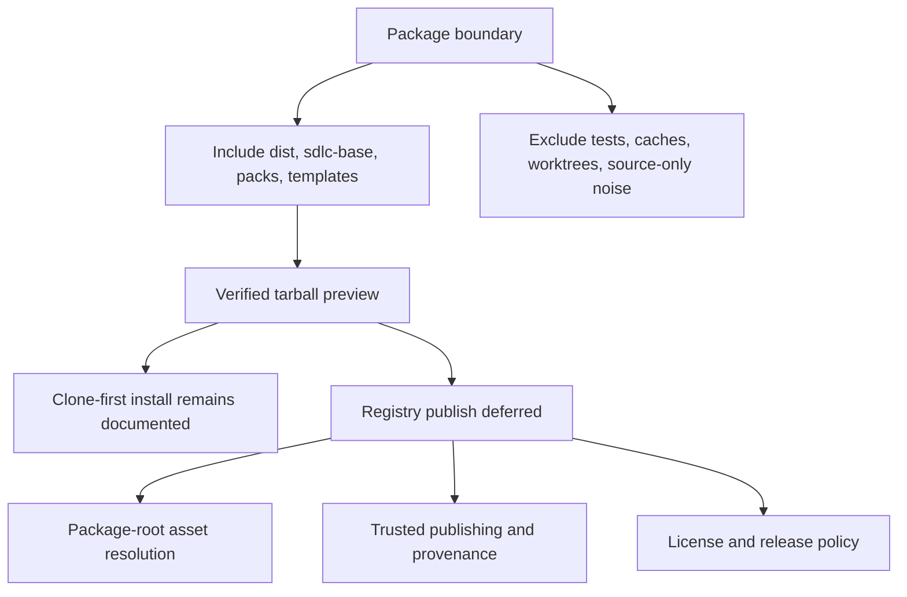

# feat: Harden project foundation checks

## Summary

This plan adds the first LFG implementation slice for the project-improvement shortlist: self-enforcing CI, lint/format tooling, package tarball verification, security reporting documentation, and a durable follow-up map for the larger miner, host-parity, eval, hook-runtime, large-repo, distribution, and test-parallelism work.

The slice is intentionally reviewable. It improves the repo's ability to safely execute later changes without refactoring the miner, changing host adapter behavior, or claiming npm registry readiness before the package-root and release-policy decisions are made.

---

## Problem Frame

The repo is a TypeScript CLI/framework with strict typing and a meaningful Vitest suite, but it does not currently enforce its own quality gates in root CI. It also has no lint/format toolchain, no package tarball boundary, and no security reporting policy. That makes later changes to `src/customize/repo-miner.ts`, host adapters, loop evals, and generated hook runtime riskier than they need to be.

The strategy in `STRATEGY.md` emphasizes hands-off, evidence-backed setup and drift detection. The framework should dogfood that posture by making local and PR validation explicit, reproducible, and easy for agents and humans to run.

---

## Requirements

### Self-Enforcement

- R1. The repository must have a root GitHub Actions workflow that validates pull requests and pushes to `main` without requiring secrets.
- R2. The workflow must run the same offline checks contributors can run locally: lint/format validation, TypeScript typecheck, build, Vitest, and package-tarball verification.
- R3. CI must avoid network-dependent evaluation flows such as external `bench` runs and must preserve the existing serial Vitest behavior.

### Lint And Formatting

- R4. The repository must have a single lint/format toolchain with a read-only check script for CI and a write-mode script for local mechanical fixes.
- R5. Initial formatting adoption must be reviewable as mechanical churn and must not mix unrelated product refactors into the same implementation unit.

### Package Boundary

- R6. Package metadata must define the intended publish surface so `dist/`, `sdlc-base/`, `packs/`, and `templates/` are included while tests, worktrees, verification caches, and source-only scaffolding are excluded.
- R7. Package verification must fail when the CLI bin target or required runtime assets are missing from the tarball preview.
- R8. The implementation must not claim full npm registry publish readiness until install-time package-root resolution, release ownership, license selection, and trusted publishing policy are decided.

### Security And Follow-Up Scope

- R9. The repository must provide a security reporting policy suitable for an early open-source CLI/framework.
- R10. Deferred items from the improvement shortlist must be durably recorded with links to existing plans where available and clear boundaries for future LFG runs.

---

## Key Technical Decisions

- KTD1. Use Biome as the first lint/format toolchain. The repo has no existing lint stack, and Biome gives one config and one CI entry point for TypeScript, JavaScript, JSON, and formatting without introducing a larger ESLint plus Prettier surface.
- KTD2. Use a root `ci.yml` workflow rather than reusing the emitted `sdlc-gate.yml` name. The emitted Copilot gate workflow is a generated consumer artifact; this repo's CI should be clearly distinguished from host output.
- KTD3. Keep the default CI offline. `npm test` already covers golden snapshots, capability-matrix freshness, adapters, packs, corpus fixtures, smoke, and status behavior; `bench` and live host evals remain opt-in because they clone external repositories or depend on host/runtime surfaces.
- KTD4. Verify package contents with an explicit allowlist and tarball assertions. Relying on `.gitignore` is unsafe because `dist/` is ignored but required by `bin.aisdlc`.
- KTD5. Treat npm publish automation as deferred. This slice can make the tarball contract testable, but trusted publishing, provenance, release versioning, and package-root path resolution require separate policy and runtime work.
- KTD6. Record larger improvement items as durable follow-up, not hidden open questions. The top-10 analysis contains multi-PR product work; this LFG run should leave a clear map rather than pretending all items fit one reviewable PR.

---

## High-Level Technical Design

---

## Workflow Contracts

The local contributor path should expose a small script vocabulary:

| Script | Contract |
| --- | --- |
| `check` | Read-only lint/format validation for CI and pre-push use. |
| `check:fix` | Local mechanical lint/format fixes. |
| `typecheck` | Strict TypeScript validation without emitting files. |
| `build` | Compile `src/` into `dist/`, including declarations. |
| `test` | Run the existing offline Vitest suite. |
| `verify:pack` | Verify the package tarball preview contains required runtime assets and excludes development-only surfaces. |

CI should run the same contracts in a deterministic order. Pack verification depends on build output, while tests can continue to use source-level imports and existing fixtures.

---

## Scope Boundaries

### In Scope

- Add Biome configuration and scripts.
- Add root CI for PRs and pushes to `main`.
- Add package metadata and a package content allowlist.
- Add tarball preview verification.
- Add a security reporting policy.
- Update README development/package guidance.
- Add a follow-up document covering the remaining improvement-list items.

### Deferred to Follow-Up Work

- Split `src/customize/repo-miner.ts` into focused modules.
- Refresh Copilot and broader host parity beyond documentation/follow-up mapping.
- Productize live loop traces and host outcome recording.
- Harden generated hook runtime away from `npx --yes aisdlc record-event`.
- Finish large-repo/path-scoped instruction scaling.
- Add full npm registry publishing, provenance, release automation, and install-time bundled asset resolution.
- Add containerized or live-host eval harnesses beyond the offline suite.
- Add an opt-in parallel Vitest profile after the existing teardown stability risk is resolved.

### Non-Goals

- Do not change adapter output behavior in this slice.
- Do not alter the `customize`, `compile`, `smoke`, `status`, or `bench` command contracts.
- Do not run network-dependent external repository evaluations in default CI.
- Do not add a custom SDLC orchestrator.

---

## Implementation Units

### U1. Add Biome Tooling

- **Goal:** Introduce a single lint/format toolchain with CI and local-fix scripts.
- **Requirements:** R2, R4, R5.
- **Dependencies:** None.
- **Files:** `package.json`, `package-lock.json`, `biome.json`, source and test files touched only by mechanical formatting.
- **Approach:** Add `@biomejs/biome` as an exact dev dependency, configure it to respect ignored paths, and wire read-only and write-mode scripts. Keep fixtures, generated snapshots, and large sample repositories out of unnecessary formatting if they create noise.
- **Patterns to follow:** Existing root tool scripts in `package.json`; the current serial Vitest configuration in `vitest.config.ts` remains unchanged.
- **Test scenarios:** The read-only check reports clean after the mechanical formatting pass; the write-mode script makes no changes on a clean tree; fixtures excluded by configuration do not produce formatter churn.
- **Verification:** The formatter/linter gate is reproducible locally and in CI without changing product behavior.

### U2. Add Root CI

- **Goal:** Make pull requests and pushes to `main` run the repo's offline validation gates.
- **Requirements:** R1, R2, R3.
- **Dependencies:** U1.
- **Files:** `.github/workflows/ci.yml`, `README.md`.
- **Approach:** Add a least-privilege workflow with deterministic install, Node version coverage aligned to `engines.node`, CI concurrency, and ordered validation for lint/format, typecheck, build, tests, and package verification. Keep `bench` and future live-host evals out of the default path.
- **Patterns to follow:** The repo's emitted Copilot CI backstop in `src/adapters/copilot/gates.ts` informs the idea of CI as an honest gate, but this root workflow must use a distinct name and this repo's own scripts.
- **Test scenarios:** Pull request events run all expected jobs; pushes to `main` run the same validation; workflow permissions remain read-only; fork PRs require no secrets.
- **Verification:** CI exposes failures with actionable step names and can be watched by LFG's CI loop once the PR exists.

### U3. Harden Package Metadata And Tarball Boundary

- **Goal:** Define and verify the package surface needed by the compiled CLI.
- **Requirements:** R6, R7, R8.
- **Dependencies:** U1.
- **Files:** `package.json`, `package-lock.json`, package verification script or test under `scripts/` or `tests/`, `README.md`.
- **Approach:** Add package metadata and an explicit allowlist that includes `dist/`, `sdlc-base/`, `packs/`, and `templates/`. Add a verification path that builds first, inspects a dry-run or generated tarball listing, and asserts the required CLI and runtime asset paths are present while development-only paths are absent.
- **Patterns to follow:** Existing CLI bin target in `package.json`; README's clone-first install guidance; `docs/eval/external-repo-workflow.md` safety posture of explicit opt-in for external work.
- **Test scenarios:** A built package preview contains `dist/cli/index.js`; the preview contains representative `sdlc-base`, `packs`, and `templates` files; the preview excludes `tests/`, `.verify/`, `.worktrees/`, and `node_modules/`; verification fails if build output is missing.
- **Verification:** The package boundary is testable without publishing to npm and does not overstate registry readiness.

### U4. Add Security And Developer Guidance

- **Goal:** Document how contributors validate changes and how reporters disclose vulnerabilities.
- **Requirements:** R2, R4, R8, R9.
- **Dependencies:** U1, U2, U3.
- **Files:** `SECURITY.md`, `README.md`.
- **Approach:** Add a minimal security policy for the current early-stage project and update README development guidance with the new check, fix, and pack verification contracts. Keep publishing instructions clone-first until a future install-path and release-policy slice lands.
- **Patterns to follow:** README's concise command tables and explicit notes about opt-in external repo evaluation.
- **Test scenarios:** README documents the same script names CI uses; SECURITY.md names supported versions and a reporting path without promising an unavailable process; publish guidance does not imply npm registry availability.
- **Verification:** A new contributor can identify the local validation path and a vulnerability reporter can identify the reporting process.

### U5. Record Deferred Improvement Follow-Ups

- **Goal:** Make the remaining top-10 recommendations durable and schedulable for later LFG runs.
- **Requirements:** R10.
- **Dependencies:** None.
- **Files:** `docs/plans/2026-06-29-008-feat-project-foundation-hardening-plan.md`, follow-up document under `docs/plans/` or `docs/ideation/`.
- **Approach:** Add a compact follow-up artifact mapping the larger improvement items to existing plans when they exist, or to new backlog entries when they do not. Include the large-repo scaling item so no recommendation is orphaned.
- **Patterns to follow:** Existing plan references in `docs/plans/`; residual review findings format under `docs/residual-review-findings/`.
- **Test scenarios:** Each deferred recommendation has an owner path or follow-up note; existing plans are linked by repo-relative path; the follow-up document distinguishes this project-hygiene shortlist from `docs/plans/2026-06-29-004-feat-lfg-improvement-backlog-plan.md`.
- **Verification:** Future agents can pick up any deferred item without relying on chat history or the canvas artifact.

---

## Risks & Dependencies

- **Biome churn:** First adoption can create a large mechanical diff. Mitigate by keeping formatter changes separate from functional edits and avoiding fixture churn where possible.
- **Tarball false confidence:** A tarball can contain the right files while the CLI still resolves default assets from the wrong directory. Mitigate by documenting clone-first install and deferring package-root resolution.
- **License selection:** Choosing an open-source license is a project-owner decision. If no repository license exists, avoid making legal claims beyond the current package metadata and follow-up note.
- **CI bootstrap:** The first PR introduces CI, so LFG's watch loop becomes useful only after the workflow exists on the branch.
- **Scope creep:** Host parity, miner refactors, and eval hardening are high-value but larger than a foundation PR. Mitigate with the deferred follow-up artifact.

---

## Documentation / Operational Notes

README should keep the current clone-first installation path as authoritative. Package verification should be framed as publish-readiness groundwork, not as a claim that `npm install -g ai-sdlc` is ready.

The follow-up document should include a short note that the current improvement shortlist came from project analysis, while `docs/plans/2026-06-29-004-feat-lfg-improvement-backlog-plan.md` tracks a separate agent-language-tooling backlog.

---

## Sources & Research

- `README.md` defines the current install, quickstart, emitted host artifacts, and development commands.
- `package.json` defines the current scripts, `bin.aisdlc`, Node engine, and minimal dependency surface.
- `vitest.config.ts` documents why tests remain serial in restricted environments.
- `docs/capability-matrix.md` and `tests/core/capability-matrix.test.ts` show generated capability-matrix freshness is already enforced by tests.
- `CONCEPTS.md` defines Base, Overlay, Adapter, Host, Approved? Gate, Behavior-Level Eval, Loop Trace, and Setup-ready.
- `docs/solutions/design-patterns/round-trip-editable-generated-config.md` establishes the preserve-user-owned-fields pattern for generated/editable config.
- `docs/plans/2026-06-29-002-feat-refresh-copilot-custom-agents-plan.md`, `docs/plans/2026-06-29-006-feat-agent-loop-quality-plan.md`, `docs/plans/2026-06-29-006-feat-external-repo-eval-workflow-plan.md`, and `docs/plans/2026-06-14-004-feat-large-repo-scaling-plan.md` cover several deferred items.
- Current external docs for npm package `files`, trusted publishing, Biome CI, GitHub Actions hardening, OpenSSF Scorecard, Cursor plugins, Copilot custom agents, Codex AGENTS/hooks, and SWE-bench-style evaluation shaped the package, CI, host-parity, and eval boundaries.
