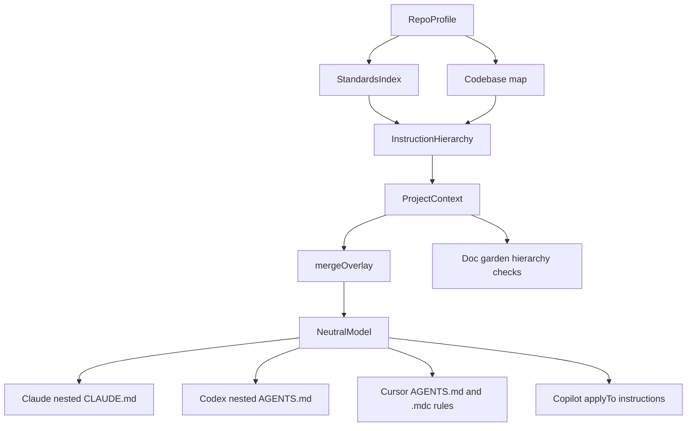

# feat: Add host-native instruction hierarchy

## Summary

Extend ai-sdlc from package-level layered instructions to a full host-native instruction hierarchy. The feature mines evidence-backed instruction scopes, persists a reviewable accepted hierarchy, and compiles it into Claude Code, Codex, Cursor, and GitHub Copilot surfaces while preserving user-owned instruction files and keeping root guidance lean.

---

## Problem Frame

ai-sdlc already emits root instructions and package-level instruction files, but the current shape stops at workspace packages. Large single-package repos still need local guidance for source modules, tests, services, and other evidenced areas, and Cursor's native `.mdc` rules are not used even when their `globs` and metadata would make scoped guidance more reliable. The product promise in `STRATEGY.md` is repo-grounded alignment that stays fresh by re-run, so hierarchy generation must be an accepted compile input rather than a parallel set of hand-authored host files.

---

## Requirements

**Hierarchy state and ownership**

- R1. Customize must produce a durable instruction hierarchy artifact that lists accepted scopes, evidence, host targets, and generated ownership metadata.
- R2. The hierarchy must distinguish deterministic mined facts from user-approved policy prose so compile never treats unaccepted LLM text as source of truth.
- R3. Existing user-authored instruction files must not be silently overwritten when they conflict with generated hierarchy output.
- R4. Status and doc-gardening must expose hierarchy health: accepted scope count, stale or missing pointers, root bloat, duplicate scoped guidance, and Codex size risk.

**Scope detection and content**

- R5. The planner must promote meaningful evidence-backed areas beyond packages, including high-confidence architecture modules and package paths already found by mining.
- R6. Each non-root scope must render local instruction content with a role, evidence sources, scoped standards when available, and a clear statement that the root constitution still applies.
- R7. Low-confidence or low-value areas must stay in the root codebase map only rather than becoming nested instruction files.

**Host-native emission**

- R8. Claude Code must receive nested `CLAUDE.md` files for accepted non-root scopes.
- R9. Codex and Cursor must receive nested `AGENTS.md` files for accepted non-root scopes.
- R10. Cursor must receive `.cursor/rules/*.mdc` files for accepted scopes where glob metadata adds value.
- R11. GitHub Copilot must receive `.github/instructions/*.instructions.md` files with `applyTo` frontmatter for accepted scopes.
- R12. Root instructions must remain a table of contents plus cross-cutting guidance; scoped standards must not re-bloat the root.

**Validation**

- R13. Smoke, adapter tests, and customize tests must verify the accepted hierarchy artifact and emitted host files.
- R14. Behavior-level tests must prove a scoped task sees local guidance without relying only on file-existence checks.
- R15. Deterministic mode must still work without a host LLM; Plugin Mode can add accepted guidance later without changing the mined hierarchy contract.

---

## Key Technical Decisions

- KTD1. **Extend `ProjectContext` instead of creating a second compile model.** The existing `project-context.json` is already the customize-to-compile handoff for packages, codebase map, and exclusions. Adding an `instructionHierarchy` field keeps adapters pure and avoids a parallel artifact pipeline.
- KTD2. **Persist a separate reviewable hierarchy artifact.** `project-context.json` is derived compile input; a sibling `instruction-hierarchy.json` should be the reviewable state with scope ownership, targets, and acceptance metadata.
- KTD3. **Accepted deterministic hierarchy ships now; LLM prose remains accepted-only.** Deterministic mining can immediately accept evidence-backed scope facts. Future Plugin Mode prose should enter the same hierarchy only after review, mirroring `roleAddenda`.
- KTD4. **One area list feeds all hosts.** Adapters should map the same accepted scope list to host-native filenames and metadata. Host emitters may choose different filenames, but they must not re-author policy or invent extra scopes.
- KTD5. **Cursor `.mdc` is scoped metadata, not a duplicate constitution.** Cursor rules should be generated only for accepted non-root scopes and should point to local guidance while carrying enough scoped facts to be useful when auto-attached.
- KTD6. **Preservation is conservative.** Generated files need clear ownership markers; conflict detection should block or report foreign hand-authored files before overwriting. The first implementation can make this a structured compile-time safety check rather than an interactive merge tool.
- KTD7. **Codex budget is a health signal.** Codex silently truncates combined instruction chains at a configured byte cap, so hierarchy health should estimate chain size per scope and warn before guidance is lost.

---

## High-Level Technical Design

The hierarchy is generated from the same evidence as standards and the codebase map. Compile receives only accepted scopes through `NeutralModel.projectContext`, and each adapter maps those scopes into host-native files without changing their meaning.

---

## Implementation Units

### U1. Instruction hierarchy model and persistence

**Goal:** Add a host-neutral `InstructionHierarchy` model and persist it beside the existing project context.

**Requirements:** R1, R2, R5, R6, R15.

**Dependencies:** none.

**Files:**
- `src/core/project-context.ts`
- `src/customize/emitters.ts`
- `src/cli/customize.ts`
- `src/core/loader.ts`
- `tests/customize/customize.test.ts`
- `tests/core/project-context.test.ts`

**Approach:** Add `InstructionScope` and `InstructionHierarchy` interfaces with scope path, kind, role, sources, host targets, ownership, accepted state, and rendered instruction body. Build the hierarchy from `buildCodebaseMap` and scoped standards; packages keep their current details and high-confidence modules become module scopes. Serialize the hierarchy as `instruction-hierarchy.json` and embed it in `ProjectContext` for compile.

**Patterns to follow:** `serializeProjectContext`, `parseProjectContext`, `buildProjectContext`, `diffStandardsIndex`, and the existing `.sdlc/overlay/` write pattern.

**Test scenarios:**
- Given the monorepo fixture, customize writes `instruction-hierarchy.json` with accepted package scopes and evidence sources.
- Given a single-package repo with high-confidence modules, customize writes module scopes without setting `packages`.
- Given malformed hierarchy JSON, parsing falls back safely instead of crashing compile.
- Given deterministic mode, hierarchy scopes are accepted mined facts and no host LLM state is required.

**Verification:** The hierarchy artifact round-trips, is stable across repeated customize runs, and is available on `NeutralModel.projectContext`.

### U2. Scope selection beyond packages

**Goal:** Promote meaningful architecture modules into first-class instruction scopes without over-segmenting low-confidence repos.

**Requirements:** R5, R6, R7, R12.

**Dependencies:** U1.

**Files:**
- `src/customize/emitters.ts`
- `src/customize/repo-miner.ts`
- `tests/customize/customize.test.ts`
- `tests/fixtures/sample-repos/`

**Approach:** Reuse `RepoProfile.architecture` and `buildCodebaseMap` as the eligibility source. Package paths remain package scopes; high-confidence architecture map entries that are not packages become module scopes. Demoted roots, non-source directories, overflow-only modules, and low-confidence architecture remain map-only.

**Patterns to follow:** `buildCodebaseMap`, `compareMapEntries`, `NON_SOURCE_DIRS`, `LOW_VALUE_ROOTS`, and `MAX_ARCHITECTURE_MODULES`.

**Test scenarios:**
- A single-package fixture with `src/core`, `src/adapters`, and `src/customize` emits module scopes for those paths.
- A low-confidence architecture fixture emits no module scopes.
- Directories such as `docs`, `examples`, `fixtures`, and `__tests__` do not become instruction scopes.
- A path that is both a package and a module appears once, with package kind winning.

**Verification:** Scope selection is deterministic, bounded, evidence-backed, and does not change root-only output for flat repos.

### U3. Shared area instruction rendering

**Goal:** Replace package-only instruction rendering with shared accepted-scope rendering used by all host adapters.

**Requirements:** R6, R8, R9, R11, R12.

**Dependencies:** U1, U2.

**Files:**
- `src/adapters/shared/package-instructions.ts`
- `src/core/project-context.ts`
- `tests/adapters/instructions.test.ts`

**Approach:** Generalize `packageInstructionFiles` into scope-based helpers while preserving package helpers as compatibility wrappers if useful. Render each accepted non-root scope with a heading, local role, evidence list, scoped standards, and the inherited-root note. Generate Copilot `applyTo` frontmatter from the scope path.

**Patterns to follow:** `copilotPackageInstructionFiles`, stable slug generation, and existing adapter `emitInstructions` functions.

**Test scenarios:**
- Claude emits nested `CLAUDE.md` for package and module scopes.
- Codex and Cursor emit nested `AGENTS.md` for package and module scopes.
- Copilot emits one `.github/instructions/*.instructions.md` per accepted scope with the correct `applyTo`.
- Unaccepted or root scopes never emit nested host files.

**Verification:** Existing package instruction tests still pass, and new module-scope tests verify host-specific paths and content.

### U4. Cursor `.mdc` rule emission

**Goal:** Emit Cursor-native scoped project rules when hierarchy scopes have useful file globs.

**Requirements:** R10, R12, R13.

**Dependencies:** U1, U3.

**Files:**
- `src/adapters/cursor/instructions.ts`
- `src/adapters/cursor/index.ts`
- `src/adapters/cursor/rules.ts`
- `tests/adapters/instructions.test.ts`
- `docs/capability-matrix.md`

**Approach:** Add a Cursor rule emitter that creates `.cursor/rules/<scope-slug>.mdc` for accepted non-root scopes. Each rule should use frontmatter with `globs: "<path>/**"` and `alwaysApply: false`, include a concise description, and point to the local `AGENTS.md` for full context while preserving the highest-signal local facts.

**Patterns to follow:** `.cursor/rules/lfg-bugbot-merge.mdc`, adapter file composition in `CursorAdapter`, and host capability declarations.

**Test scenarios:**
- A scope `src/core` emits `.cursor/rules/src-core.mdc` with `globs: src/core/**`.
- The generated rule has `.mdc` frontmatter and is not emitted for the root scope.
- Cursor still emits nested `AGENTS.md` alongside `.mdc` without duplicating the full constitution.

**Verification:** Cursor adapter output includes scoped `.mdc` files and remains stable under sorted emission.

### U5. Preservation and generated ownership safety

**Goal:** Prevent silent overwrite of user-authored instruction files and keep generated hierarchy files out of future mining.

**Requirements:** R1, R3, R13.

**Dependencies:** U3, U4.

**Files:**
- `src/core/engine.ts`
- `src/customize/repo-miner.ts`
- `src/adapters/shared/package-instructions.ts`
- `tests/customize/customize.test.ts`
- `tests/compile/compile.test.ts`

**Approach:** Add a small ownership marker to generated hierarchy files. Before writing emitted files, detect existing instruction files that lack the marker and would be overwritten. Report a structured conflict rather than replacing them. Extend generated-artifact exclusion to nested `AGENTS.md`, nested `CLAUDE.md`, `.cursor/rules/*.mdc`, and `.github/instructions/*.instructions.md` so re-mining remains stable after compile.

**Patterns to follow:** `isGeneratedArtifact`, `.sdlc/emitted.json`, `EmittedFile` write path in the engine, and existing idempotency tests around pre-existing root instruction files.

**Test scenarios:**
- A generated nested instruction file is overwritten safely on a second compile.
- A hand-written `backend/CLAUDE.md` blocks or reports a conflict before overwrite.
- Re-mining after compile does not count generated nested instruction or `.mdc` files as source.
- Conflict reporting identifies path and suggested next action.

**Verification:** Compile is conservative around foreign files and idempotent around its own generated files.

### U6. Hierarchy status and doc-gardening health

**Goal:** Surface hierarchy drift and host-specific health risks in status and doc gardening.

**Requirements:** R4, R7, R12, R14.

**Dependencies:** U1, U3, U4.

**Files:**
- `src/cli/status.ts`
- `src/garden/doc-gardener.ts`
- `src/garden/types.ts`
- `tests/garden/doc-gardener.test.ts`
- `tests/cli/status.test.ts`

**Approach:** Extend status output with hierarchy scope counts, accepted state, conflict count, and stale signals when evidence changes. Extend doc gardening to check for missing nested pointers, root bloat, duplicate Cursor rule and local markdown guidance, broken local hierarchy links, and Codex chain-size warnings.

**Patterns to follow:** `findRootBloat`, `findMissingCodebaseMap`, `renderDocGardenText`, and existing status role/personalization reporting.

**Test scenarios:**
- A repo with accepted scopes reports the scope count in status.
- A missing nested file referenced from root yields a doc-gardening warning.
- A root doc over the size limit still warns without failing setup-ready.
- A large Codex chain estimate yields a warning naming the affected scope.

**Verification:** Health reporting is report-first and does not mutate docs automatically.

### U7. Behavior and corpus validation

**Goal:** Prove scoped guidance changes agent-facing decisions, not just emitted file lists.

**Requirements:** R13, R14, R15.

**Dependencies:** U3, U4, U6.

**Files:**
- `tests/eval/behavior-eval-v2.test.ts`
- `tests/corpus/corpus-expectations.ts`
- `tests/smoke/smoke.test.ts`
- `eval-corpus/`

**Approach:** Add a fixture or corpus expectation where root guidance alone is ambiguous and a scoped hierarchy supplies the right local command or module. Extend smoke to assert hierarchy artifacts and key host files exist after customize and compile. Keep behavior validation deterministic by using the current mock decision extractor rather than a live host LLM.

**Patterns to follow:** existing Behavior-Level Eval fixtures, corpus expectations for module/test-command signals, and smoke validation for emitted config shape.

**Test scenarios:**
- A scoped backend task chooses backend-local test guidance rather than frontend/root guidance.
- Generic baseline lacks the scoped signal and accepted hierarchy includes it.
- Smoke fails when accepted hierarchy state exists but host files are missing.
- Deterministic mode passes hierarchy validation without Plugin Mode prose.

**Verification:** Structural, smoke, and behavior-level signals are separate and all cover the hierarchy feature.

---

## System-Wide Impact

- The customize-to-compile contract grows from `project-context.json` to include a reviewable hierarchy artifact and accepted scopes.
- Adapters emit more files for single-package multi-module repos, so snapshot and emitted-manifest tests need intentional updates.
- Root instructions should become leaner over time as scoped standards move down into accepted local files.
- Status, smoke, and doc-gardening become the main surfaces for hierarchy health rather than runtime hooks.

---

## Scope Boundaries

### In Scope

- Deterministic accepted hierarchy generation from repo evidence.
- Scope detection beyond packages using high-confidence architecture.
- Host-native nested instruction files and Cursor `.mdc` rules.
- Ownership markers, overwrite protection, and generated-artifact exclusion.
- Status, doc-gardening, smoke, adapter, customize, and behavior validation.

### Deferred to Follow-Up Work

- Self-improving hooks that propose hierarchy edits from session retrospectives.
- Full Plugin Mode UI for accepting or editing LLM-authored hierarchy prose.
- Path-scoped domain skills.
- Automatic web crawling of host best-practice docs.

### Outside This Product's Identity

- Runtime orchestration of agent sessions.
- Auto-accepting LLM-authored instruction policy without a reviewable accepted state.
- Reorganizing the user's repository to fit ai-sdlc's hierarchy.

---

## Risks & Dependencies

- **Over-segmentation:** Emitting instructions for every visible directory would bloat host context. Mitigate by using high-confidence architecture, package paths, and existing module caps.
- **Cursor dual-surface duplication:** Nested `AGENTS.md` plus `.mdc` can repeat guidance. Mitigate by making `.mdc` rules short and pointer-oriented.
- **Foreign file conflicts:** Many repos already have `AGENTS.md` or `CLAUDE.md`. Mitigate with ownership markers and fail-closed conflict reports.
- **Codex silent truncation:** Codex has a default combined instruction cap. Mitigate with chain-size estimates in status and doc gardening.
- **Golden churn:** More host files will change compile snapshots. Mitigate with focused structural adapter tests and intentional snapshot updates.

---

## Sources & Research

- `STRATEGY.md`
- `CONCEPTS.md`
- `docs/brainstorms/2026-06-14-large-repo-scaling-requirements.md`
- `docs/brainstorms/2026-06-29-plugin-first-llm-personalization-requirements.md`
- `docs/plans/2026-06-14-004-feat-large-repo-scaling-plan.md`
- `docs/solutions/design-patterns/round-trip-editable-generated-config.md`
- `src/core/project-context.ts`
- `src/customize/emitters.ts`
- `src/customize/repo-miner.ts`
- `src/adapters/shared/package-instructions.ts`
- `src/garden/doc-gardener.ts`
- Claude Code large-codebase guidance: https://claude.com/blog/how-claude-code-works-in-large-codebases-best-practices-and-where-to-start
- OpenAI Codex `AGENTS.md` guidance: https://developers.openai.com/codex/guides/agents-md
- Cursor rules guidance: https://cursor.com/docs/rules
- GitHub Copilot customization guidance: https://docs.github.com/en/copilot/reference/customization-cheat-sheet
