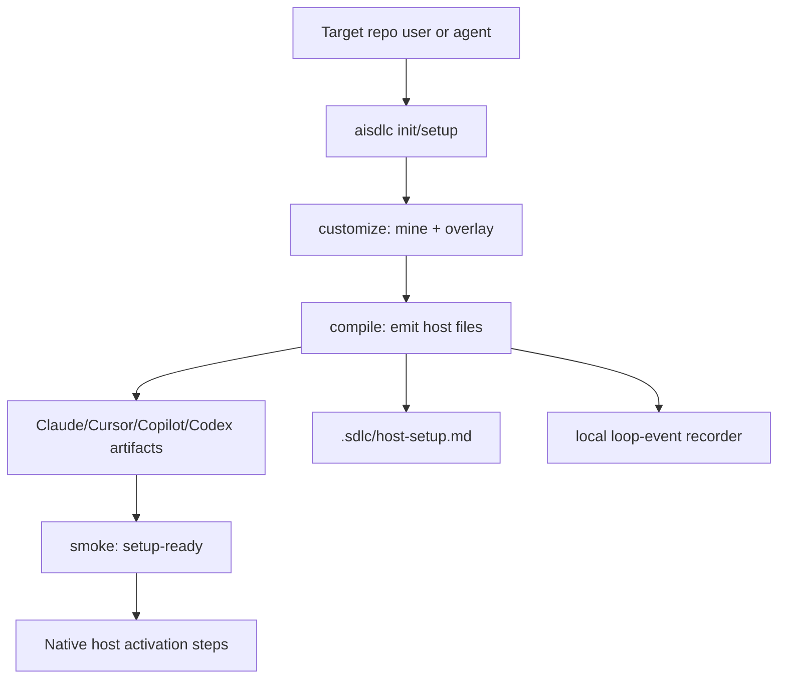
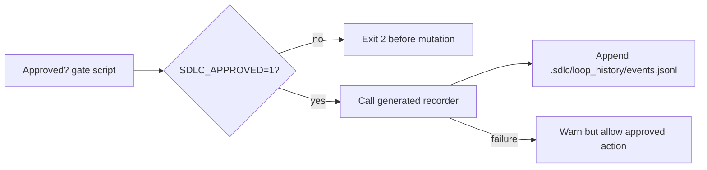

# feat: Add native host install setup

## Summary

This plan turns the prior install research into a v1 implementation slice for Claude Code, Cursor, Copilot, and Codex. It separates framework contributor setup from target-repo setup, adds a native setup entrypoint over the existing `customize -> compile -> smoke` chain, hardens generated gate runtime away from registry-resolved `npx`, fixes Copilot hook metadata to the documented shape, and emits host activation guidance that agents and humans can use after compile.

---

## Problem Frame

`README.md` still presents clone-first plus `npm link` as the visible install path. That is valid for ai-sdlc contributors, but it is not the native target-repo story promised by the product: compile should leave each Host with files it can discover and a clear activation path. The gap is especially sharp because generated Approved? gate scripts currently call `npx --yes aisdlc record-event`, which can hit the registry and resolve a different CLI version while enforcing a security-sensitive checkpoint.

The strategy in `STRATEGY.md` is hands-off, evidence-backed setup. This work should preserve the composable CLI and adapter architecture while making native host setup more obvious, more secure, and better aligned with current host surfaces.

---

## Requirements

### Setup UX

- R1. Documentation must distinguish framework contributor setup from target-repo native setup.
- R2. The CLI must provide a native setup wrapper that runs the existing resumable setup chain without bypassing `customize`, `compile`, or `smoke`.
- R3. CLI defaults must resolve bundled runtime assets such as `sdlc-base/` from the installed package location when possible, while preserving explicit `--base` overrides.

### Host Activation Guidance

- R4. Compile output must include a stable host setup guide that lists every enabled Host and the native files it should load.
- R5. Host setup guidance must cover Claude Code, Cursor, Copilot, and Codex activation or trust steps, including known reload and verification caveats.
- R6. Host guidance must report honest degradation, especially Copilot's IDE Approved? and per-role MCP limitations.

### Gate Runtime Hardening

- R7. Generated Approved? gate scripts must not call `npx --yes aisdlc` or otherwise resolve `aisdlc` from the registry at gate time.
- R8. Gate event recording must use a project-local or generated recorder path shared across Claude Code, Cursor, Copilot, and Codex outputs.
- R9. Runtime behavior for approved and unapproved gate paths must be covered by focused tests.

### Copilot Native Shape

- R10. Copilot hook JSON must match the documented native hook configuration shape for CLI/cloud-agent hooks.
- R11. Copilot must retain its fallback gate posture: instruction checklist plus CLI/cloud hook plus CI workflow, with portability gaps still recorded.

### Scope Honesty

- R12. The implementation must not claim public npm registry readiness, marketplace publishing, org-wide plugin rollout, live IDE load verification, or LSP installation.

---

## Key Technical Decisions

- **Keep setup composable, add a wrapper:** Add an `init` or `setup` CLI entrypoint that orchestrates existing subcommands rather than replacing their phase ledger. This supersedes the earlier "no init" preference only as a thin UX wrapper; `customize`, `compile`, and `smoke` remain the source of truth.
- **Resolve package assets centrally:** Introduce a package-root helper for CLI defaults instead of hardcoding cwd-relative `sdlc-base`. This is required before target repos can use a built or packaged CLI without passing `--base /path/to/ai_sdlc/sdlc-base`.
- **Emit guidance, not live host installation:** Adapter outputs should stay pure files. The v1 native setup guide tells Cursor, Claude Code, Copilot, and Codex what to load and what remains manual or host-trust-gated; it does not automate IDE UI or marketplace flows.
- **Prefer a generated local recorder over CLI subprocess:** A shared recorder script emitted with host hooks avoids registry access and version drift. It should append the same loop-trace approval event that `record-event` records today, and tolerate recording failures without weakening the gate decision.
- **Fix Copilot shape without claiming parity:** Copilot hook JSON should use the current `.github/hooks/*.json` `version` plus `hooks.preToolUse[]` structure, but Copilot IDE remains fallback-only. The existing `approved-gate-hook` and `per-role-mcp-hook` gaps are still correct.
- **Cursor remains the only packaged-distribution host in v1:** Existing `.cursor-plugin/plugin.json` support should be documented and wired into the setup guide. Claude Code and Codex plugin manifests are deferred until their package contracts are implemented and verified; Copilot distribution remains repo customization plus cloud/CI.

---

## High-Level Technical Design

---

## Scope Boundaries

### In Scope

- Add a thin setup wrapper over the existing setup chain.
- Resolve bundled base assets from package location for CLI defaults.
- Emit a generated host setup guide for enabled hosts.
- Replace generated gate-time `npx --yes aisdlc record-event` usage.
- Deduplicate Approved? gate runtime logic where practical.
- Fix Copilot hook JSON to a native configuration shape.
- Update README, skills, capability notes, and tests.

### Deferred to Follow-Up Work

- Public npm publishing, trusted publishing, license/release policy, and provenance.
- Marketplace submission or organization-wide plugin rollout.
- Claude Code `.claude-plugin/` and Codex `.codex-plugin/` bundle generation.
- Cursor plugin-native root layout or `.cursor/rules/*.mdc` conversion.
- Live host activation verification through IDE automation.
- LSP binary installation or runtime LSP proxying.

### Non-Goals

- Do not change setup-ready to require live host activation.
- Do not remove existing `customize`, `compile`, or `smoke` commands.
- Do not weaken Copilot capability gaps to make the matrix appear more uniform.

---

## Implementation Units

### U1. Resolve Packaged Runtime Assets

- **Goal:** Make CLI defaults work from a built or packaged ai-sdlc install, not only from this repo root.
- **Requirements:** R2, R3, R12.
- **Dependencies:** None.
- **Files:** `src/core/package-root.ts`, `src/cli/index.ts`, `src/cli/compile.ts`, `src/cli/smoke.ts`, `tests/cli/package-root.test.ts`, `tests/pack/verify-pack.test.ts`.
- **Approach:** Add a helper that resolves the package root from `import.meta.url`, verifies bundled asset directories such as `sdlc-base/`, and falls back to cwd-relative paths for source checkouts. Thread the helper into default `--base` handling while preserving explicit CLI options.
- **Patterns to follow:** Package allowlist verification in `scripts/verify-pack.mjs`; CLI default handling in `src/cli/index.ts`; root package metadata in `package.json`.
- **Test scenarios:** Source checkout resolves `sdlc-base`; a temp packaged layout resolves bundled `sdlc-base`; explicit `--base` wins; missing bundled assets produce a clear error.
- **Verification:** Target-repo commands can omit `--base` when using the built package layout.

### U2. Add Native Setup Wrapper

- **Goal:** Provide one entrypoint for target-repo setup while keeping the resumable phase model intact.
- **Requirements:** R1, R2, R3.
- **Dependencies:** U1.
- **Files:** `src/cli/index.ts`, `src/eval/setup-chain.ts`, `src/cli/setup.ts`, `tests/cli/setup.test.ts`, `README.md`, `sdlc-base/skills/customize/SKILL.md`.
- **Approach:** Add `aisdlc init` or `aisdlc setup` as a thin wrapper that calls the existing `customize`, `compile`, and `smoke` path with host, pack, overlay, and mode options. It should reuse freshness behavior and surface the same setup-ready result, not invent a parallel state machine.
- **Patterns to follow:** `src/eval/setup-chain.ts` for chain orchestration; `sdlc-base/skills/customize/SKILL.md` for phase wording; `src/cli/status.ts` for concise next-action output.
- **Test scenarios:** A fixture repo reaches setup-ready through the wrapper; a blocking interview gap exits non-zero and points to the overlay; explicit hosts limit emitted artifacts; freshness reruns skip unchanged phases.
- **Verification:** The wrapper is a convenience layer over existing commands and does not bypass smoke.

### U3. Emit Host Setup Guidance

- **Goal:** Make native activation steps durable and agent-readable after compile.
- **Requirements:** R4, R5, R6, R12.
- **Dependencies:** U1.
- **Files:** `src/core/host-setup-guidance.ts`, `src/core/engine.ts`, `src/adapters/*/index.ts`, `tests/core/host-setup-guidance.test.ts`, `tests/golden/compile.test.ts`, `README.md`.
- **Approach:** Add a shared guidance renderer that produces `.sdlc/host-setup.md` from enabled hosts, emitted paths, capability gaps, and existing distribution metadata. Include host-specific sections for Claude Code, Cursor, Copilot, and Codex, with exact artifact paths and non-automated activation caveats.
- **Patterns to follow:** LSP guidance generation in `src/core/lsp-guidance.ts`; capability matrix labels in `src/core/capability-matrix.ts`; honest gap reporting from Copilot adapter.
- **Test scenarios:** All default hosts appear in the guide; host-limited compile lists only selected hosts; Cursor plugin manifest instructions appear only when enabled; Copilot gaps appear in the Copilot section; every referenced emitted path exists or is marked as conditional.
- **Verification:** After compile, an agent can read one generated file to know how each Host loads the output.

### U4. Harden Approved? Gate Recording

- **Goal:** Remove gate-time registry resolution and share recording behavior across hosts.
- **Requirements:** R7, R8, R9.
- **Dependencies:** U1.
- **Files:** `src/adapters/shared/approved-gate.ts`, `src/adapters/shared/loop-event-recorder.ts`, `src/adapters/claude-code/gates.ts`, `src/adapters/cursor/gates.ts`, `src/adapters/copilot/gates.ts`, `src/adapters/codex/gates.ts`, `sdlc-base/skills/sdlc-loop/SKILL.md`, `tests/adapters/gates.test.ts`, `tests/golden/compile.test.ts`.
- **Approach:** Emit a generated recorder script under a shared project-local path and make each host gate script call it with the approval event payload. Keep the block-before-write behavior unchanged: unapproved exits with code 2; approved proceeds even if recording warns.
- **Patterns to follow:** Existing MCP gate runtime tests in `tests/adapters/gates.test.ts`; `appendLoopEvent` behavior in `src/core/memory.ts`; repeated approved-gate scripts in the host adapters.
- **Test scenarios:** Unapproved gate exits 2 and writes no event; approved gate exits 0 and records one approval; duplicate approval events are deduped if current CLI behavior dedupes them; recorder failure logs a warning without blocking an approved action; emitted scripts contain no `npx --yes aisdlc`.
- **Verification:** Generated host gates no longer depend on global or registry-resolved `aisdlc`.

### U5. Align Copilot Hook Configuration

- **Goal:** Make Copilot CLI/cloud hook metadata match the documented native `.github/hooks/*.json` shape.
- **Requirements:** R10, R11.
- **Dependencies:** U4.
- **Files:** `src/adapters/copilot/gates.ts`, `tests/adapters/gates.test.ts`, `tests/golden/compile.test.ts`, `README.md`, `docs/capability-matrix.md`.
- **Approach:** Replace the flat `event`/`command` descriptor with a `version: 1` hook configuration containing `hooks.preToolUse[]` entries and a command or bash field pointing at the generated gate script. Preserve CI workflow emission for `gateMode: ci` and keep existing portability gaps.
- **Patterns to follow:** Copilot adapter's existing instruction checklist and CI backstop; documented Copilot hook fail-closed behavior for command pre-tool hooks.
- **Test scenarios:** Hook JSON parses and contains `hooks.preToolUse`; command path points at `.github/hooks/approved-gate.mjs`; `gateMode: instructions` still omits the CI workflow; portability gaps remain unchanged.
- **Verification:** Copilot native hook config is structurally aligned without claiming IDE parity.

### U6. Refresh Host Install Documentation

- **Goal:** Update human-facing and skill-facing docs to reflect native setup for all supported hosts.
- **Requirements:** R1, R4, R5, R6, R12.
- **Dependencies:** U2, U3, U4, U5.
- **Files:** `README.md`, `templates/overlay/README.md`, `sdlc-base/skills/customize/SKILL.md`, `sdlc-base/skills/sdlc-loop/SKILL.md`, `docs/capability-matrix.md`.
- **Approach:** Reframe install as two paths: contributor setup for this repo and target-repo native setup through `aisdlc init/setup` or the explicit subcommand chain. Document host-specific activation for Claude Code, Cursor, Copilot, and Codex. Keep npm registry and marketplace claims deferred.
- **Patterns to follow:** README command tables and "What gets emitted" section; capability matrix generated from adapter capabilities; concepts for Host and Setup-ready.
- **Test scenarios:** README names the same wrapper and subcommands as CLI help; docs mention clone/npm-link only as contributor or development setup; host sections include all four default hosts; no doc claims public npm or marketplace readiness.
- **Verification:** A new user can tell how to install ai-sdlc for development and how to activate compiled config in a target repo.

---

## System-Wide Impact

This change affects the CLI entrypoint, compile output, every hook-capable adapter, generated golden snapshots, and the user-facing setup story. It also creates a new agent-readable setup artifact, so future behavior evals can test whether agents follow activation guidance rather than relying on README prose.

---

## Risks & Dependencies

- **Scope creep:** Native host install can expand into marketplace publishing and IDE automation. The v1 scope stops at emitted files, guidance, and structural tests.
- **Hook behavior regression:** Approved? gate scripts are safety-sensitive. Parametrized runtime tests across hosts must cover approved and unapproved paths before changing snapshots.
- **Package-root false confidence:** Package-root resolution improves install behavior but does not mean npm publishing is ready. README must keep release policy deferred.
- **Copilot schema churn:** Copilot hook docs are moving. Structural tests should encode the current documented shape while leaving the existing fallback gaps intact.
- **Golden snapshot churn:** Shared gate script changes will touch snapshots. Keep functional changes focused and review snapshots alongside targeted tests.

---

## Documentation / Operational Notes

README should present target-repo setup first for users who want to apply ai-sdlc, and contributor setup separately for people working on this framework. The generated `.sdlc/host-setup.md` should be concise enough for agents to load after setup-ready without becoming another bloated root instruction file.

---

## Sources & Research

- `README.md` documents the current clone-first install, quickstart chain, emitted host artifacts, and package verification caveat.
- `sdlc-base/skills/customize/SKILL.md` defines the resumable setup chain and setup-ready semantics.
- `CONCEPTS.md` defines Host, Adapter, Setup-ready, Plugin Mode, and Approved? Gate.
- `TECH_DEBT_AUDIT.md` flags generated hook runtime use of `npx --yes aisdlc record-event`.
- `docs/plans/2026-06-29-008-feat-project-foundation-hardening-plan.md` defers package-root and hook-runtime hardening.
- `docs/plans/2026-06-29-005-feat-cursor-plugin-manifest-plan.md` defines Cursor's opt-in plugin metadata boundary.
- `docs/plans/2026-06-29-007-feat-lsp-plugin-doc-gardening-plan.md` establishes the emit-guidance-not-runtime-install pattern.
- `src/adapters/claude-code/`, `src/adapters/cursor/`, `src/adapters/copilot/`, and `src/adapters/codex/` contain the current per-host emitters.
- Current host docs researched before this LFG run shaped native surfaces for Claude Code plugins/skills/hooks, Cursor plugins/skills/hooks/MCP, Copilot customizations/hooks/skills, and Codex project config/plugins/skills.
