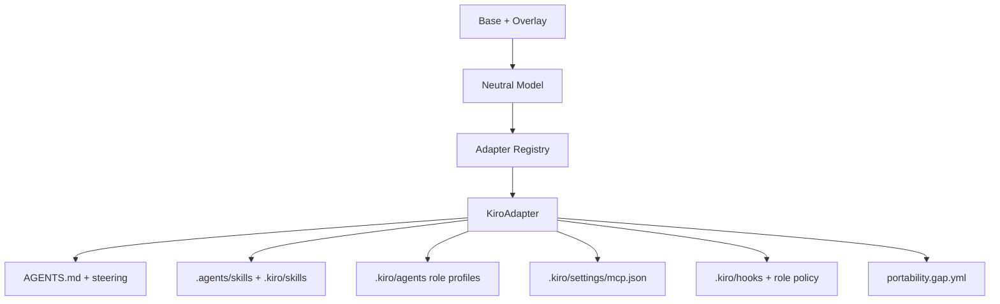

# feat: Kiro as first-class host adapter

## Summary

Add `kiro` as a first-class compile target with the same host-neutral SDLC capabilities the framework emits for existing providers: instructions, scoped guidance, skills, role agents, MCP bindings, Approved? gate enforcement, setup guidance, capability matrix coverage, and tests. Kiro should join the default base host manifest only after adapter capabilities are finalized; any native limit must be recorded as an adapter capability gap before default output expands.

---

## Problem Frame

The framework currently compiles the Neutral Model to Cursor, Claude Code, GitHub Copilot, and Codex. Kiro has native workspace surfaces for `AGENTS.md`, steering files, agent skills, custom subagents, MCP, and hooks, so leaving it out forces users to hand-port generated SDLC workflow artifacts and risks drift from the host-neutral Base.

---

## Requirements

### Host Availability

- R1. `kiro` is accepted anywhere a host ID is parsed and is registered in the adapter registry, capability matrix ordering, host setup guide, hierarchy target mapping, and default base host manifest.
- R2. `aisdlc compile` can target Kiro alone or alongside existing hosts without manual post-compile edits to make the emitted files structurally valid.
- R3. The default all-host compile output includes Kiro artifacts after the adapter emits stable files and `sdlc-base/host-manifest.yaml` includes `kiro`.

### Capability Parity

- R4. Kiro emits root `AGENTS.md` and scoped instruction guidance using Kiro-native steering where appropriate while preserving existing nested `AGENTS.md` behavior.
- R5. Kiro emits portable skills under `.agents/skills/` and Kiro-native workspace skills under `.kiro/skills/`.
- R6. Kiro emits role subagents for every Base role with posture-aligned tool access, loop guidance, and evaluator-gate instructions.
- R7. Kiro emits MCP server configuration from the same integration bindings used by other hosts and scopes role MCP reach through generated role policy.
- R8. Kiro emits Approved? and MCP least-privilege hooks using Kiro `PreToolUse` command hooks and shared gate scripts where the Kiro event contract permits fail-closed enforcement.
- R9. Kiro declares capability levels honestly in adapter capabilities, `docs/capability-matrix.md`, and `portability.gap.yml`.

### Documentation and Verification

- R10. README, package metadata, setup guidance, and loop-facing instructions name Kiro as a supported host and describe any activation caveats.
- R11. Adapter, schema, core, loop, and golden tests cover the Kiro output shape and cross-host parity.
- R12. Generated docs and snapshots remain deterministic after adding Kiro to the default host set.

---

## Key Technical Decisions

- KTD1. Treat Kiro as a Host adapter, not an LLM provider: the implementation belongs under `src/adapters/kiro/` and consumes the existing Neutral Model like Cursor, Claude Code, Copilot, and Codex.
- KTD2. Mirror the Codex adapter structure for core composition, but treat Kiro steering and tool allowlists as Kiro-specific designs: Codex has no steering equivalent, and Claude tool names cannot be reused directly.
- KTD3. Use Kiro workspace-native paths: `.kiro/agents/*.md`, `.kiro/skills/*/SKILL.md`, `.kiro/settings/mcp.json`, `.kiro/hooks/*.json`, `.kiro/steering/*.md`, and `.kiro/sdlc/role-policy.json`.
- KTD4. Encode role permissions with a Kiro-specific posture mapper: use built-in tool names such as `read`, `write`, `shell`, and `web`, add explicit MCP selectors such as `@server` or `@server/tool` only for roles with bindings, and avoid broad `includeMcpJson: true` for restricted roles.
- KTD5. Treat hooks as security enforcement, not just file shape: Kiro gate tests must replay documented or fixture-based `PreToolUse` payloads, deny missing or unknown role/server identity, and downgrade `gates` or `perRoleToolRestriction` to `partial` if the payload cannot support fail-closed behavior.

---

## High-Level Technical Design

The Kiro adapter should remain pure: it returns emitted files and gaps, while the engine owns disk I/O, pruning, setup guide generation, and golden-test determinism.

---

## Kiro Native Surface

Public Kiro docs support these workspace surfaces:

- `AGENTS.md` is always included as workspace steering.
- `.kiro/steering/*.md` supports `always`, `fileMatch`, `manual`, and `auto` inclusion modes.
- `.kiro/skills/<name>/SKILL.md` follows the open Agent Skills standard.
- `.kiro/agents/<name>.md` defines custom subagents with YAML frontmatter for `name`, `description`, `tools`, `model`, `includeMcpJson`, and related fields.
- `.kiro/settings/mcp.json` defines workspace MCP servers.
- `.kiro/hooks/*.json` defines event hooks; `PreToolUse` can block by exiting with code `2`.

---

## Implementation Units

### U1. Host Schema, Matrix, Setup, and Hierarchy Wiring

- **Goal:** Make `kiro` a valid, discoverable host across parser, host ordering, setup guidance, and hierarchy target mapping without enabling default compile output before the adapter exists.
- **Requirements:** R1, R2, R3, R9
- **Dependencies:** None
- **Files:** `src/schema/host-manifest.ts`, `src/core/capability-matrix.ts`, `src/core/host-setup-guidance.ts`, `src/core/project-context.ts`, `tests/schema/load.test.ts`, `tests/core/capability-matrix.test.ts`, `tests/core/host-setup-guidance.test.ts`, `tests/customize/setup-chain.test.ts`
- **Approach:** Add `kiro` to the host enum, extend `HOST_ORDER`, add a Kiro setup guide entry, and add `.kiro/steering/<slug>.md` to scope target mapping. Do not add `kiro` to `sdlc-base/host-manifest.yaml` until U4, after adapter capabilities and snapshots are stable.
- **Patterns to follow:** `src/core/host-setup-guidance.ts`, existing `hostTargetsForScope()` entries, and current capability matrix tests.
- **Test scenarios:** Validate host manifest parsing accepts `kiro`; verify the matrix renders Kiro in deterministic order when a Kiro adapter is supplied; verify host setup guidance includes Kiro artifacts and trust/MCP caveats; verify customize scope targets include Kiro steering paths.
- **Verification:** Schema, matrix, setup guidance, and customize tests prove host-level scaffolding before default compile output expands.

### U2. Kiro Adapter Emitters

- **Goal:** Create and register `src/adapters/kiro/` with deterministic emitters for instructions, steering, skills, agents, MCP, gates, and adapter composition.
- **Requirements:** R4, R5, R6, R7, R8, R9
- **Dependencies:** U1
- **Files:** `src/adapters/registry.ts`, `src/adapters/kiro/index.ts`, `src/adapters/kiro/instructions.ts`, `src/adapters/kiro/skills.ts`, `src/adapters/kiro/agents.ts`, `src/adapters/kiro/mcp.ts`, `src/adapters/kiro/gates.ts`, `src/adapters/kiro/steering.ts`, `tests/adapters/instructions.test.ts`, `tests/adapters/skills.test.ts`, `tests/adapters/agents.test.ts`, `tests/adapters/mcp.test.ts`, `tests/adapters/gates.test.ts`
- **Approach:** Reuse shared MCP collection, skill rendering, package instruction emission, role policy, and approved-gate scripts without editing shared modules unless implementation reveals a concrete cross-host gap. Emit Kiro-native markdown agents with YAML frontmatter, workspace skills, workspace MCP JSON, Kiro hooks, and steering files for scoped instructions. Kiro MCP emission must reuse environment-variable references and never write literal secrets.
- **Execution note:** Confirm Kiro hook payload fields while implementing the hook tests; if active role or MCP identity cannot be observed reliably, mark the affected enforcement as partial and emit an explicit gap before U3/U4. Kiro hooks should deny missing role, unknown role, disallowed server, shell, or write access when policy requires denial; they are inert only when no role policy exists.
- **Patterns to follow:** `src/adapters/codex/` for adapter composition and hooks, `src/adapters/cursor/` for scoped instruction mapping, `src/adapters/shared/roles.ts` for posture intent, and `src/adapters/shared/package-instructions.ts` for nested `AGENTS.md`.
- **Test scenarios:** Compile a model with project context and verify root plus scoped instructions; verify Kiro steering files use `fileMatch` for non-root scopes and preserve nested `AGENTS.md`; compile skills and verify both portable and `.kiro` copies; verify every Base role emits a subagent with Kiro-specific posture-aligned tools; verify restricted roles omit broad `includeMcpJson`; verify reviewer cannot write, shell, or reach MCP while engineer receives only bound MCP selectors; verify MCP JSON matches shared integration bindings; verify PreToolUse hook runtime cases allow permitted role/server access, deny missing role, deny unknown role, deny disallowed server, block mutating tools when unapproved, and stay inert when no policy file exists.
- **Verification:** Focused adapter tests prove each emitted Kiro file is deterministic, structurally valid, and capability-equivalent to existing hosts where Kiro exposes a native surface.

### U3. Loop, Documentation, and Generated Matrix Surface

- **Goal:** Make Kiro visible in user-facing docs, loop instructions, and generated capability artifacts.
- **Requirements:** R9, R10, R12
- **Dependencies:** U1, U2
- **Files:** `README.md`, `package.json`, `docs/capability-matrix.md`, `sdlc-base/skills/sdlc-loop/SKILL.md`, `src/cli/index.ts`, `tests/loop/role-guidance.test.ts`, `tests/loop/compiled-shape.test.ts`
- **Approach:** Update prose and CLI help to list Kiro with the capability levels finalized in U2. Regenerate the capability matrix from adapter declarations instead of editing it by hand. Add loop guidance only where Kiro changes agent invocation or role-dispatch instructions; treat setup, status, and fingerprint modules as verification-only unless implementation reveals host-specific branches.
- **Patterns to follow:** Existing Codex references in README, capability matrix generation, and loop role guidance tests.
- **Test scenarios:** Verify generated role guidance mentions Kiro where host-specific dispatch matters; verify status or fingerprint code recognizes Kiro without special casing errors; verify the committed capability matrix matches generated output.
- **Verification:** Docs and CLI surfaces accurately describe Kiro support and do not leave Kiro as an undocumented host flag.

### U4. Golden Compile and Pack Verification

- **Goal:** Enable the default Kiro host and update all-host compile snapshots and package verification.
- **Requirements:** R3, R11, R12
- **Dependencies:** U1, U2, U3
- **Files:** `sdlc-base/host-manifest.yaml`, `tests/helpers/model.ts`, `tests/golden/compile.test.ts`, `tests/golden/__snapshots__/compile.test.ts.snap`, `tests/smoke/smoke.test.ts`, `tests/pack/verify-pack.test.ts`, `tests/customize/setup-chain.test.ts`
- **Approach:** Add Kiro to the default base manifest only after U2 capability declarations are finalized. Extend test helpers and snapshots after adapter output is stable. Review snapshot churn for missing Kiro files, duplicate paths, unstable ordering, and accidental changes to other host outputs.
- **Patterns to follow:** Existing Codex golden coverage and smoke assertions.
- **Test scenarios:** Verify the all-host compile includes Kiro artifacts, setup guidance, matrix-compatible gaps, and prune manifest entries; verify smoke tests remain host-agnostic or explicitly cover Kiro output where needed; verify pack contents include Kiro adapter source and generated base docs.
- **Verification:** Full test and pack verification demonstrate the default Kiro host does not regress existing hosts.

---

## Scope Boundaries

### In Scope

- Workspace-local Kiro IDE artifacts and deterministic structural validation.
- Default base manifest support for `kiro`.
- Honest Kiro capability declaration and generated docs.
- Adapter tests, matrix tests, golden snapshots, smoke coverage, and pack verification.

### Deferred to Follow-Up Work

- Live Kiro IDE or CLI behavior evaluation.
- Kiro marketplace, Powers, or installable distribution metadata.
- Kiro-specific Plugin Mode host-LLM invocation if it requires a new customization backend.
- User-global `~/.kiro/` configuration management.

### Out of Scope

- Replacing Kiro Specs or wrapping Kiro Web/autonomous modes.
- Committing user-specific Kiro permission files outside the project workspace.
- Changing existing host behavior except where shared tests require parity updates.

---

## Risks & Dependencies

- Kiro hook payload shape is the main unknown for fail-closed MCP and Approved? enforcement. The implementation must validate enough payload shape in tests to avoid declaring native enforcement from guesses.
- Kiro IDE and CLI agent formats differ. This PR should target documented workspace IDE surfaces unless a CLI-compatible file is identical and low-risk.
- Adding Kiro to the default manifest creates large golden snapshot churn. The diff must be reviewed for ordering and accidental existing-host changes.
- Kiro workspace trust and MCP enablement are user actions. Setup guidance should state these as activation caveats, not pretend compile proves live runtime load.

---

## Sources & Research

- Kiro docs: Subagents, Steering, Agent Skills, MCP, Hooks, and CLI custom agent configuration.
- Current host adapter patterns: `src/adapters/codex/`, `src/adapters/cursor/`, `src/adapters/claude-code/`, `src/adapters/copilot/`
- Shared adapter utilities: `src/adapters/shared/mcp.ts`, `src/adapters/shared/roles.ts`, `src/adapters/shared/approved-gate.ts`, `src/adapters/shared/skill-file.ts`, `src/adapters/shared/package-instructions.ts`
- Domain vocabulary: `CONCEPTS.md`
- Prior adapter plan: `docs/plans/2026-06-29-002-feat-codex-host-adapter-plan.md`
