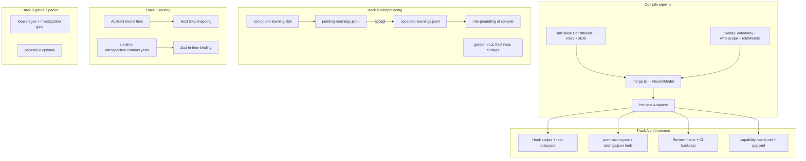
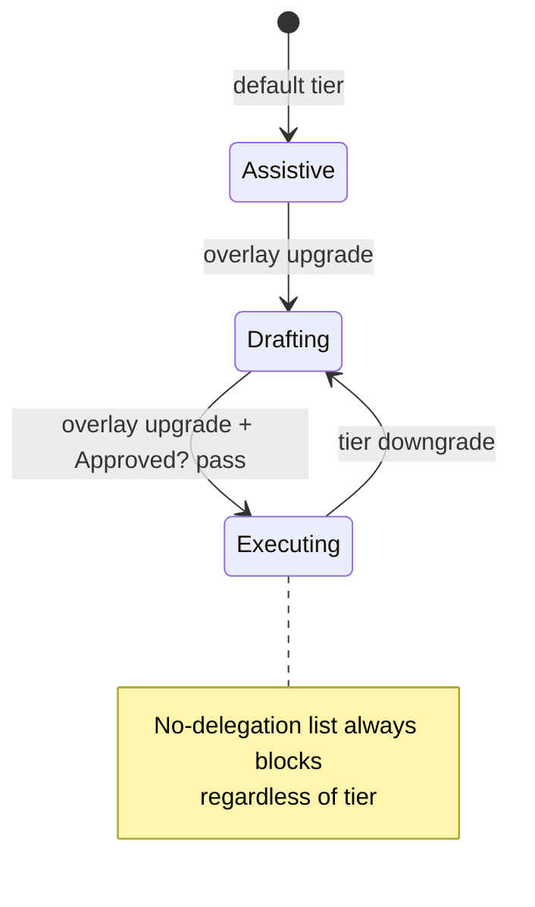

# feat: Reusable agentic SDLC patterns (tracks A→B→C→D)

## Summary

Encode durable patterns from a mature agentic SDLC operating model as host-neutral, compiled `ai-sdlc` capability across four phased tracks: **A** autonomy and access enforcement, **B** compounding loop and documentation freshness, **C** default model-tier routing and runtime-introspection grounding, **D** read-only investigation gate and optional E2E test pack. Every track preserves hands-off setup, evidence coverage, re-run-no-op, and honest capability-matrix parity across Cursor, Claude Code, Copilot, Codex, and Kiro.

---

## Problem Frame

`ai-sdlc` already compiles roles, skills, gates, and standards to multiple hosts and mines an evidence-backed overlay. The reusable patterns from the observed model are governance enforced instead of promised, access boundaries compiled instead of described, grounding live instead of only mined, and a learning loop that is a system instead of a habit. The risk is scope creep and host divergence — each capability must degrade honestly where a host is less capable and must not regress strategy metrics (see `STRATEGY.md`).

---

## Requirements

### Track A — Autonomy & access enforcement

- **R1.** Represent delegation autonomy as tiers (`assistive` / `drafting` / `executing`) plus a no-delegation list (production data, secret material, deploy approvals, history rewrites), authored in Constitution edges and tunable in the Overlay.
- **R2.** Adapters emit tier + no-delegation enforcement per host via permission allow/deny lists, pre-action approval hooks, and MCP scoping; where a host lacks pre-tool hooks, degrade to instruction checklist + CI backstop and record degradation in the capability matrix.
- **R3.** Each role declares a machine-checkable write scope; the Tester's scope is limited to test paths and excludes production code; read-only roles (Architect, Reviewer, Debugger) emit no write capability.
- **R4.** A conditional review matrix defines which lenses activate for which diff surfaces: base Reviewer always, security lens always, data/migration lens when schema/migration paths change, infrastructure lens when CI/IaC or container files change; the same gate runs at loop-completion and in the CI backstop.
- **R5.** `aisdlc status` reports the resolved autonomy tier, per-role write-scope enforcement state, and active review lenses per host.

### Track B — Compounding loop & grounding

- **R6.** A `compound-learning` skill routes a correction to the correct surface (global → Constitution/standards; role → role grounding / `roleAddenda`; domain → domain doc) and records an evidence-linked Accepted Learning Ledger entry that resurfaces on future runs touching the same surface.
- **R7.** Routed learnings are reviewable before acceptance and remain evidence-linked; accepted entries appear in role guidance and `status`.
- **R8.** A domain-doc grounding capability mines or scaffolds per-domain docs with a code-path-to-doc map and feeds them into role grounding; keyed off mined evidence (no boilerplate for repos without signal).
- **R9.** `aisdlc garden-docs` gains gating findings for broken code references and docs older than the code they describe; `--fail-on` applies to the extended finding set without changing default report-only behavior.

### Track C — Routing & runtime grounding

- **R10.** Ship default role-model tiers in the Neutral Model expressed abstractly (`narrow-fast`, `standard`, `high-reasoning`); Overlay `roleModels` overrides still win; adapters map tiers to each host and degrade where fewer tiers exist.
- **R11.** Add a host-neutral **runtime-introspection** integration contract (live schema, routes/endpoints, logs) with least-privilege posture; binds just-in-time, defaults to read-only and local/non-production, reachable only by roles whose posture allows it.
- **R12.** Runtime-introspection grounding is additive to static mining and never a prerequisite for setup-ready.

### Track D — Investigation gate & extension packs

- **R13.** Add a read-only investigation step for bug-fix work: Debugger produces root cause, evidence, recommended fix, and regression-test list before any fix is delegated; Ceremony-Track-aware (skippable on Quick track / trivial fixes).
- **R14.** Add "generate deterministic artifacts; keep AI off the execution path" as a Constitution standard for generated automation.
- **R15.** Add an optional E2E test pack encoding explore-before-generate, test-pyramid coverage budget, bounded self-healing with retry limit, and test-bug-vs-application-bug decision; activates only on ecosystem detection and emits nothing when inactive.

---

## Key Technical Decisions

- **KTD1.** Default autonomy tiers live in Constitution configurable edges; per-project tier and no-delegation extensions live in Overlay under a new `autonomy` object. Constitution declares the canonical no-delegation categories; Overlay may add project-specific entries but cannot remove base categories (see origin Q1 default).
- **KTD2.** Extend `RoleFrontmatter` with optional `writeScope: { allow: string[], deny: string[] }` glob patterns relative to repo root. When absent, posture-only enforcement applies (backward compatible). Tester defaults to allow `**/test/**`, `**/tests/**`, `**/*.{test,spec}.*`, deny everything else for write tools.
- **KTD3.** Emit write-scope metadata into existing role-policy JSON consumed by hook scripts (`src/adapters/shared/roles.ts` → `buildRolePolicy()`). Extend gate scripts (`approved-gate`, tool-gate, mcp-gate) to check path against scope on mutating tool calls where the host exposes file paths in hook context; record per-host fidelity in `HostCapabilities` and `docs/capability-matrix.md`.
- **KTD4.** Review matrix conditions live in Base (`sdlc-base/review-matrix.yaml` or equivalent compiled artifact); lens depth content comes from existing packs (`security`, `infra`). Matrix evaluation is a pure function over changed paths; CI backstop reuses Copilot workflow pattern from `src/adapters/copilot/gates.ts`.
- **KTD5.** `compound-learning` skill writes proposed ledger entries to a pending queue (`.sdlc/memory/pending-learnings.jsonl`); acceptance promotes to `accepted-learnings.jsonl` via existing `upsertAcceptedLearning()` in `src/core/accepted-learnings.ts`. Routing heuristics use surface keywords + optional `--surface` flag; human review is the default accept path.
- **KTD6.** Domain docs scaffold under `.sdlc/domain-docs/` with a `code-path-map.yaml` derived from mined architecture roots and standards evidence; customize emits only when miner confidence exceeds threshold (reuse architecture confidence signals from customize).
- **KTD7.** Abstract model tiers map in adapter layer: `src/adapters/shared/model-tiers.ts` holds host-specific SKU tables with degradation to nearest tier; base role frontmatter gains optional `modelTier` defaulting per role class (Architect/Debugger → high-reasoning, Reviewer → standard, Tester → narrow-fast, Engineer → standard).
- **KTD8.** Runtime-introspection contract follows gitlab/jira pattern in `sdlc-base/integrations/`; default allowed roles: `engineer`, `debugger`; never bound during smoke/setup-ready checks (R12).
- **KTD9.** Investigation gate inserts a Debugger stage before Engineer fix delegation in `src/core/loop.ts` `stagesForTrack()` for Standard/Full; Quick track skips unless overlay sets `requireInvestigation: true`. Loop-Quality Score gains investigation-present checks.
- **KTD10.** E2E pack (`packs/e2e/`) activates when miner detects Playwright/Cypress/WebdriverIO signals (reuse e2e detection from prior work in `src/customize/`); pack is inert otherwise.

---

## High-Level Technical Design

---

## Phased Delivery

| Phase | Track | Units | Depends on |
|---|---|---|---|
| 1 | A | U1–U5 | — |
| 2 | B | U6–U9 | U1 (shared overlay surfaces) |
| 3 | C | U10–U11 | U1 for runtime role scoping |
| 4 | D | U12–U14 | U1, U4; U14 optional after B |

---

## Scope Boundaries

### In Scope

Tracks A–D as specified in origin requirements R1–R15.

### Deferred to Follow-Up Work

- Ticket-grounded loop entry (origin #9)
- Generated onboarding / health "doctor" artifact (origin #11)
- Live host behavior eval productization beyond pinned offline scenarios

### Non-Goals

- Runtime delivery-metrics dashboards
- Cloning any host's exact agent/command names
- Tool-specific token proxies in base
- Duplicating full standards into every agent body
- New front-of-lifecycle requirements-refinement role

---

## System-Wide Impact

- **Adapters:** All five hosts gain new emitted fields; golden compile snapshots must update.
- **Overlay schema:** Strict Zod additions — backward compatible defaults preserve re-run-no-op on existing overlays.
- **Capability matrix:** New rows for autonomy tier enforcement, path write-scope, review matrix, model tier mapping, runtime contract.
- **Behavior eval:** Extend pinned scenarios to prefer enforced-policy artifacts over generic baseline.
- **Fingerprints:** New overlay/autonomy fields participate in compile freshness when they change enforcement output.

---

## Risks & Dependencies

- Host write-scope fidelity varies; instruction + CI backstop must remain visible in matrix (origin Q2).
- Review matrix overlap with security pack must dedupe lens prompts (origin note on idea #3).
- Domain-doc scaffolding must stay evidence-gated to avoid boilerplate (origin Q on idea #5).
- Model tier host SKU tables drift; abstract tiers + documented degradation gaps mitigate (origin Q4).
- Runtime introspection must never reach production; contract defaults + role scoping + smoke non-requirement enforce R12 (origin Q5).

---

## Open Questions

- **Q1 (resolved):** Autonomy tiers in Constitution defaults + Overlay tuning (KTD1).
- **Q2:** Minimum acceptable write-scope degradation per host — plan assumes hook path check where available, instruction + CI elsewhere; implementers validate against real hook payloads per host.
- **Q3 (resolved):** Review conditions in Base; lens depth from packs (KTD4).
- **Q4 (resolved):** Abstract tiers with adapter mapping tables (KTD7).
- **Q5 (resolved):** Runtime contract limited to engineer/debugger; local-only defaults; excluded from setup-ready prerequisites (KTD8, R12).

---

## Implementation Units

### U1. Autonomy tier and no-delegation schema

- **Goal:** Add host-neutral autonomy policy to Constitution edges and Overlay schema.
- **Requirements:** R1.
- **Dependencies:** None.
- **Files:** `sdlc-base/AGENTS.md`, `src/schema/overlay.ts`, `src/schema/autonomy.ts` (new), `src/core/merge.ts`, `tests/schema/autonomy.test.ts` (new).
- **Approach:** Define `AutonomyTier` enum, `NoDelegationCategory` list, overlay `autonomy: { tier?, additionalNoDelegation?: string[] }`. Merge resolves effective tier and merged no-delegation set onto `NeutralModel`. Constitution prose documents tiers and base no-delegation list.
- **Patterns to follow:** Overlay strict schema in `src/schema/overlay.ts`; gate prose in `sdlc-base/AGENTS.md`.
- **Test scenarios:** Default tier is `assistive` when overlay omits autonomy; overlay tier override applies; base no-delegation categories always present; additional overlay categories merge without duplicates; invalid tier rejected at parse time.
- **Verification:** `aisdlc compile` succeeds on existing fixtures with no overlay changes.

### U2. Role write-scope schema and defaults

- **Goal:** Machine-checkable path write boundaries per role.
- **Requirements:** R3.
- **Dependencies:** U1.
- **Files:** `src/schema/role.ts`, `sdlc-base/roles/tester.md`, `sdlc-base/roles/{architect,reviewer,debugger,engineer}.md`, `src/core/merge.ts`, `tests/schema/role-write-scope.test.ts` (new).
- **Approach:** Add optional `writeScope` to `RoleFrontmatter`. Apply Tester default scopes at merge when not overridden. Read-only roles explicitly deny all write paths. Engineer retains full workspace write unless overlay narrows.
- **Patterns to follow:** Existing `ToolPosture` in `src/schema/role.ts`.
- **Test scenarios:** Tester default allows test paths only; read-only roles emit empty allow / universal deny; pack roles inherit posture without write unless declared; overlay roleAddenda does not bypass writeScope.
- **Verification:** Role schema validates glob patterns; merge output includes resolved writeScope per role.

### U3. Adapter emission for autonomy and write-scope

- **Goal:** Emit enforcement artifacts on all hosts with honest degradation.
- **Requirements:** R2, R3.
- **Dependencies:** U1, U2.
- **Files:** `src/adapters/shared/roles.ts`, `src/adapters/shared/autonomy.ts` (new), `src/adapters/shared/write-scope-gate.ts` (new), `src/adapters/cursor/gates.ts`, `src/adapters/claude-code/gates.ts`, `src/adapters/codex/gates.ts`, `src/adapters/copilot/gates.ts`, `src/adapters/kiro/gates.ts`, each host `index.ts`, `tests/adapters/gates.test.ts`, `tests/adapters/write-scope.test.ts` (new), `tests/golden/compile.test.ts`.
- **Approach:** Extend `RolePolicyEntry` with `writeScope` and `autonomyTier`. Gate scripts check no-delegation patterns (secrets, prod URLs, force-push) and write paths. Copilot degrades to checklist + workflow step. Update `HostCapabilities` and regenerate capability matrix.
- **Patterns to follow:** `buildRolePolicy()`, `approvedGateScript()`, existing MCP gate pattern.
- **Test scenarios:** Cursor hook denies Tester write to `src/` production path; Claude tool list excludes Write for read-only roles; no-delegation blocks deploy hook either way; Copilot emits checklist when native path scope unavailable; gap.yml records degradation per host.
- **Verification:** Golden compile snapshots updated; `aisdlc gen-matrix` reflects new capabilities.

### U4. Conditional review matrix

- **Goal:** Diff-surface-activated review lenses at loop completion and CI.
- **Requirements:** R4.
- **Dependencies:** U1.
- **Files:** `sdlc-base/review-matrix.yaml` (new), `src/core/review-matrix.ts` (new), `src/core/loop.ts`, `sdlc-base/skills/sdlc-loop/SKILL.md`, `src/adapters/copilot/gates.ts`, `tests/core/review-matrix.test.ts` (new), `tests/loop/evaluator-gate.test.ts`.
- **Approach:** YAML defines lens → path glob triggers. Pure evaluator returns active lenses for a path list. Loop skill instructs parallel lens review when triggered. Copilot CI workflow runs matrix check on PR diff paths. Security lens always on; migration/infra lenses conditional.
- **Patterns to follow:** Pack roles in `packs/security/`, `packs/infra/`; loop stages in `src/core/loop.ts`.
- **Test scenarios:** Security lens always active; migration lens fires on `db/migrate/` change only; infra lens fires on `.github/workflows/` and `Dockerfile`; empty diff returns base Reviewer only; CI workflow step fails when required lens skipped (Copilot path).
- **Verification:** Review matrix unit tests green; loop skill references matrix artifact path.

### U5. Status reporting for enforcement state

- **Goal:** Surface autonomy tier, write-scope enforcement, and review lenses in status.
- **Requirements:** R5.
- **Dependencies:** U3, U4.
- **Files:** `src/cli/status.ts`, `tests/cli/status.test.ts`.
- **Approach:** Extend `StatusReport` with `autonomy`, `writeScopeEnforcement`, `reviewLenses` per host from compiled model + capability matrix degradation flags.
- **Patterns to follow:** Existing accepted learnings and loop-quality sections in `status.ts`.
- **Test scenarios:** Status JSON includes resolved tier; each role shows enforcement level (`native` / `instruction` / `ci-backstop`); active lenses listed for sample diff fixture; text format human-readable.
- **Verification:** `aisdlc status` output matches test fixtures.

### U6. compound-learning skill

- **Goal:** Route corrections to the right instruction surface with ledger integration.
- **Requirements:** R6.
- **Dependencies:** U1.
- **Files:** `sdlc-base/skills/compound-learning/SKILL.md` (new), `src/core/compound-learning.ts` (new), `src/core/accepted-learnings.ts`, `tests/core/compound-learning.test.ts` (new).
- **Approach:** Skill accepts correction text + optional evidence paths. Router classifies surface: global, role, domain. Writes pending entry with proposed target path and evidence links. CLI subcommand or skill step for accept/reject.
- **Patterns to follow:** `sdlc-base/skills/tune-roles/SKILL.md`; `AcceptedLearningEntry` kinds in `accepted-learnings.ts`.
- **Test scenarios:** Global correction targets standards index; role correction targets roleAddenda; domain correction targets domain doc path; missing evidence rejected; duplicate pending entry upserts.
- **Verification:** Skill loads in compile output; routing tests pass.

### U7. Learning review and acceptance workflow

- **Goal:** Reviewable, evidence-linked learnings in guidance and status.
- **Requirements:** R7.
- **Dependencies:** U6.
- **Files:** `src/core/accepted-learnings.ts`, `src/core/role-grounding.ts`, `src/cli/status.ts`, `tests/memory/accepted-learnings.test.ts`.
- **Approach:** Add `pending` → `accepted` promotion API; new kind `compound-correction`. Status shows pending count. Compile injects only accepted entries via existing `appendAcceptedLearnings()`.
- **Patterns to follow:** `syncAcceptedLearningsFromCustomize()` promotion pattern.
- **Test scenarios:** Pending entries excluded from role grounding; accept promotes to jsonl; reject removes pending; status lists top pending claims; evidence required on accept.
- **Verification:** Accepted learnings tests extended; status reflects pending/accepted split.

### U8. Domain-doc grounding and code-path map

- **Goal:** Evidence-backed per-domain docs fed into role grounding.
- **Requirements:** R8.
- **Dependencies:** U6.
- **Files:** `src/core/domain-docs.ts` (new), `src/customize/emitters.ts`, `src/core/project-context.ts`, `src/core/role-grounding.ts`, `tests/core/domain-docs.test.ts` (new).
- **Approach:** When miner finds multiple architecture roots with evidence, scaffold `.sdlc/domain-docs/<domain>.md` and `code-path-map.yaml`. Customize skips when confidence low. Role grounding injects relevant domain slice by path prefix.
- **Patterns to follow:** `projectContext` map emission; instruction hierarchy in customize.
- **Test scenarios:** High-confidence multi-root repo generates map; low-signal repo generates nothing; map entry resolves doc for changed path; grounding truncates to budget.
- **Verification:** Customize fixture emits domain docs when expected; no emission on minimal fixture repo.

### U9. garden-docs code-ref and stale-doc findings

- **Goal:** Extend gardener findings for freshness gating.
- **Requirements:** R9.
- **Dependencies:** None (parallel with B after A).
- **Files:** `src/garden/doc-gardener.ts`, `src/garden/types.ts`, `src/cli/garden-docs.ts`, `tests/garden/doc-gardener.test.ts`, `tests/cli/garden-docs.test.ts`.
- **Approach:** Add finding IDs `broken-code-reference`, `stale-doc-vs-code`. Compare doc mtime vs referenced code mtime; validate `file:line` refs exist. `--fail-on warning|error` applies without changing default.
- **Patterns to follow:** Existing `broken-local-link` finding pattern.
- **Test scenarios:** Broken code ref → error finding; doc older than code → warning; `--fail-on error` exits 0 on warnings only; default report-only exits 0; fixed refs clear finding.
- **Verification:** garden-docs tests cover new IDs and exit codes.

### U10. Default abstract model tiers

- **Goal:** Ship vendor-neutral tier defaults with host mapping.
- **Requirements:** R10.
- **Dependencies:** U1.
- **Files:** `src/schema/role.ts`, `src/adapters/shared/model-tiers.ts` (new), `src/core/merge.ts`, each host `agents.ts`, `sdlc-base/roles/*.md`, `tests/adapters/model-tiers.test.ts` (new).
- **Approach:** Add `ModelTier` enum and optional `modelTier` on roles with defaults per role. `roleModels` overlay override still wins over tier resolution. Adapters map tier → host model string with nearest-tier degradation and gap entries.
- **Patterns to follow:** Existing `model` frontmatter emission in adapter agents.
- **Test scenarios:** Default tiers applied when no overlay override; overlay `roleModels` beats tier; host with two tiers degrades high-reasoning → standard with gap; compile emits model in agent frontmatter.
- **Verification:** Golden snapshots include tier-mapped models.

### U11. Runtime-introspection integration contract

- **Goal:** Host-neutral read-only runtime grounding contract.
- **Requirements:** R11, R12.
- **Dependencies:** U1, U3.
- **Files:** `sdlc-base/integrations/runtime-introspection.contract.yaml` (new), `src/schema/integration-contract.ts`, `tests/core/loader.test.ts`, `tests/smoke/smoke.test.ts`.
- **Approach:** Contract defines read-only operations (schema, routes, logs). Default binding: local only, engineer + debugger roles. Smoke and setup-ready do not require binding. Adapters emit MCP stub like gitlab/jira.
- **Patterns to follow:** `sdlc-base/integrations/jira.contract.yaml`.
- **Test scenarios:** Contract loads in base; default allowedRoles correct; unbound compile succeeds; binding adds server to allowed roles only; least-privilege denies architect.
- **Verification:** Loader test includes new contract; smoke passes without binding.

### U12. Debugger investigation gate

- **Goal:** Read-only root-cause step before fix delegation.
- **Requirements:** R13.
- **Dependencies:** U4.
- **Files:** `sdlc-base/roles/debugger.md`, `src/core/loop.ts`, `sdlc-base/skills/sdlc-loop/SKILL.md`, `tests/eval/loop-score.test.ts`, `tests/loop/role-guidance.test.ts`.
- **Approach:** Insert `investigate` stage before engineer fix on Standard/Full tracks. Debugger output template: root cause, evidence, recommended fix, regression tests. Quick track skips. Loop-Quality Score checks investigation artifact when stage expected.
- **Patterns to follow:** Ceremony track gating in `stagesForTrack()`.
- **Test scenarios:** Standard track includes investigation stage; Quick track omits; investigation artifact satisfies loop score; missing investigation fails score on Standard; overlay can force investigation on Quick.
- **Verification:** Loop score tests updated; sdlc-loop skill documents gate.

### U13. Deterministic automation standard

- **Goal:** Constitution standard for author-once/run-natively automation.
- **Requirements:** R14.
- **Dependencies:** U1.
- **Files:** `sdlc-base/AGENTS.md`, `tests/golden/compile.test.ts`.
- **Approach:** Add standard under configurable edges prose and emitted standards index template. No behavioral code change beyond compile text.
- **Patterns to follow:** Existing gate prose style in Constitution.
- **Test scenarios:** Compiled constitution includes deterministic-automation standard; golden snapshot reflects text.
- **Verification:** Compile golden passes.

### U14. Optional E2E test pack

- **Goal:** Ecosystem-gated E2E pack with pyramid and self-heal guidance.
- **Requirements:** R15.
- **Dependencies:** U8 (domain doc patterns helpful), U10 optional.
- **Files:** `packs/e2e/pack.yaml`, `packs/e2e/AGENTS.md`, `packs/e2e/skills/e2e-authoring/SKILL.md`, `packs/e2e/roles/e2e-tester.md`, `src/customize/ecosystem-detect.ts` (or existing miner hook), `tests/packs/e2e-pack.test.ts` (new), `docs/packs.md`.
- **Approach:** Pack encodes explore-before-generate, pyramid budget, bounded self-heal (max 3 retries), test-bug vs app-bug decision tree. Miner/customize adds pack to compile list only when browser e2e framework detected. Inactive → `loadPack` never called for e2e.
- **Patterns to follow:** `packs/frontend/` Playwright contract; `tests/packs/reference-packs.test.ts`.
- **Test scenarios:** Playwright fixture repo activates pack; Go-only repo does not; pack roles/skills unique names; compile with pack includes e2e skill; without detection emits no e2e files.
- **Verification:** Reference pack tests extended; docs/packs.md lists e2e pack.

---

## Sources & Research

- Origin: `docs/ideation/2026-07-01-reusable-agentic-sdlc-patterns-ideation-and-requirements.md`
- Adapter patterns: `src/adapters/shared/roles.ts`, `src/adapters/shared/approved-gate.ts`
- Ledger: `src/core/accepted-learnings.ts`, `src/core/role-grounding.ts`
- Loop/ceremony: `src/core/loop.ts`
- Garden: `src/garden/doc-gardener.ts`
- Prior accepted-learnings plan: `docs/plans/2026-06-29-005-feat-accepted-learnings-ledger-plan.md`
